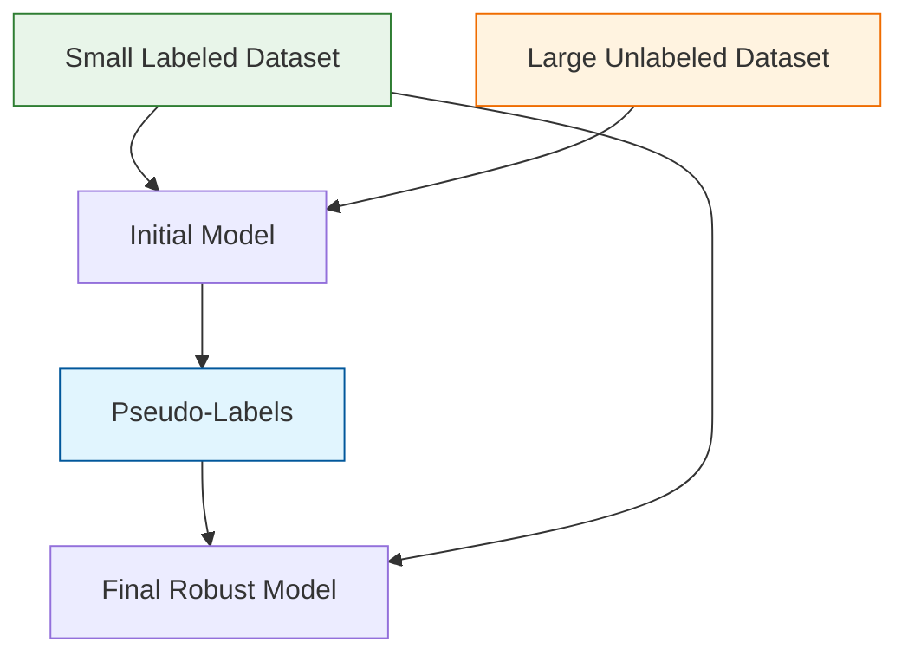

In the real world, data is plentiful, but **labels are expensive**. 

* **Supervised Learning** requires every data point to be labeled by a human expert (expensive and slow).
* **Unsupervised Learning** uses no labels but can't perform specific tasks like classification.

**Semi-Supervised Learning (SSL)** sits in between. It uses a small set of labeled data to "guide" the discovery of patterns in a much larger set of unlabeled data.

## 1. The Core Idea: Self-Training & Pseudo-Labeling

The most common technique in SSL is **Pseudo-labeling**. Instead of a human labeling millions of images, the model does it itself.

1.  **Train:** Train a model on the small amount of human-labeled data.
2.  **Predict:** Use that model to predict labels for the large unlabeled dataset.
3.  **Filter:** Keep only the predictions where the model is highly confident (e.g., probability $> 95\%$). These are your "Pseudo-labels."
4.  **Retrain:** Combine the original human labels with the new pseudo-labels and train a final, more robust model.

## 2. Key Assumptions of SSL

For semi-supervised learning to work, the data must satisfy certain mathematical properties:

* **Continuity Assumption:** Points that are close to each other are likely to share the same label.
* **Cluster Assumption:** Data tends to form discrete clusters. Points in the same cluster are likely to share a label.
* **Manifold Assumption:** High-dimensional data lies on a lower-dimensional "manifold" or structure (like a 2D sheet crumpled in 3D space).

## 3. When to Use Semi-Supervised Learning

SSL is the standard approach in industries where expert labeling is prohibitively expensive:

* **Medical Imaging:** You have millions of X-rays, but only 1,000 have been analyzed by a specialized radiologist.
* **Language Translation:** Huge amounts of raw text exist, but human-translated pairs are limited.
* **Speech Analysis:** Thousands of hours of audio recordings, but only a fraction are transcribed.

## 4. SSL vs. Other Types

| Feature | Supervised | Unsupervised | Semi-Supervised |
| :--- | :--- | :--- | :--- |
| **Label Requirement** | 100% Labeled | 0% Labeled | ~1-10% Labeled |
| **Cost** | Very High | Low | Moderate |
| **Common Use Case** | Prediction | Discovery | Scaling Predictions |

## 5. Active Learning: A Related Concept

Sometimes, SSL is combined with **Active Learning**. In this setup, the model identifies the specific unlabeled examples it is most "confused" about and asks a human expert to label *only those* specific points. This maximizes the value of human effort.

## References for More Details

* **[Scikit-Learn: Self Training](https://scikit-learn.org/stable/modules/semi_supervised.html):** Learning about `SelfTrainingClassifier` and `LabelPropagation`.

---

**Semi-supervised learning is about making the most of what you have. But what if there are no labels at all, and the AI must learn by "playing" in an environment?**