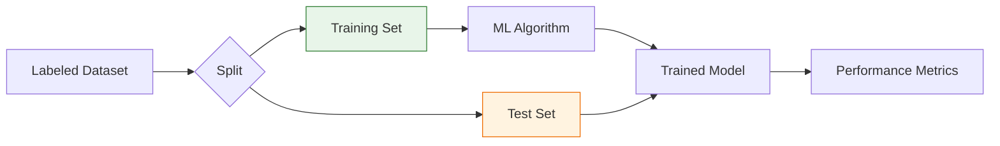

**Supervised Learning** is the most widely used branch of Machine Learning. It is called "supervised" because the process of an algorithm learning from the training dataset can be thought of as a teacher supervising the learning process. 

In this paradigm, we provide the computer with **Inputs** (features) and the correct **Answers** (labels). The goal is for the model to learn a general rule that maps inputs to outputs.

## 1. The Mathematical Core

At its heart, supervised learning is about finding a function $f$ that maps input variables ($X$) to an output variable ($y$).

$$
y = f(X) + \epsilon
$$

* **$y$**: The Target (the value we want to predict).
* **$X$**: The Features (the data we use to make the prediction).
* **$f$**: The Model (the mapping function learned by the algorithm).
* **$\epsilon$**: Error/Noise (random variability that the model cannot predict).

## 2. The Two Main Branches

Supervised learning is divided based on the **nature of the target variable**.

### A. Regression (Continuous Values)
Regression is used when the output variable is a **real or continuous value**. You are predicting a "how much" or "how many."
* **Example:** Predicting the price of a house based on its square footage.
* **Example:** Predicting the temperature for tomorrow.

### B. Classification (Discrete Categories)
Classification is used when the output variable is a **category or label**. You are predicting "which one."
* **Binary Classification:** Only two possible classes (e.g., Spam or Not Spam).
* **Multi-class Classification:** More than two classes (e.g., Identifying if an image is a Cat, Dog, or Bird).

## 3. The Supervised Learning Workflow

The process of training a supervised model follows a strict sequence:

1. **Data Labeling:** Ensuring every row of data has a known "ground truth."
2. **Feature Selection:** Choosing which attributes are relevant.
3. **Training:** The algorithm looks at the training data and adjusts its internal parameters to minimize error.
4. **Prediction:** We feed the model new, unseen data () and it generates a prediction ().

## 4. Common Supervised Algorithms

Depending on the complexity of the data, we choose different "learners":

| Algorithm | Type | Use Case |
| --- | --- | --- |
| **Linear Regression** | Regression | Predicting sales or house prices. |
| **Logistic Regression** | Classification | Predicting if a transaction is fraudulent (Yes/No). |
| **Decision Trees** | Both | Creating "if-this-then-that" logic for credit scoring. |
| **Support Vector Machines (SVM)** | Both | High-dimensional classification like facial recognition. |
| **Neural Networks** | Both | Complex tasks like image and speech recognition. |

## 5. Challenges: Overfitting and Underfitting

The biggest hurdle in supervised learning is ensuring the model generalizes well to **new** data.

* **Underfitting:** The model is too simple to capture the underlying pattern (High Bias).
* **Overfitting:** The model learns the noise in the training data too well and fails to predict new data (High Variance).

## References for More Details

* **[Scikit-Learn Supervised Learning Guide](https://scikit-learn.org/stable/supervised_learning.html):** Code examples for every major algorithm.
* **[Machine Learning Mastery - Supervised Learning](https://machinelearningmastery.com/supervised-and-unsupervised-machine-learning-algorithms/):** A simple, beginner-friendly explanation of the differences.

---

**Now that you understand how models learn from labeled data, let's explore the opposite: finding hidden patterns in data where the "answers" aren't provided.**