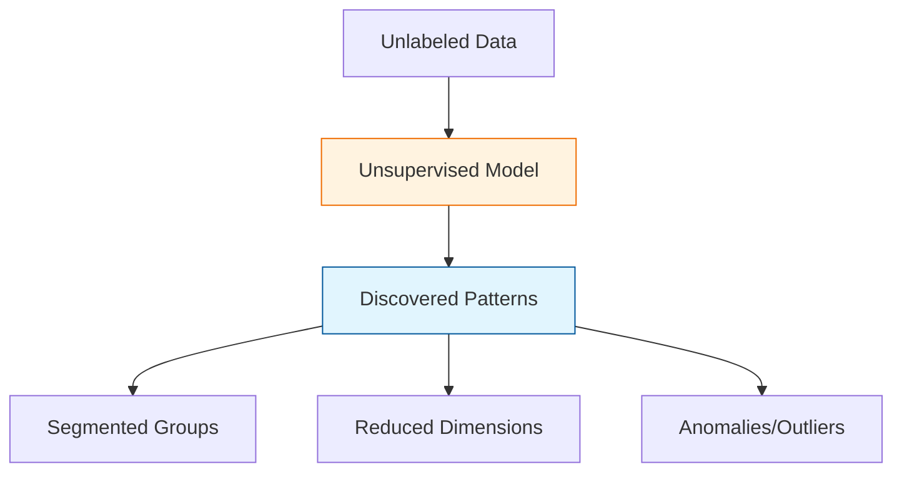

In **Unsupervised Learning**, the model is given a dataset without explicit instructions on what to do with it. There are no labels ($y$), and there is no "teacher" to correct the model. Instead, the algorithm explores the data to find inherent structures, patterns, and groupings.

## 1. The Core Objective

The mathematical goal of unsupervised learning is to model the underlying probability distribution or structure of the input data ($X$).

$$
P(X)
$$

Instead of mapping $X \to y$, the model asks: *"How is $X$ organized?"*

## 2. Key Techniques and Use Cases

### A. Clustering
Grouping data points so that objects in the same group (called a **cluster**) are more similar to each other than to those in other groups.
* **Algorithm:** K-Means, DBSCAN, Hierarchical Clustering.
* **Use Case:** **Customer Segmentation**. Grouping users by purchasing behavior to create targeted marketing campaigns.

### B. Dimensionality Reduction
Reducing the number of random variables under consideration by obtaining a set of principal variables.
* **Algorithm:** PCA (Principal Component Analysis), t-SNE.
* **Use Case:** **Data Visualization**. Compressing 100+ features into a 2D plot to see if there are natural groupings in the data.

### C. Association Rule Learning
Discovering interesting relations between variables in large databases.
* **Algorithm:** Apriori, Eclat.
* **Use Case:** **Market Basket Analysis**. Realizing that customers who buy "Diapers" are also highly likely to buy "Beer."

### D. Anomaly Detection
Identifying rare items, events, or observations which raise suspicions by differing significantly from the majority of the data.
* **Algorithm:** Isolation Forest, One-Class SVM.
* **Use Case:** **Fraud Detection**. Spotting a credit card transaction that doesn't fit a user's normal spending profile.

## 3. Comparison: Supervised vs. Unsupervised

| Feature | Supervised Learning | Unsupervised Learning |
| :--- | :--- | :--- |
| **Data** | Labeled ($X, y$) | Unlabeled ($X$) |
| **Goal** | Predict outcomes | Find hidden patterns |
| **Feedback** | Direct (Correct/Incorrect) | None (Evaluation is subjective) |
| **Complexity** | Usually simpler to evaluate | Harder to validate results |

## 4. The Challenge of Evaluation

In Supervised Learning, you can calculate "Accuracy." In Unsupervised Learning, there is no "ground truth" to compare against. Engineers often use internal metrics like:
* **Silhouette Score:** Measures how similar an object is to its own cluster compared to other clusters.
* **Inertia:** Measures how far the points within a cluster are from their center.

## 5. Real-World Applications

1. **Genetics:** Clustering DNA sequences to identify groups with similar genetic properties.
2. **Recommendation Systems:** Finding "neighbor" users who like similar movies (Collaborative Filtering).
3. **Search Engines:** Grouping similar search results or news articles into topics (Topic Modeling).

## References for More Details

* **[Scikit-Learn Unsupervised Learning](https://scikit-learn.org/stable/unsupervised_learning.html):** Technical documentation on clustering and manifold learning.

* **[Clustering Algorithms (Visual Guide)](https://projector.tensorflow.org/):** Playing with high-dimensional data in your browser.

---

**Unsupervised learning reveals the "who" and the "what" in your data. But what if you want an AI to learn how to make decisions through trial and error?**