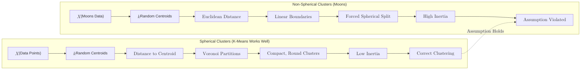

**K-Means** is an unsupervised learning algorithm that groups data points into $K$ distinct, non-overlapping clusters. Unlike Supervised Learning, there are no "correct answers" or labels; the algorithm finds structure based purely on the features of the data.

## 1. How the Algorithm Works

K-Means is an iterative process that follows these steps:

1.  **Initialization:** Choose $K$ (the number of clusters) and randomly place $K$ points in the feature space. these are the **Centroids**.
2.  **Assignment:** Assign each data point to the nearest centroid (usually using Euclidean distance).
3.  **Update:** Calculate the mean of all points assigned to each centroid. Move the centroid to this new mean position.
4.  **Repeat:** Keep repeating the Assignment and Update steps until the centroids stop moving or a maximum number of iterations is reached.

## 2. Choosing the Optimal 'K': The Elbow Method

One of the biggest challenges in K-Means is knowing how many clusters to use. If you have too few, you miss patterns; too many, and you over-segment the data.

We use **Inertia** (the sum of squared distances of samples to their closest cluster center). As $K$ increases, inertia always decreases. We look for the "Elbow"—the point where the rate of decrease shifts significantly.

## 3. Implementation with Scikit-Learn

```python
from sklearn.cluster import KMeans
import matplotlib.pyplot as plt

# 1. Initialize the model
# n_clusters is the 'K'
# n_init='auto' handles the number of times the algorithm runs with different seeds
kmeans = KMeans(n_clusters=3, n_init='auto', random_state=42)

# 2. Fit the model (Notice: we only pass X, not y!)
kmeans.fit(X)

# 3. Get cluster assignments and centroid locations
labels = kmeans.labels_
centroids = kmeans.cluster_centers_

# 4. Predict the cluster for a new point
new_point_cluster = kmeans.predict([[5.1, 3.5]])

```

## 4. Important Considerations

### Scaling is Mandatory

Since K-Means relies on distance (Euclidean), features with larger ranges will dominate the clustering. Always use `StandardScaler` before running K-Means.

### Sensitivity to Initialization

Randomly picking centroids can sometimes lead to poor results (local minima). Scikit-Learn uses **K-Means++** by default, a smart initialization technique that spreads out initial centroids to ensure better convergence.

## 5. Pros and Cons

| Advantages | Disadvantages |
| --- | --- |
| **Scalable:** Very fast and efficient for large datasets. | **Manual K:** You must specify the number of clusters upfront. |
| **Simple:** Easy to interpret and implement. | **Spherical Bias:** Struggles with clusters of irregular shapes (like crescents). |
| **Guaranteed Convergence:** Will always find a solution. | **Sensitive to Outliers:** Outliers can pull centroids away from the true center. |



## 6. Real-World Use Cases

* **Customer Segmentation:** Grouping customers by purchasing behavior for targeted marketing.
* **Image Compression:** Reducing the number of colors in an image by clustering similar pixel values.
* **Anomaly Detection:** Identifying data points that are very far from any cluster centroid.

## References for More Details

* **[Scikit-Learn Clustering Guide](https://scikit-learn.org/stable/modules/clustering.html#k-means):** Technical details on K-Means++ and the ELKAN algorithm.

---

**K-Means assumes clusters are circular. What if your data is organized in hierarchies or nested structures?**