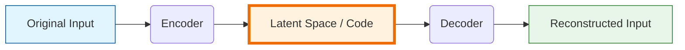

An **Autoencoder** is a type of artificial neural network used to learn efficient data codings in an unsupervised manner. The aim is to learn a compressed representation (encoding) for a set of data, typically for dimensionality reduction or feature learning.

## 1. The Architecture: "The Hourglass"

An autoencoder consists of two main parts connected by a "bottleneck":

1.  **The Encoder:** This part of the network compresses the input into a latent-space representation. It reduces the input dimensions layer by layer.
2.  **The Code (Bottleneck):** This is the hidden layer that contains the compressed representation of the input data. It is the "knowledge" extracted from the input.
3.  **The Decoder:** This part of the network tries to reconstruct the original input from the compressed code.

### The Learning Flow


## 2. The Loss Function: Reconstruction Loss

The autoencoder is trained to minimize the difference between the **Input** and the **Reconstruction**. Since we want the output to be as close to the input as possible, we use a loss function like **Mean Squared Error (MSE)**.

$$
L(x, \hat{x}) = ||x - \hat{x}||^2
$$

Where:

* $x$ is the original input.
* $\hat{x}$ is the reconstructed output from the decoder.

The network is forced to prioritize the most important features of the data because the "bottleneck" (Code) doesn't have enough capacity to store everything.

## 3. Autoencoders vs. PCA

| Feature | PCA | Autoencoder |
| --- | --- | --- |
| **Mapping** | Linear | Non-Linear (via activation functions) |
| **Complexity** | Simple / Fast | Complex / Resource Intensive |
| **Features** | Principal Components (Orthogonal) | Latent Variables (Flexible) |
| **Use Case** | Tabular data / Simple compression | Image, Audio, and Complex patterns |

### 3.1 Visual Comparison

```mermaid
graph LR
    X["$$X \in \mathbb{R}^{n \times d}$$<br/>$$\text{Input Data}$$"]

    %% PCA Path
    X --> PCA["PCA"]

    PCA --> P1["$$Z = XV_k$$<br/>$$\text{Linear Projection}$$"]
    P1 --> P2["$$\hat{X} = ZV_k^\top$$<br/>$$\text{Linear Reconstruction}$$"]
    P2 --> P3["$$\min \|X - \hat{X}\|_2^2$$"]
    P3 --> P4["$$\text{Captures Linear Variance}$$"]
    P4 --> P5["$$\text{Fails on Non-Linear Manifolds}$$"]

    %% Autoencoder Path
    X --> AE["Autoencoder"]

    AE --> E["$$Z = f_\theta(X)$$<br/>$$\text{Non-Linear Encoder}$$"]
    E --> D["$$\hat{X} = g_\phi(Z)$$<br/>$$\text{Non-Linear Decoder}$$"]
    D --> L["$$\min \|X - \hat{X}\|_2^2$$"]
    L --> A1["$$\text{Learns Complex Manifolds}$$"]
    A1 --> A2["$$\text{Better Reconstruction for Non-Linear Data}$$"]

    P5 -.->|"$$\text{Comparison}$$"| A2

```



**In this diagram:**

* PCA uses linear transformations to reduce and reconstruct data, which works well for linearly correlated features.
* Autoencoders use non-linear functions (neural networks) to capture complex patterns, making them more powerful for intricate datasets.

## 4. Common Types of Autoencoders

* **Denoising Autoencoder:** Trained to ignore "noise" by receiving a corrupted input and trying to reconstruct the clean version.
* **Sparse Autoencoder:** Uses a penalty in the loss function to ensure only a few neurons in the bottleneck are "active" at once.
* **Variational Autoencoder (VAE):** Instead of learning a fixed code, it learns a probability distribution of the latent space. (Great for generating new data!)

## 5. Practical Implementation (Keras/TensorFlow)

```python
import tensorflow as tf
from tensorflow.keras import layers, losses

# 1. Define the Encoder
encoder = tf.keras.Sequential([
    layers.Input(shape=(784,)),
    layers.Dense(128, activation='relu'),
    layers.Dense(64, activation='relu'),
    layers.Dense(32, activation='relu'), # The Bottleneck
])

# 2. Define the Decoder
decoder = tf.keras.Sequential([
    layers.Dense(64, activation='relu'),
    layers.Dense(128, activation='relu'),
    layers.Dense(784, activation='sigmoid'), # Reconstruct to original size
])

# 3. Create the Autoencoder
autoencoder = tf.keras.Model(inputs=encoder.input, outputs=decoder(encoder.output))
autoencoder.compile(optimizer='adam', loss=losses.MeanSquaredError())

# 4. Train (Notice: x_train is both input and target!)
autoencoder.fit(x_train, x_train, epochs=10, shuffle=True)

```

## 6. Real-World Applications

1. **Anomaly Detection:** If an autoencoder is trained on "normal" data, it will fail to reconstruct "anomalous" data correctly. A high reconstruction error indicates an anomaly.
2. **Image Denoising:** Removing grain or artifacts from photos.
3. **Dimensionality Reduction:** For visualization or speeding up other ML models.

## References for More Details

* **TensorFlow Tutorial: Intro to Autoencoders:**
* [Link](https://www.tensorflow.org/tutorials/generative/autoencoder)
* *Best for:* Step-by-step code examples for denoising and anomaly detection.

---

**Autoencoders are the bridge between Unsupervised Learning and Deep Learning. Ready to see how we evaluate all these different models?**