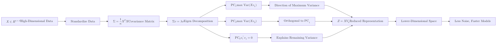

**Principal Component Analysis (PCA)** is a statistical technique used to simplify complex datasets. It transforms a large set of variables into a smaller one that still contains most of the information (variance) from the original set.

Think of PCA as taking a 3D object and finding the perfect angle to take a 2D photo of it so that you can still tell exactly what the object is.

## 1. How PCA Works (The Intuition)

PCA finds new "axes" for your data called **Principal Components (PCs)**.
* **PC1:** The direction in space along which the data varies the most.
* **PC2:** The direction orthogonal (perpendicular) to PC1 that captures the next highest amount of variation.

### The Step-by-Step Logic

1.  **Standardize the Data:** PCA is sensitive to the scale of the data, so we standardize features to have a mean of 0 and a standard deviation of 1.
2.  **Compute the Covariance Matrix:** This matrix shows how features vary together.
3.  **Calculate Eigenvalues and Eigenvectors:** These help identify the directions (eigenvectors) where the data varies the most (eigenvalues).
4.  **Sort and Select Principal Components:** We sort the eigenvalues in descending order and select the top `k` eigenvectors to form a new feature space.

**Now let's visualize this process:**



**In this diagram:**

* We start with high-dimensional data $X$.
* We standardize it and compute the covariance matrix $\Sigma$.
* We perform eigen decomposition to find eigenvalues and eigenvectors.
* We identify the principal components $(PC_1, PC_2, ..., PC_k)$.
* Finally, we project the data onto the new lower-dimensional space $Z$.

## 2. The Mathematical Foundation

To perform PCA, we solve for the **Eigenvectors** of the covariance matrix.

### Step 1: Covariance Matrix ($\Sigma$)

If we have a standardized matrix $X$, the covariance matrix is calculated as:

$$
\Sigma = \frac{1}{n-1} X^T X
$$
Where:

* **$\Sigma$**: Covariance Matrix (measures how features vary together).
* **$X^T$**: Transpose of the standardized data matrix.
* **$n$**: Number of samples.

### Step 2: Eigenvalue Decomposition

We find the Eigenvectors ($v$) and Eigenvalues ($\lambda$) such that:

$$
\Sigma v = \lambda v
$$

Where:

* **Eigenvectors ($v$):** Define the direction of the new axes (Principal Components).
* **Eigenvalues ($\lambda$):** Define the magnitude (how much variance) is captured in that direction.

## 3. The Explained Variance Ratio

When you reduce dimensions, you lose some information. We measure this using the **Explained Variance Ratio**. If PC1 explains 70% of the variance and PC2 explains 20%, using both allows you to represent 90% of the original data complexity in just two variables.

## 4. Implementation with Scikit-Learn

```python
from sklearn.decomposition import PCA
from sklearn.preprocessing import StandardScaler

# 1. PCA is extremely sensitive to scale!
scaler = StandardScaler()
X_scaled = scaler.fit_transform(X)

# 2. Initialize PCA
# n_components can be an integer (2) or a percentage (0.95)
pca = PCA(n_components=2)

# 3. Fit and Transform the data
X_pca = pca.fit_transform(X_scaled)

# 4. Check how much information was kept
print(f"Explained Variance: {pca.explained_variance_ratio_}")

```

## 5. Pros and Cons

| Advantages | Disadvantages |
| --- | --- |
| **Removes Noise:** By dropping low-variance components, you remove random fluctuations. | **Loss of Interpretability:** The new "PCs" are combinations of features; they no longer have "real world" names. |
| **Visualization:** Turns 100+ dimensions into a 2D plot you can actually see. | **Linearity:** PCA assumes relationships are linear. It fails on curved structures. |
| **Efficiency:** Speeds up training for other algorithms by reducing feature count. | **Scaling Sensitive:** If you don't scale your data, PCA will focus on the features with the largest units. |

## 6. When to use PCA?

1. **High Dimensionality:** When you have too many features and your model is overfitting.
2. **Multicollinearity:** When your features are highly correlated with each other.
3. **Visualization:** When you need to plot high-dimensional clusters on a graph.

## References for More Details

* **[Scikit-Learn PCA Documentation](https://scikit-learn.org/stable/modules/generated/sklearn.decomposition.PCA.html):** Learning about `IncrementalPCA` for datasets too large for memory.

---

**PCA is amazing for linear structures. But what if your data is twisted or curved? For visualizing complex, non-linear patterns (like the "Swiss Roll"), we use a different tool.**