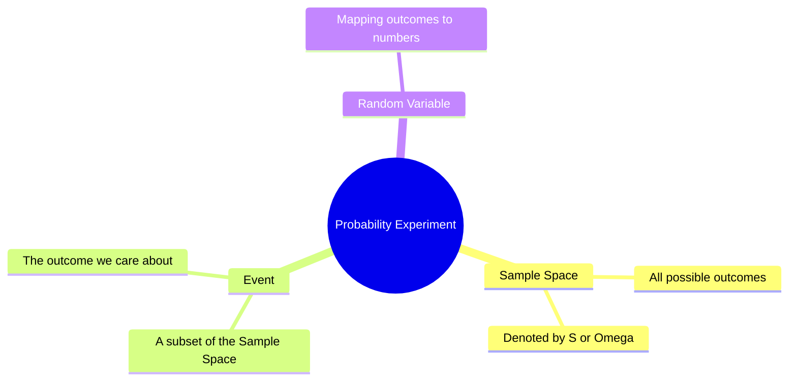
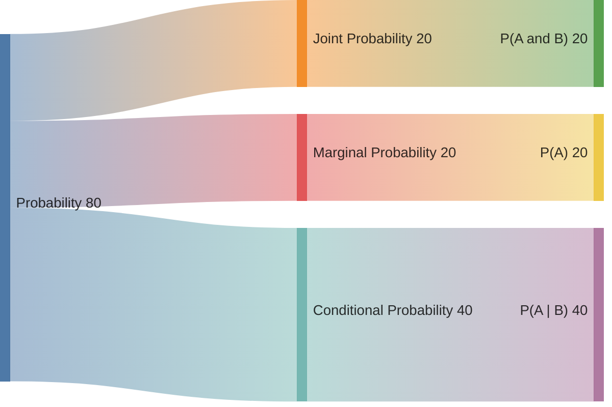

In Machine Learning, we never have perfect information. Data is noisy, sensors are imperfect, and the future is uncertain. **Probability** is the mathematical framework we use to quantify this uncertainty.

## 1. Key Terminology

Before we calculate anything, we must define the "world" we are looking at.

* **Experiment:** An action with an uncertain outcome (e.g., classifying an image).
* **Sample Space ($S$):** The set of all possible outcomes. For a coin flip, $S = \{Heads, Tails\}$.
* **Event (A):** A specific outcome or set of outcomes. For a die roll, an event could be "rolling an even number" ($A = \{2, 4, 6\}$).

## 2. The Three Axioms of Probability

To ensure our probability system is consistent, it must follow these three rules defined by Kolmogorov:

1. **Non-negativity:** The probability of any event A is at least 0.
$P(A) \ge 0$
2. **Certainty:** The probability of the entire sample space S is exactly 1.
P(S) = 1
3. **Additivity:** For mutually exclusive events (events that cannot happen at the same time), the probability of their union is the sum of their probabilities.
$P(A \cup B) = P(A) + P(B)$

## 3. Calculating Probability

In the simplest case (where every outcome is equally likely), probability is a ratio of counting:

$$
P(A) = \frac{\text{Number of favorable outcomes}}{\text{Total number of outcomes in } S}
$$

### Complement Rule

The probability that an event **does not** occur is 1 minus the probability that it does.

$$
P(A^c) = 1 - P(A)
$$

## 4. Types of Probability

 

 

* **Marginal Probability:** The probability of an event occurring ($P(A)$), regardless of other variables.
* **Joint Probability:** The probability of two events occurring at the same time ($P(A \cap B)$).
* **Conditional Probability:** The probability of event A occurring **given** that B has already occurred ($P(A|B)$).

## 5. Why Probability is the "Heart" of ML

Machine Learning models are essentially **probabilistic estimators**.

* **Classification:** When a model says an image is a "cat," it is actually saying: $P(\text{Class} = \text{Cat} \mid \text{Pixels}) = 0.94$.
* **Generative AI:** Large Language Models (LLMs) like GPT predict the "next token" by calculating the probability distribution of all possible words.
* **Anomaly Detection:** We flag data points that have a very low probability of occurring based on the training distribution.

---

Knowing the basics is just the start. In ML, we often need to update our beliefs as new data comes in. This brings us to one of the most famous formulas in all of mathematics.