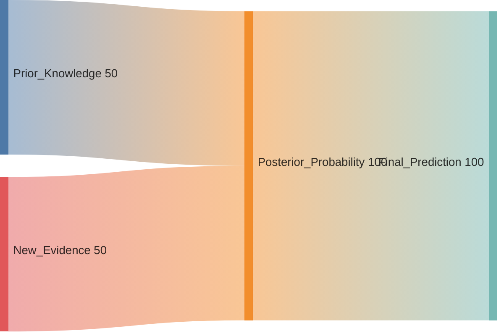

**Bayes' Theorem** is more than just a formula; it is a philosophy of how to learn. It describes the probability of an event based on prior knowledge of conditions that might be related to the event. In Machine Learning, it is the engine behind **Bayesian Inference** and the **Naive Bayes** classifier.

## 1. The Formula

Bayes' Theorem allows us to find $P(A|B)$ if we already know $P(B|A)$.

$$
P(A|B) = \frac{P(B|A) \cdot P(A)}{P(B)}
$$

### Breaking Down the Terms

* **$P(A|B)$ (Posterior):** The probability of our hypothesis $A$ *after* seeing the evidence $B$.
* **$P(B|A)$ (Likelihood):** The probability of the evidence $B$ appearing *given* that hypothesis $A$ is true.
* **$P(A)$ (Prior):** Our initial belief about hypothesis $A$ *before* seeing any evidence.
* **$P(B)$ (Evidence/Marginal Likelihood):** The total probability of seeing evidence $B$ under all possible hypotheses.

## 2. The Logic of Bayesian Updating

Bayesian logic is iterative. Today's **Posterior** becomes tomorrow's **Prior**.

 

 

 

## 3. A Practical Example: Medical Testing

Suppose a disease affects **1%** of the population (Prior). A test for this disease is **99%** accurate (Likelihood). If a patient tests positive, what is the probability they actually have the disease?

1. $P(\text{Disease}) = 0.01$
2. $P(\text{Pos} | \text{Disease}) = 0.99$
3. $P(\text{Pos} | \text{No Disease}) = 0.01 (False Positive rate)$

### Using Bayes' Theorem:

Even with a 99% accurate test, the probability of having the disease given a positive result is only **50%**. This is because the disease is so rare (low Prior) that the number of false positives equals the number of true positives.

## 4. Bayes' Theorem in Machine Learning

### A. Naive Bayes Classifier

Naive Bayes is a popular algorithm for text classification (like spam detection). It assumes that every feature (word) is independent of every other feature (the "Naive" part) and uses Bayes' Theorem to calculate the probability of a category:

$$ 
P(\text{Spam} | \text{Words}) \propto P(\text{Words} | \text{Spam}) P(\text{Spam}) 
$$

### B. Bayesian Neural Networks

Unlike standard neural networks that have fixed weights, Bayesian Neural Networks represent weights as **probability distributions**. This allows the model to express **uncertainty**, it can say "I think this is a cat, but I'm only 60% sure."

### C. Hyperparameter Optimization

**Bayesian Optimization** is a strategy used to find the best hyperparameters for a model. It builds a probability model of the objective function and uses it to select the most promising hyperparameters to evaluate next.

## 5. Summary Table

| Concept | Traditional (Frequentist) | Bayesian |
| --- | --- | --- |
| **View of Probability** | Long-run frequency of events. | Measure of "degree of belief." |
| **Parameters** | Fixed, unknown constants. | Random variables with distributions. |
| **New Data** | Used to refine the estimate. | Used to update the entire belief (Prior \to Posterior). |

---

Now that we can update our beliefs using Bayes' Theorem, we need to understand how these probabilities are spread across different outcomes. This brings us to Random Variables and Probability Distributions.