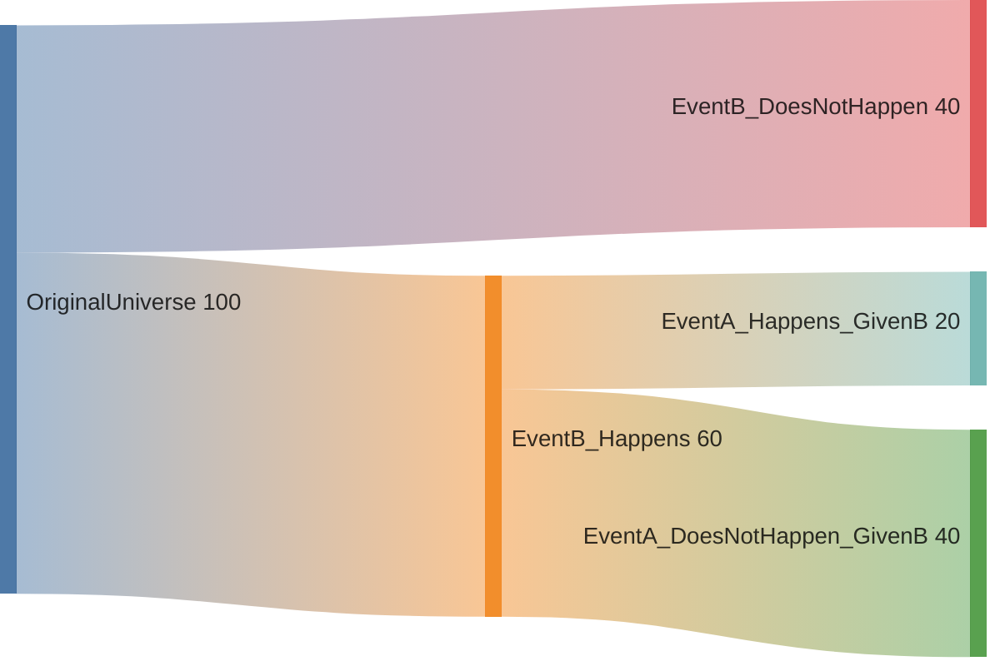
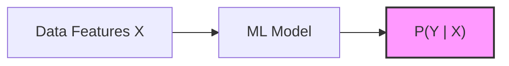

In the real world, events are rarely isolated. The probability of it raining is higher **given** that it is cloudy. The probability of a user clicking an ad is higher **given** their past search history. This "given" is the essence of **Conditional Probability**.

## 1. The Definition

Conditional probability is the probability of an event $A$ occurring, given that another event $B$ has already occurred. It is denoted as $P(A|B)$.

The formula is:

$$
P(A|B) = \frac{P(A \cap B)}{P(B)}
$$

Where:
* $P(A \cap B)$ is the **Joint Probability** (both $A$ and $B$ happen).
* $P(B)$ is the probability of the condition (the "new universe").

## 2. Intuition: Shrinking the Universe

Think of probability as a "Universe" of possibilities. When we say "given $B$," we are throwing away every part of the universe where $B$ did not happen. Our new total area is just $B$.

 

 

## 3. Independent vs. Dependent Events

How do we know if one event affects another? We look at their conditional probabilities.

### A. Independent Events

Event A and B are independent if the occurrence of B provides **zero** new information about $A$.

* **Mathematical Check:** $P(A|B) = P(A)$
* **Example:** Rolling a 6 on a die given that you ate an apple for breakfast.

### B. Dependent Events

Event A and B are dependent if knowing B happened changes the likelihood of $A$.

* **Mathematical Check:** $P(A|B) \neq P(A)$
* **Example:** Having a cough $(A)$ given that you have a cold $(B)$.

## 4. The Multiplication Rule

We can rearrange the conditional probability formula to find the probability of both events happening:

This is the foundation for the **Chain Rule of Probability**, which allows ML models to calculate the probability of a long sequence of events (like a sentence in an LLM).

## 5. Application: Predictive Modeling

In Machine Learning, almost every prediction is a conditional probability.

* **Medical Diagnosis:** $P(\text{Disease} \mid \text{Symptoms})$
* **Spam Filter:** $P(\text{Spam} \mid \text{Words in Email})$
* **Self-Driving Cars:** $P(\text{Pedestrian crosses} \mid \text{Camera Image})$

---

If we flip the question—if we know $P(A|B)$ but we want to find $P(B|A)$ we use the most powerful tool in probability theory.