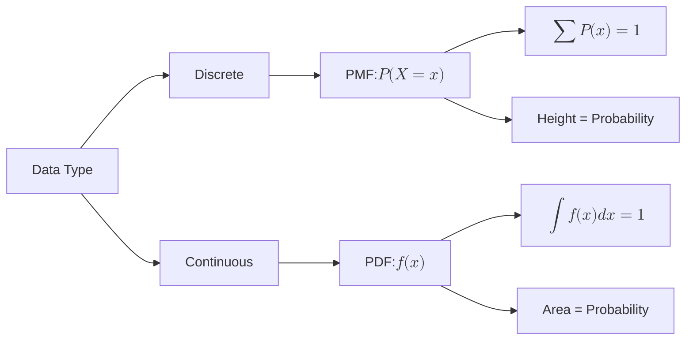
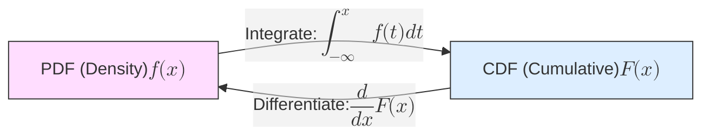

To work with data in Machine Learning, we need a mathematical way to describe how likely different values are to occur. Depending on whether our data is **Discrete** (countable) or **Continuous** (measurable), we use either a **PMF** or a **PDF**.

## 1. Probability Mass Function (PMF)

The **PMF** is used for discrete random variables. It gives the probability that a discrete random variable is exactly equal to some value.

### Key Mathematical Properties:
1.  **Direct Probability:** $P(X = x) = f(x)$. The "height" of the bar is the actual probability.
2.  **Summation:** All individual probabilities must sum to 1.
    $$ 
    \sum_{i} P(X = x_i) = 1 
    $$
3.  **Range:** $0 \le P(X = x) \le 1$.

**Example:** If you roll a fair die, the PMF is $1/6$ for each value $\{1, 2, 3, 4, 5, 6\}$. There is no "1.5" or "2.7"; the probability exists only at specific points.

## 2. Probability Density Function (PDF)

The **PDF** is used for continuous random variables. Unlike the PMF, the "height" of a PDF curve does **not** represent probability; it represents **density**.

### The "Zero Probability" Paradox
In a continuous world (like height or time), the probability of a variable being *exactly* a specific number (e.g., exactly $175.00000...$ cm) is effectively **0**. 

Instead, we find the probability over an **interval** by calculating the **area under the curve**.

### Key Mathematical Properties:
1.  **Area is Probability:** The probability that $X$ falls between $a$ and $b$ is the integral of the PDF:
    $$ 
    P(a \le X \le b) = \int_{a}^{b} f(x) dx 
    $$
2.  **Total Area:** The total area under the entire curve must equal 1.
    $$ 
    \int_{-\infty}^{\infty} f(x) dx = 1 
    $$
3.  **Density vs. Probability:** $f(x)$ can be greater than 1, as long as the total area remains 1.

## 3. Comparison at a Glance

| Feature | PMF (Discrete) | PDF (Continuous) |
| --- | --- | --- |
| **Variable Type** | Countable (Integers) | Measurable (Real Numbers) |
| **Probability at a point** | $P(X=x) = \text{Height}$ | $P(X=x) = 0$ |
| **Probability over range** | Sum of heights | Area under the curve (Integral) |
| **Visualization** | Bar chart / Stem plot | Smooth curve |

---

## 4. The Bridge: Cumulative Distribution Function (CDF)

The **CDF** is the "running total" of probability. It tells you the probability that a variable is **less than or equal to** $x$.

* **For PMF:** It is a step function (it jumps at every discrete value).
* **For PDF:** It is a smooth S-shaped curve.

$$ 
F(x) = P(X \le x) 
$$

## 5. Why this matters in Machine Learning

1. **Likelihood Functions:** When training models (like Logistic Regression), we maximize the **Likelihood**. For discrete labels, this uses the PMF; for continuous targets, it uses the PDF.
2. **Anomaly Detection:** We often flag a data point as an outlier if its PDF value (density) is below a certain threshold.
3. **Generative Models:** VAEs and GANs attempt to learn the underlying **PDF** of a dataset so they can sample new points from high-density regions (creating realistic images or text).

---

Now that you understand how we describe probability at a point or over an area, it's time to meet the most important distribution in all of data science.