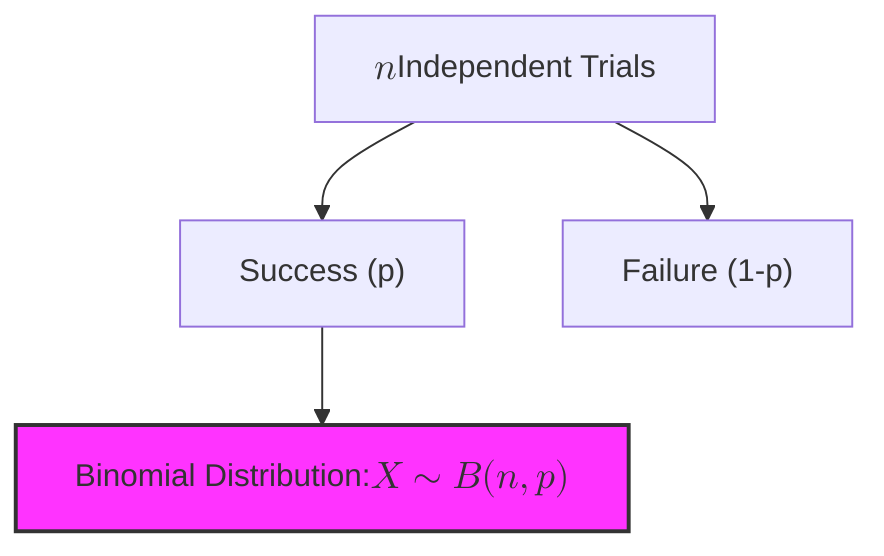
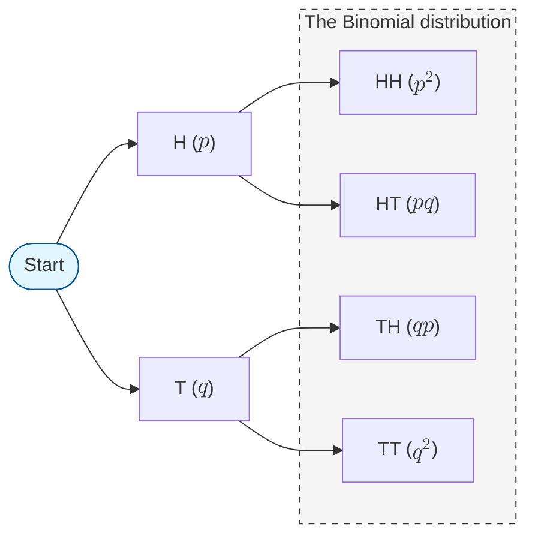

In Machine Learning, we often ask "Yes/No" questions: Will a user click this ad? Is this transaction fraudulent? Does the image contain a cat? These binary outcomes are modeled using the **Bernoulli** and **Binomial** distributions.

## 1. The Bernoulli Distribution

A **Bernoulli Distribution** is the simplest discrete distribution. It represents a single trial with exactly two possible outcomes: **Success** (1) and **Failure** (0).

### The Math
If $p$ is the probability of success, then $1-p$ (often denoted as $q$) is the probability of failure.

$$
P(X = x) = p^x (1-p)^{1-x} \quad \text{for } x \in \{0, 1\}
$$

* **Mean ($\mu$):** $p$
* **Variance ($\sigma^2$):** $p(1-p)$

## 2. The Binomial Distribution

The **Binomial Distribution** is the sum of $n$ independent Bernoulli trials. It tells us the probability of getting exactly $k$ successes in $n$ attempts.

### The 4 Conditions (B.I.N.S.)
For a variable to follow a Binomial distribution, it must meet these criteria:
1. **Binary:** Only two outcomes per trial (Success/Failure).
2. **Independent:** The outcome of one trial doesn't affect the next.
3. **Number:** The number of trials ($n$) is fixed in advance.
4. **Same:** The probability of success ($p$) is the same for every trial.

### The Formula
The Probability Mass Function (PMF) is:

$$
P(X = k) = \binom{n}{k} p^k (1-p)^{n-k}
$$

Where $\binom{n}{k}$ is the "n-choose-k" combination formula: $\frac{n!}{k!(n-k)!}$.

 

## 3. Visualizing the Trials

If we have $n=3$ trials, the possible outcomes can be visualized as a tree. The Binomial distribution simply groups these outcomes by the total number of successes.

 

## 4. Why this matters in Machine Learning

### A. Binary Classification

When you train a Logistic Regression model, you are essentially assuming your target variable follows a **Bernoulli distribution**. The model outputs the parameter $p$ (the probability of the positive class).

### B. Evaluation (A/B Testing)

If you show an ad to $1,000$ people ($n$) and $50$ click it, you use the Binomial distribution to calculate the confidence interval of your click-through rate.

### C. Logistic Loss (Cross-Entropy)

The "Loss Function" used in most neural networks is derived directly from the likelihood of a Bernoulli distribution. Minimizing this loss is equivalent to finding the p that best fits your binary data.

$$
\text{Loss} = -\frac{1}{n} \sum [y \log(p) + (1-y) \log(1-p)]
$$

## 5. Summary Table

| Feature | Bernoulli | Binomial |
| --- | --- | --- |
| **Number of Trials** | $1$ | $n$ |
| **Outcomes** | $0$ or $1$| $0$, $1$, $2$, $\dots$, $n$ |
| **Mean** | $p$ | $np$ |
| **Variance** | $p(1-p)$ | $np(1-p)$ |

---

The Binomial distribution covers discrete successes. But what if we are counting the number of events happening over a fixed interval of time or space? For that, we turn to the Poisson distribution.