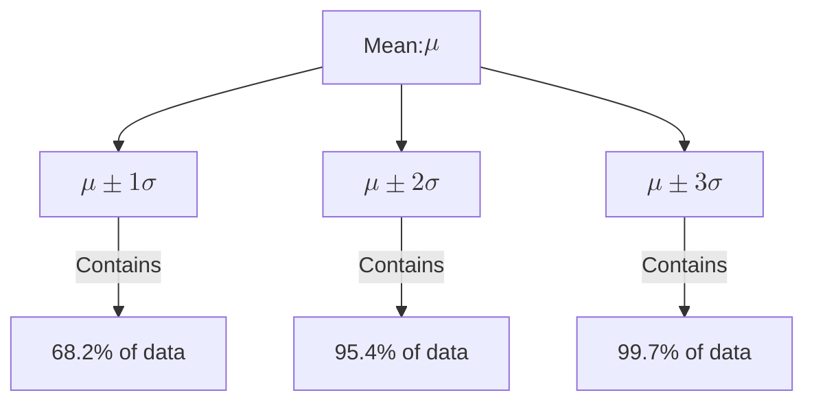

The **Normal Distribution**, often called the **Gaussian Distribution**, is the most significant probability distribution in statistics and Machine Learning. It is characterized by its iconic symmetric "bell shape," where most observations cluster around the central peak.

## 1. The Mathematical Definition

A continuous random variable $X$ is said to be normally distributed with mean $\mu$ and variance $\sigma^2$ (denoted as $X \sim \mathcal{N}(\mu, \sigma^2)$) if its Probability Density Function (PDF) is:

$$
f(x) = \frac{1}{\sigma\sqrt{2\pi}} e^{-\frac{1}{2}\left(\frac{x-\mu}{\sigma}\right)^2}
$$

### Key Parameters:
* **Mean ($\mu$):** Determines the center of the peak (location).
* **Standard Deviation ($\sigma$):** Determines the "spread" or width of the bell (scale).

## 2. The Empirical Rule (68-95-99.7)

One of the most useful properties of the Normal Distribution is that we know exactly how much data falls within specific distances from the mean.

## 3. The Standard Normal Distribution (Z)

A **Standard Normal Distribution** is a special case where the mean is 0 and the standard deviation is $1$.

$$ 
Z \sim \mathcal{N}(0, 1) 
$$

We can convert any normal distribution into a standard one using the **Z-score formula**. This process is called **Standardization**, a critical step in ML feature engineering.

$$
z = \frac{x - \mu}{\sigma}
$$

## 4. The Central Limit Theorem (CLT)

Why is the Normal Distribution so "normal"? Because of the **Central Limit Theorem**.

> **CLT:** If you take many independent random samples from *any* distribution and calculate their mean, the distribution of those means will approach a Normal Distribution as the sample size increases.

This is why we assume errors in measurement or noise in data follow a Gaussian distribution—they are usually the sum of many small, independent random effects.

## 5. Why Normal Distribution is the "King" of ML

1. **Algorithm Assumptions:** Many models, like **Linear Regression** and **Logistic Regression**, assume that the residual errors are normally distributed.
2. **Gaussian Naive Bayes:** This classifier assumes that the continuous features associated with each class are normally distributed.
3. **Weight Initialization:** In Deep Learning, we often initialize neural network weights using a truncated normal distribution (like **He initialization** or **Xavier initialization**) to prevent gradients from exploding or vanishing.
4. **Gaussian Processes:** A powerful family of models used for regression and optimization that relies entirely on multivariate normal distributions.

## 6. Summary Comparison

| Feature | Description |
| --- | --- |
| **Symmetry** | Perfectly symmetric around the mean. |
| **Measures of Center** | Mean = Median = Mode. |
| **Asymptotic** | The tails approach but never touch the horizontal axis (x). |
| **Total Area** | Exactly equal to 1. |

---

The Normal Distribution handles continuous data perfectly. But what if we are counting successes and failures in discrete steps? For that, we turn to the Binomial and Bernoulli distributions.