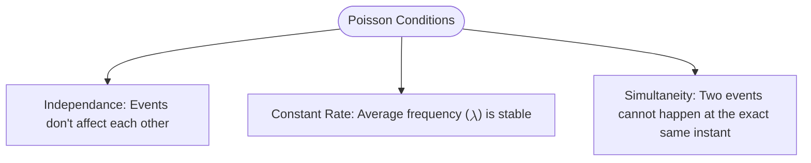

While the Binomial distribution counts successes in a fixed number of **trials**, the **Poisson Distribution** counts the number of times an event occurs in a fixed **interval** of time or space. 

## 1. What defines a Poisson Process?

For a variable to follow a Poisson distribution, it must meet three specific criteria:

## 2. The Mathematical Formula

The Probability Mass Function (PMF) of a Poisson distribution tells us the probability of observing $k$ events in an interval, given the average rate $\lambda$ (Lambda).

$$
P(X = k) = \frac{e^{-\lambda} \lambda^k}{k!}
$$

### Key Parameters:

* **$\lambda$ (Lambda):** The average number of events per interval.
* **$k$:** The actual number of occurrences we want to find the probability for ($0, 1, 2, \dots$).
* **$e$:** Euler's constant ($\approx 2.718$).

### Properties:

* **Mean ($\mu$):** $\lambda$
* **Variance ($\sigma^2$):** $\lambda$

:::tip Unique Property
The Poisson distribution is unique because its **Mean and Variance are equal**. If your data's variance is much higher than its mean (Overdispersion), a simple Poisson model might not be enough!
:::

## 3. Poisson as the "Limit" of Binomial

The Poisson distribution is actually a special case of the Binomial distribution. When you have a massive number of trials ($n \to \infty$) and a very small probability of success ($p \to 0$), the Binomial distribution $B(n, p)$ turns into a Poisson distribution $P(\lambda)$ where $\lambda = np$.

## 4. Why this matters in Machine Learning

### A. Modeling Rare Events

Poisson is used to model things like the number of credit card frauds per day or the number of times a server crashes in a month. These are "rare" relative to the total number of opportunities for them to happen.

### B. Natural Language Processing (NLP)

In some classical NLP models, the frequency of a rare keyword in a document is modeled using a Poisson distribution. This helps in identifying if a word appears more often than "random chance" would suggest.

### C. Traffic Prediction

Predicting the number of queries reaching a database or the number of users logging into an app in a specific minute. This is vital for **Auto-scaling** infrastructure in cloud computing.

### D. Poisson Regression

This is a type of Generalized Linear Model (GLM) used when the target variable ($y$) is a **count** (e.g., predicting the number of insurance claims or the number of items sold).

---

## 5. Summary Comparison

| Feature | Binomial | Poisson |
| --- | --- | --- |
| **Interval** | Fixed number of trials ($n$) | Fixed unit of time/space |
| **Outcomes** | Binary (Success/Failure) | Non-negative counts ($0, 1, \dots$) |
| **Key Parameter** | $p$ (Probability) | $\lambda$ (Average rate) |
| **Limit** | $n$ is finite | $n$ is infinite (theoretically) |

---

Now that we've covered the most important discrete and continuous distributions, how do we use them to actually evaluate a model's performance? We need to look at how we measure the distance between two distributions.