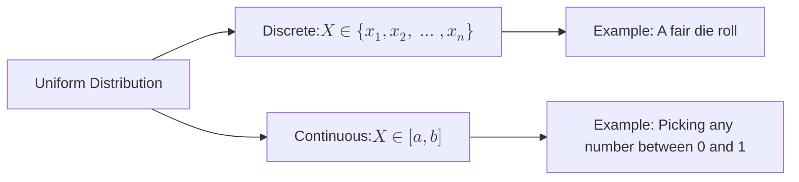

The **Uniform Distribution** is the simplest probability distribution. It describes a scenario where every possible outcome is equally likely to occur. In Machine Learning, it is the bedrock of random number generation and the initial state of many neural networks.

## 1. Two Flavors of Uniformity

We distinguish between the Uniform distribution based on whether the data is countable (Discrete) or measurable (Continuous).

## 2. Discrete Uniform Distribution

A discrete random variable $X$ has a uniform distribution if each of the $n$ values in its range has the same probability.

### The Math

$$ 
P(X = x) = \frac{1}{n} 
$$

* **Mean ($\mu$):** $\frac{a + b}{2}$
* **Variance ($\sigma^2$):** $\frac{n^2 - 1}{12}$ (for consecutive integers)

## 3. Continuous Uniform Distribution

A continuous random variable X on the interval [a, b] has a uniform distribution if its probability density is constant across that interval.

### The Math

The Probability Density Function (PDF) is:

$$
f(x) = \begin{cases} \frac{1}{b - a} & \text{for } a \le x \le b \\ 0 & \text{otherwise} \end{cases}
$$

### Key Properties:

* **Mean ($\mu$):** $\frac{a + b}{2}$ (The midpoint of the interval)
* **Variance ($\sigma^2$):** $\frac{(b - a)^2}{12}$

:::info The "Rectangle" Distribution
Because the height is constant ($1/(b-a)$) and the width is ($b-a$), the total area is always 1. This is why the continuous uniform distribution is often visualized as a perfect rectangle.
:::

## 4. Why this matters in Machine Learning

### A. Weight Initialization

When we start training a Neural Network, we cannot set all weights to zero (this causes symmetry problems). Instead, we often initialize weights using a **Uniform Distribution** (e.g., between $-0.05$ and $0.05$) to give each neuron a unique starting point.

### B. Random Sampling and Shuffling

When we "shuffle" a dataset before training, we are using a discrete uniform distribution to ensure that every row has an equal probability of appearing in any given position in the batch.

### C. Data Augmentation

In computer vision, we might rotate an image by a random angle. We typically pick that angle from a continuous uniform distribution, such as $\text{Angle} \sim \mathcal{U}(-20^\circ, 20^\circ)$, to ensure we aren't biasing the model toward specific rotations.

### D. Hyperparameter Search (Random Search)

Instead of checking every single value (Grid Search), **Random Search** picks hyperparameter values from a uniform distribution. Statistically, this is often more efficient at finding the optimal "needle in the haystack."

## 5. Summary Table

| Feature | Discrete Uniform | Continuous Uniform |
| --- | --- | --- |
| **Notation** | $X \sim \mathcal{U}(n)$ | $X \sim \mathcal{U}(a, b)$ |
| **Height** | $1/n$ (Probability) | $1/(b-a)$ (Density) |
| **Shape** | Set of equal-height dots/bars | A flat rectangle |
| **Common Use** | Shuffling, Dice, Indices | Weight initialization, Augmentation |

---

We have now covered the "Big Four" distributions: Normal, Binomial, Poisson, and Uniform. But how do we measure the "distance" between these distributions or the "information" they contain?