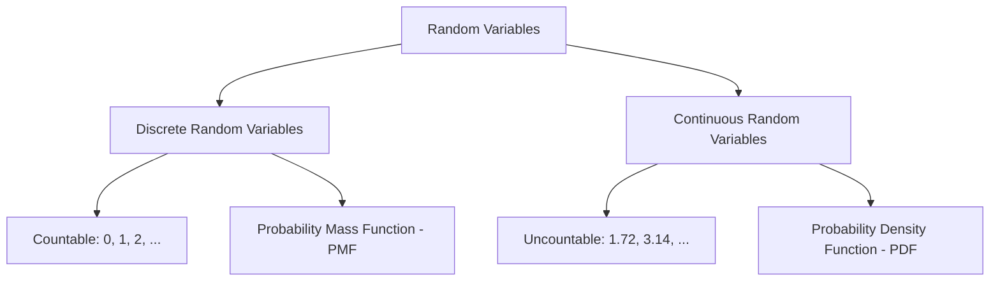

In probability, a **Random Variable (RV)** is a functional mapping that assigns a numerical value to each outcome in a sample space. It allows us to move from qualitative outcomes (like "Rain" or "No Rain") to quantitative data that we can feed into a Machine Learning model.

## 1. What exactly is a Random Variable?

A random variable is **not** a variable in the algebraic sense (where $x = 5$). Instead, it is a **function** that maps the sample space $S$ to the real numbers $\mathbb{R}$.

**Example:** If you flip two coins, the sample space is $\{HH, HT, TH, TT\}$. 
We can define a Random Variable $X$ as the "Number of Heads."
* $X(HH) = 2$
* $X(HT) = 1$
* $X(TT) = 0$

## 2. Types of Random Variables

Machine Learning handles two distinct types of data, which correspond to the two types of random variables:

### A. Discrete Random Variables

These take on a finite or countably infinite number of distinct values.

* **ML Example:** The number of clicks on an ad, the number of words in a sentence.
* **Function:** Uses a **Probability Mass Function (PMF)**, $P(X = x)$.

### B. Continuous Random Variables

These can take any value within a range or interval.

* **ML Example:** The probability that a house will sell for a specific price, the weight of a person.
* **Function:** Uses a **Probability Density Function (PDF)**, $f(x)$.

:::warning Important Distinction
For a continuous variable, the probability of the variable being **exactly** one specific number (e.g., $P(X = 1.700000...)$) is always **$0$**. Instead, we calculate the probability over an **interval**.
:::

---

## 3. Describing Distributions

To understand the behavior of a Random Variable, we use three primary functions:

| Function | Symbol | Purpose |
| --- | --- | --- |
| **PMF / PDF** | $P(X)$ or $f(x)$ | The probability (or density) of a specific value. |
| **CDF** | $F(x)$ | The probability that $X$ will be **less than or equal to** $x$. |
| **Expected Value** | $\mathbb{E}[X]$ | The "long-term average" or center of the distribution. |

### The Cumulative Distribution Function (CDF)

The CDF is defined for both discrete and continuous variables:

$$ 
F(x) = P(X \le x) 
$$

## 4. Expected Value and Variance

In Machine Learning, we often want to know the "typical" value of a feature and how much it varies.

### Expected Value (Mean)

The weighted average of all possible values.

* **Discrete:** $\mathbb{E}[X] = \sum x P(x)$
* **Continuous:** $\mathbb{E}[X] = \int_{-\infty}^{\infty} x f(x) dx$

### Variance

Measures the "spread" or "risk" of the random variable. It tells us how much the values typically deviate from the mean.

$$ 
\text{Var}(X) = \mathbb{E}[(X - \mu)^2] 
$$

## 5. Why Random Variables Matter in ML

1. **Features and Targets:** In the equation $y = f(x) + \epsilon$, $x$ and $y$ are random variables, and \epsilon (noise) is a random variable representing uncertainty.
2. **Loss Functions:** When we minimize a loss function, we are often trying to minimize the **Expected Value** of the error.
3. **Sampling:** Techniques like **Monte Carlo Dropout** or **Variational Autoencoders (VAEs)** rely on sampling from random variables to generate new data or estimate uncertainty.

---

Now that we understand how to turn events into numbers, we can look at common patterns these numbers follow. This leads us into specific Probability Distributions.