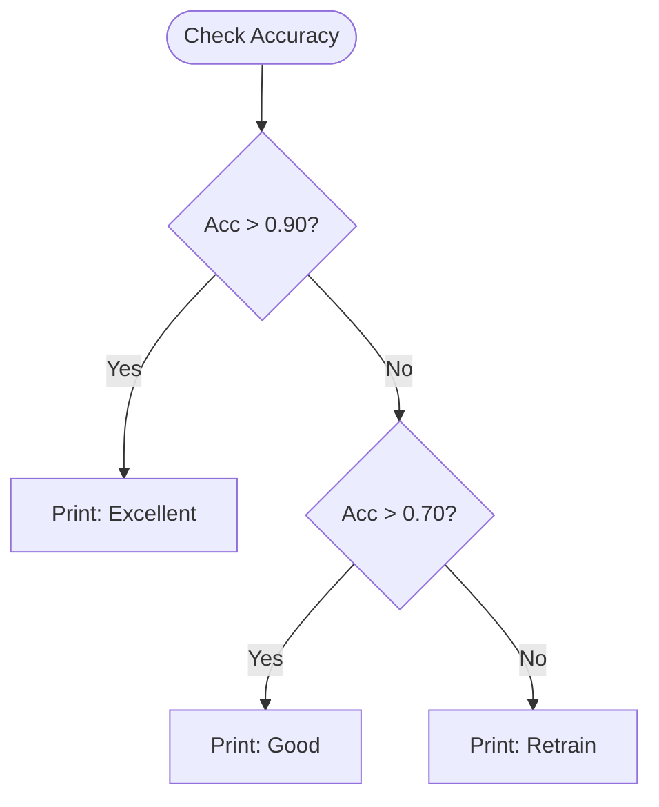

Machine Learning is often about making decisions. **Conditionals** allow our code to react differently depending on the input. Whether it's checking if a dataset is empty or deciding which model to load, `if-else` logic is the foundation of programmatic decision-making.

## 1. The `if`, `elif`, and `else` Structure

Python uses indentation to define the scope of conditional blocks.

```python
accuracy = 0.85

if accuracy > 0.90:
    print("Excellent model performance!")
elif accuracy > 0.70:
    print("Good performance, but could be improved.")
else:
    print("Model needs retraining.")

```



## 2. Comparison and Logical Operators

Conditionals rely on boolean expressions that evaluate to either `True` or `False`.

### A. Comparison Operators

* `==` (Equal to)
* `!=` (Not equal to)
* `>` / `<` (Greater/Less than)
* `>=` / `<=` (Greater/Less than or equal to)

### B. Logical Operators (Chaining)

* `and`: Both conditions must be True.
* `or`: At least one condition must be True.
* `not`: Reverses the boolean value.

```python
# Check if learning rate is within a safe range
lr = 0.001
if lr > 0 and lr < 0.1:
    print("Learning rate is valid.")

```

## 3. The "ReLU" Example: Math meets Logic

One of the most famous conditional operations in Deep Learning is the **Rectified Linear Unit (ReLU)** activation function.

$$ 
\text{ReLU}(x) = \max(0, x) 
$$

In Python code, this is a simple conditional:

```python
def relu(x):
    if x > 0:
        return x
    else:
        return 0

```

## 4. Truthiness and Identity

In ML data cleaning, we often check if a variable actually contains data.

* **Falsy values:** `None`, `0`, `0.0`, `""` (empty string), `[]` (empty list), `{}` (empty dict).
* **Truthy values:** Everything else.

```python
features = get_features()

if not features:
    print("Warning: No features found in dataset!")

```

### `is` vs `==`

* `==` checks for **Value equality** (Are the numbers the same?).
* `is` checks for **Identity** (Are they the exact same object in memory?).

## 5. Inline Conditionals (Ternary Operator)

For simple logic, Python allows a one-liner known as a ternary operator.

```python
# status = "Spam" if probability > 0.5 else "Not Spam"
prediction = "Positive" if y_hat > 0.5 else "Negative"

```

## 6. Match-Case (Python 3.10+)

For complex branching based on specific patterns (like different file extensions or model types), the `match` statement provides a cleaner syntax than multiple `elif` blocks.

```python
optimizer_type = "adam"

match optimizer_type:
    case "sgd":
        print("Using Stochastic Gradient Descent")
    case "adam":
        print("Using Adam Optimizer")
    case _:
        print("Using Default Optimizer")

```

---

Decision-making is key, but to keep our code clean, we shouldn't repeat our logic. We need to wrap our conditionals and loops into reusable components.