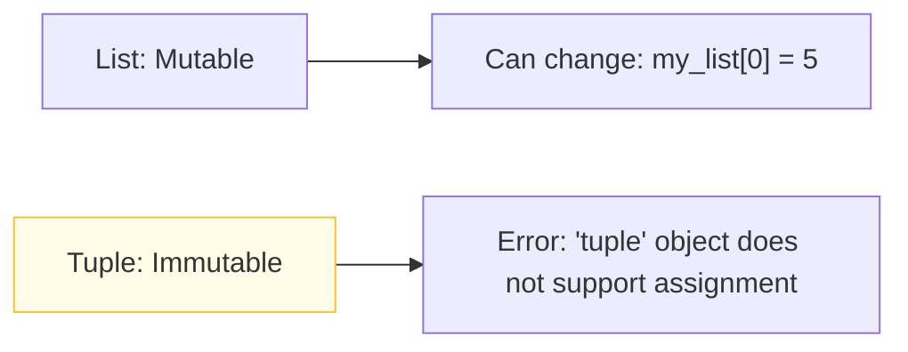
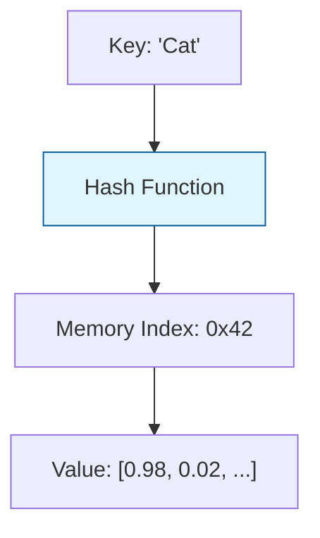
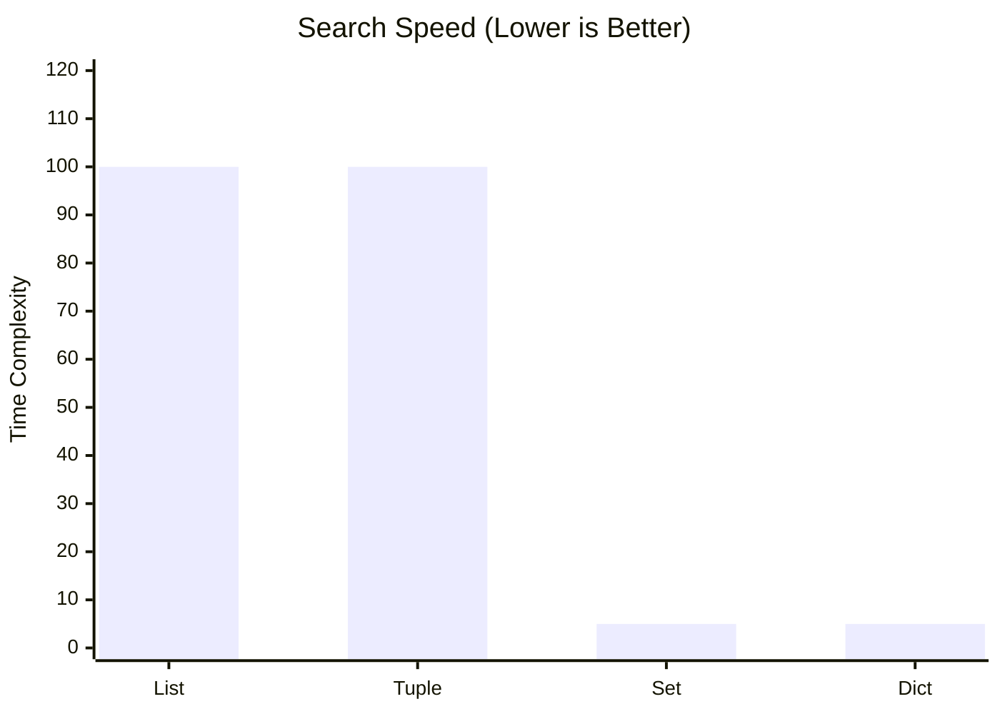

While basic types hold single values, **Data Structures** allow us to group, organize, and manipulate large amounts of information. In ML, choosing the wrong structure can lead to code that runs $100\times$ slower than it should.

## 1. Lists: The Versatile Workhorse

A **List** is an ordered, mutable collection of items. Think of it as a flexible array that can grow or shrink.

* **Syntax:** `my_list = [0.1, 0.2, 0.3]`
* **ML Use Case:** Storing the history of "Loss" values during training so you can plot them later.

```python
losses = []
for epoch in range(10):
    current_loss = train_step()
    losses.append(current_loss) # Dynamic growth

```

## 2. Tuples: The Immutable Safeguard

A **Tuple** is like a list, but it **cannot be changed** after creation (immutable).

* **Syntax:** `shape = (224, 224, 3)`
* **ML Use Case:** Defining image dimensions or model architectures. Since these shouldn't change accidentally during execution, a tuple is safer than a list.



## 3. Dictionaries: Key-Value Mapping

A **Dictionary** stores data in pairs: a unique **Key** and its associated **Value**. It uses a "Hash Table" internally, making lookups incredibly fast ( complexity).

* **Syntax:** `params = {"learning_rate": 0.001, "batch_size": 32}`
* **ML Use Case:** Managing hyperparameters or mapping integer IDs back to human-readable text labels.



## 4. Sets: Uniqueness and Logic

A **Set** is an unordered collection of **unique** items.

* **Syntax:** `classes = {"dog", "cat", "bird"}`
* **ML Use Case:** Finding the unique labels in a messy dataset or performing mathematical operations like Union and Intersection on feature sets.

## 5. Performance Comparison

Choosing the right structure is about balancing **Speed** and **Memory**.

| Feature | List | Tuple | Dictionary | Set |
| --- | --- | --- | --- | --- |
| **Ordering** | Ordered | Ordered | Ordered (Python 3.7+) | Unordered |
| **Mutable** | **Yes** | No | **Yes** | **Yes** |
| **Duplicates** | Allowed | Allowed | Keys must be unique | Must be unique |
| **Search Speed** |  (Slow) |  (Slow) |  (Very Fast) |  (Very Fast) |



## 6. Slicing and Indexing

In ML, we often need to "slice" our data (e.g., taking the first 80% for training and the last 20% for testing).

$$ 
\text{Syntax: } \text{data}[\text{start} : \text{stop} : \text{step}] 
$$

```python
data = [10, 20, 30, 40, 50, 60]
train = data[:4]  # [10, 20, 30, 40]
test = data[4:]   # [50, 60]

```

---

Now that we can organize data, we need to control the flow of our program—making decisions based on that data and repeating tasks efficiently.