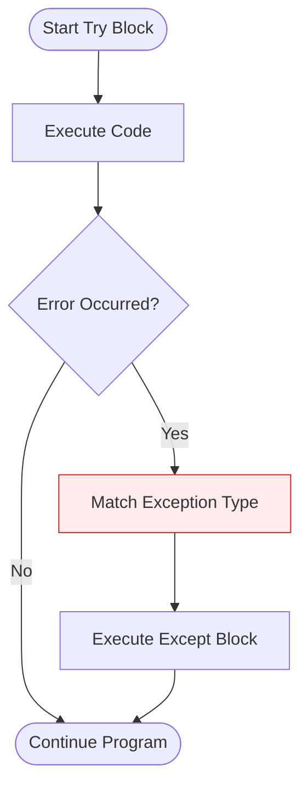
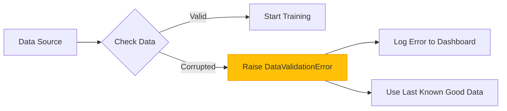

In Machine Learning, things often go wrong: a dataset file is missing, a GPU runs out of memory, or a feature contains a `NaN` (Not a Number) that crashes a calculation. **Exception Handling** allows your program to "fail gracefully" rather than crashing completely.

## 1. The Try-Except Block

The basic tool for handling errors is the `try...except` block. You "try" a piece of code, and if it raises an error, the "except" block catches it.

```python
try:
    # Attempting to load a large dataset
    data = load_dataset("huge_data.csv")
except FileNotFoundError:
    print("Error: The dataset file was not found. Please check the path.")

```



## 2. Handling Multiple Exceptions

Different operations can fail in different ways. You can catch specific errors to provide tailored solutions.

* **`ValueError`**: Raised when a function receives an argument of the right type but inappropriate value (e.g., trying to take the square root of a negative number).
* **`TypeError`**: Raised when an operation is applied to an object of inappropriate type.
* **`ZeroDivisionError`**: Common in manual normalization logic.

```python
try:
    result = total_loss / num_samples
except ZeroDivisionError:
    result = 0
    print("Warning: num_samples was zero. Setting loss to 0.")
except TypeError:
    print("Error: Check if total_loss and num_samples are numbers.")

```

## 3. The Full Lifecycle: `else` and `finally`

To build truly robust pipelines (like those that open and close database connections), we use the extended syntax:

1. **`try`**: The code that might fail.
2. **`except`**: Code that runs only if an error occurs.
3. **`else`**: Code that runs only if **no** error occurs.
4. **`finally`**: Code that runs **no matter what** (perfect for closing files or releasing GPU memory).

```python
try:
    file = open("model_weights.bin", "rb")
    weights = file.read()
except IOError:
    print("Could not read file.")
else:
    print("Weights loaded successfully.")
finally:
    file.close()
    print("File resource released.")

```

## 4. Raising Exceptions

Sometimes, you *want* to stop the program if a specific condition isn't met. For example, if a user provides a negative learning rate.

```python
def set_learning_rate(lr):
    if lr <= 0:
        raise ValueError(f"Learning rate must be positive. Received: {lr}")
    return lr

```

## 5. Exceptions in ML Data Pipelines

In production ML, we use exceptions to ensure data quality.



## 6. Summary of Common ML Exceptions

| Exception | When it happens in ML |
| --- | --- |
| **`IndexError`** | Trying to access a non-existent column or row index in an array. |
| **`KeyError`** | Looking for a hyperparameter in a config dictionary that doesn't exist. |
| **`AttributeError`** | Calling a method (like `.predict()`) on a model that hasn't been trained yet. |
| **`MemoryError`** | Loading a dataset that is larger than the available RAM. |

---
 
Handling errors ensures your code doesn't crash, but how do we organize our code so it's easy to read and maintain? Let's explore the world of Classes and Objects.