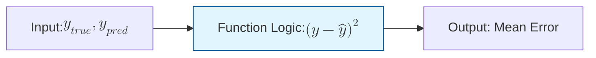
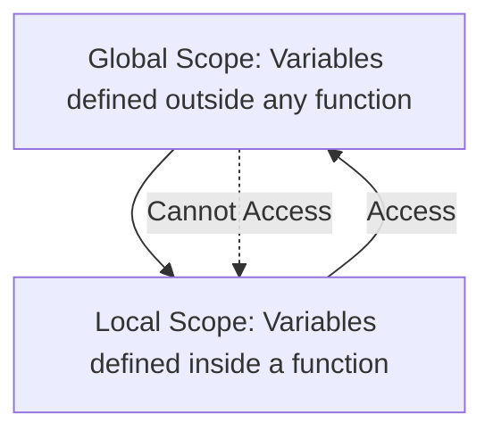

In Machine Learning, we often repeat complex logic—calculating the distance between points, normalizing features, or computing gradients. **Functions** allow us to package this logic into reusable blocks, reducing errors and making our code "DRY" (Don't Repeat Yourself).

## 1. Anatomy of a Function

A function takes an **input** (parameters), performs an **action**, and returns an **output**.

```python
def calculate_mse(y_true, y_pred):
    """Calculates Mean Squared Error."""
    error = (y_true - y_pred) ** 2
    return error.mean()

```



## 2. Arguments and Parameters

Python offers flexible ways to pass data into functions, which is essential for managing dozens of hyperparameters.

### A. Positional vs. Keyword Arguments

* **Positional:** Order matters.
* **Keyword:** Explicitly naming parameters (safer and more readable).

```python
def train_model(learning_rate, epochs):
    print(f"LR: {learning_rate}, Epochs: {epochs}")

# Keyword arguments are preferred in ML for clarity
train_model(epochs=100, learning_rate=0.001)

```

### B. Default Values

Useful for hyperparameters that have a standard "sane" default.

```python
def initialize_weights(size, distribution="normal"):
    # If distribution isn't provided, it defaults to "normal"
    pass

```

## 3. Lambda Functions (Anonymous Functions)

For simple, one-line operations, Python uses **Lambda** functions. These are frequently used in data cleaning with `pandas`.

$$ 
\text{Syntax: } \text{lambda } \text{arguments} : \text{expression} 
$$

```python
# Convert Celsius to Fahrenheit for a feature
c_to_f = lambda c: (c * 9/5) + 32
print(c_to_f(0)) # 32.0

```

## 4. Understanding Scope

**Scope** determines where a variable can be seen or accessed.



* **Global Scope:** Variables available throughout the entire script (e.g., a dataset loaded at the top).
* **Local Scope:** Variables created inside a function (e.g., a temporary calculation). They "die" once the function finishes.


## 5. Args and Kwargs (`*args`, `**kwargs`)

In advanced ML libraries (like Scikit-Learn), you'll see these used to pass a variable number of arguments.

* `*args`: Passes a list of positional arguments.
* `**kwargs`: Passes a dictionary of keyword arguments.

```python
def build_layer(**hyperparams):
    for key, value in hyperparams.items():
        print(f"{key}: {value}")

build_layer(units=64, activation="relu", dropout=0.2)

```

## 6. Functions as First-Class Citizens

In Python, you can pass a function as an argument to *another* function. This is how we pass different **activation functions** or **optimizers** into a training function.

```python
def apply_activation(value, func):
    return func(value)

# Passing the 'relu' function as data
output = apply_activation(10, relu)

```

---

Functions help us stay organized, but sometimes code fails due to unexpected data or math errors. We need a way to catch those errors without crashing our entire training pipeline.