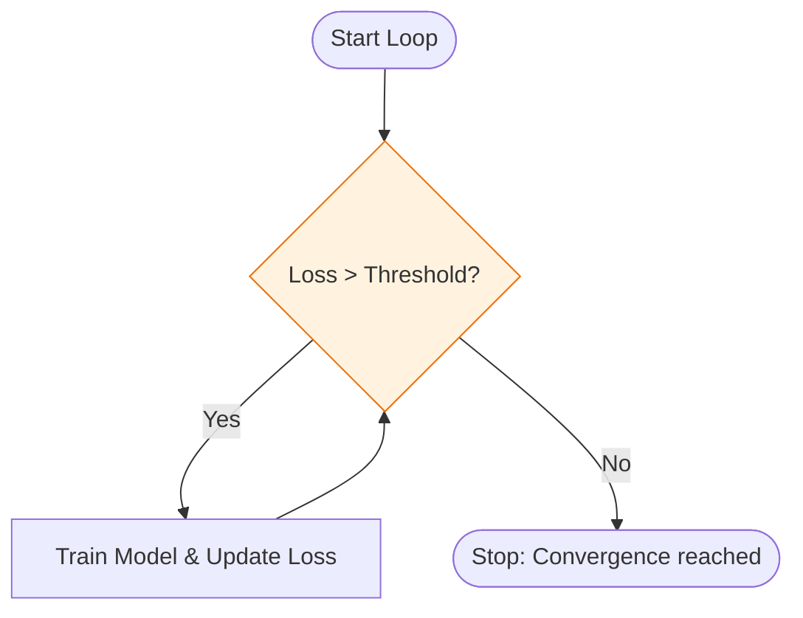
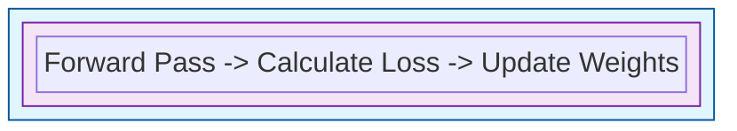

In Machine Learning, we rarely do something once. We repeat operations thousands of times: passing data through a network, updating weights, or pre-processing thousands of images. This repetition is handled by **Loops**.

## 1. The `for` Loop: Iterating over Sequences

The `for` loop is the most common loop in Python. It iterates over any "iterable" (like a list, tuple, or dictionary).

* **ML Use Case:** Iterating through a list of filenames to load images.

```python
models = ["Linear", "SVM", "RandomForest"]

for model in models:
    print(f"Training {model}...")

```

### Using `range()`

When you need to repeat an action a specific number of times (like **Epochs**), use the `range()` function.

```python
# Training for 5 epochs
for epoch in range(5):
    print(f"Epoch {epoch + 1}/5")

```

## 2. The `while` Loop: Conditional Iteration

A `while` loop continues as long as a certain condition is `True`.

* **ML Use Case:** **Early Stopping**. You might want to keep training a model until the error (loss) drops below a specific threshold.

```python
loss = 1.0
threshold = 0.01

while loss > threshold:
    loss -= 0.005  # Simulate model learning
    print(f"Current Loss: {loss:.4f}")

```



## 3. Loop Control: `break` and `continue`

Sometimes you need to alter the flow inside a loop:

* **`break`**: Exits the loop entirely. (e.g., if the model starts over-fitting).
* **`continue`**: Skips the rest of the current block and moves to the next iteration. (e.g., skipping a corrupted image file).

```python
for image in dataset:
    if image.is_corrupted:
        continue # Move to next image
    process(image)

```

## 4. The "ML Training Loop" Pattern

In deep learning (PyTorch/TensorFlow), you will almost always see this nested structure:



## 5. Efficiency Tip: List Comprehensions

Python offers a concise way to create lists using a single line of code. It is often faster and more readable than a standard `for` loop for simple transformations.

**Standard Way:**

```python
squared_errors = []
for e in errors:
    squared_errors.append(e**2)

```

**Pythonic Way (List Comprehension):**

```python
squared_errors = [e**2 for e in errors]

```

## 6. The "Vectorization" Warning 

While loops are fundamental, **Standard Python loops are slow for mathematical operations.** If you are multiplying two matrices of size , a nested Python `for` loop will take seconds, while a **Vectorized** operation in NumPy will take milliseconds.

| Operation | Python `for` loop | NumPy Vectorized |
| --- | --- | --- |
| **Summing 1M numbers** | ~50ms | ~1ms |
| **Matrix Multiplication** | $O(n^3)$ | Optimized BLAS/LAPACK |

---

Loops help us repeat tasks, but how do we bundle those tasks into reusable blocks? This is where functions come in.