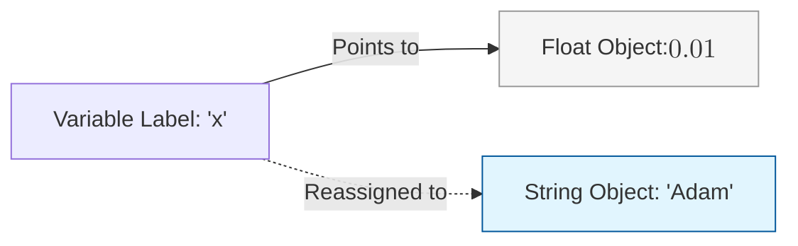
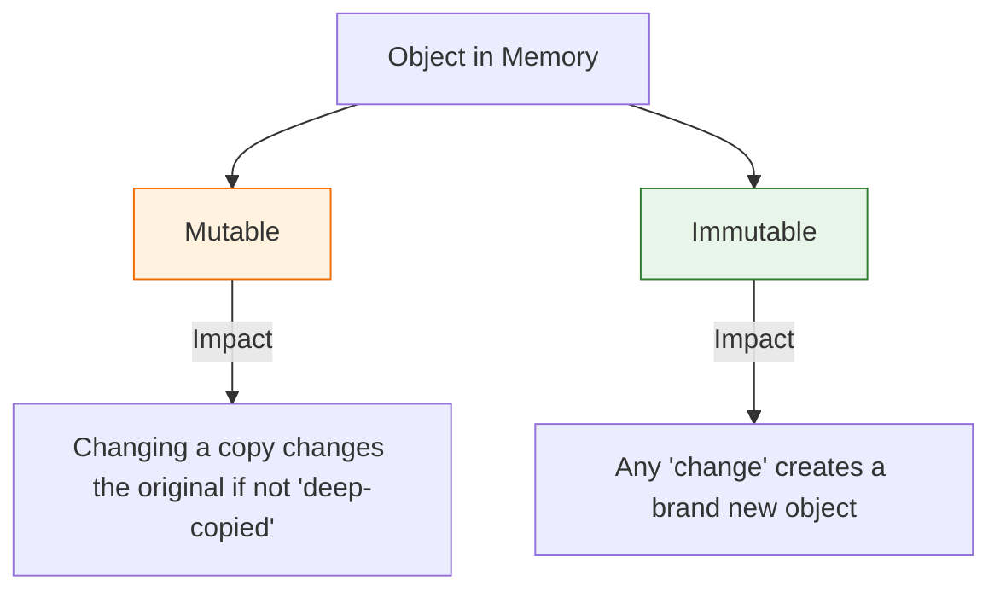

In Python, variables are not "buckets" that hold values; they are **labels** (references) that point to objects in memory. In Machine Learning, understanding how these labels work is the difference between writing clean code and hunting for memory-leak bugs.

## 1. Dynamic Typing

Python is **dynamically typed**. You don't need to declare that a variable is an integer or a string; Python figures it out at runtime.

```python
x = 0.01  # Initially a float (learning rate)
x = "Adam" # Now a string (optimizer name)

```



## 2. Fundamental Data Types in ML

Every feature in your dataset will eventually be mapped to one of these fundamental Python types.

### A. Numerical Types

* **`int`**: Whole numbers (e.g., number of layers, epochs).
* **`float`**: Decimal numbers. Most weights and probabilities in ML are 64-bit or 32-bit floats.
* **`complex`**: Used in signal processing and Fourier transforms.

### B. Boolean Type (`bool`)

* Represents `True` or `False`. Used for binary masks (e.g., selecting rows in a dataset where `age > 30`).

### C. Sequence Types

* **`str`**: Strings are used for category labels or raw text in Natural Language Processing (NLP).
* **`list`**: A mutable, ordered sequence.
* **`tuple`**: An immutable (unchangeable) sequence. Often used for tensor shapes like `(3, 224, 224)`.

## 3. Mutability: The "Gotcha" in ML

Understanding **Mutability** is crucial when passing data through pre-processing functions.

* **Mutable (Can be changed):** `list`, `dict`, `set`, `numpy.ndarray`.
* **Immutable (Cannot be changed):** `int`, `float`, `str`, `tuple`.



:::warning ML Common Bug
If you pass a list of hyperparameters to a function and the function modifies that list, the original list *outside* the function will also be changed. Always use `.copy()` if you want to preserve the original data!
:::

## 4. Type Casting

In ML, we frequently need to convert data types (e.g., converting integer pixel values `0-255` to floats `0.0-1.0`).

```python
# Converting types
pixel_val = 255
normalized = float(pixel_val) / 255.0

# Checking types
print(type(normalized)) # Output: <class 'float'>

```

## 5. Summary Reference Table

| Type | Example | Mutable? | Typical ML Usage |
| --- | --- | --- | --- |
| **int** | `32` | No | Batch size, epoch count. |
| **float** | `0.001` | No | Learning rate, weights. |
| **str** | `"cat"` | No | Target labels, text data. |
| **list** | `[1, 2, 3]` | **Yes** | Collecting loss values over time. |
| **tuple** | `(28, 28)` | No | Input dimensions of an image. |
| **dict** | `{"id": 1}` | **Yes** | Storing model configuration. |


---

Now that we know how to store single values and lists, we need to know how to organize them logically for complex tasks. Let's look at more advanced data structures.