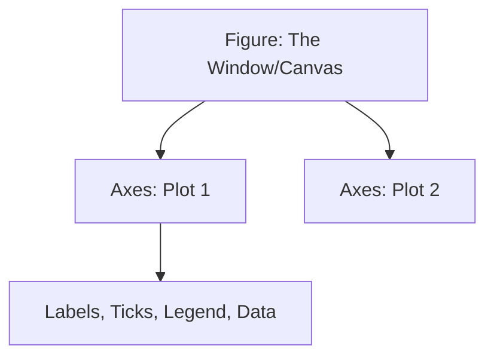

In Machine Learning, a picture is worth a thousand rows of data. **Matplotlib** is the foundational "grandfather" library for plotting in Python, while **Seaborn** sits on top of it to provide beautiful, statistically-informed visualizations with much less code.

## 1. The Anatomy of a Plot

To master Matplotlib, you must understand its hierarchy. Every plot is contained within a **Figure**, which can hold one or more **Axes** (the actual plots).



## 2. Matplotlib: The Basics

The most common interface is `pyplot`. It follows a state-machine logic similar to MATLAB.

```python
import matplotlib.pyplot as plt

# Data
epochs = [1, 2, 3, 4, 5]
loss = [0.9, 0.7, 0.5, 0.3, 0.2]

# Plotting
plt.plot(epochs, loss, label='Training Loss', marker='o')
plt.title("Model Training Progress")
plt.xlabel("Epochs")
plt.ylabel("Loss")
plt.legend()
plt.show()

```

## 3. Essential ML Plots

In your ML workflow, you will constantly use these four types of visualizations:

| Plot Type | Best Use Case | Library Choice |
| --- | --- | --- |
| **Line Plot** | Monitoring Loss/Accuracy over time (epochs). | Matplotlib |
| **Scatter Plot** | Finding correlations between two features ( vs ). | Seaborn |
| **Histogram** | Checking if a feature follows a **Normal Distribution**. | Seaborn |
| **Heatmap** | Visualizing a **Correlation Matrix** or **Confusion Matrix**. | Seaborn |

## 4. Seaborn: Statistical Beauty

Seaborn makes complex plots easy. It integrates directly with Pandas DataFrames and handles the labeling and coloring automatically.

```python
import seaborn as sns

# Load a built-in dataset
iris = sns.load_dataset("iris")

# A single line to see relationships across all features
sns.pairplot(iris, hue="species")
plt.show()

```

## 5. Visualizing Model Performance

### The Heatmap (Confusion Matrix)

A heatmap is the standard way to visualize where a classification model is getting confused.

```python
# Assuming 'cm' is your confusion matrix array
sns.heatmap(cm, annot=True, cmap='Blues')
plt.xlabel("Predicted Label")
plt.ylabel("True Label")

```

### Subplots

Sometimes you need to compare multiple plots side-by-side (e.g., Training Loss vs. Validation Loss).

```python
fig, (ax1, ax2) = plt.subplots(1, 2, figsize=(10, 4))

ax1.plot(loss)
ax1.set_title("Loss")

ax2.plot(accuracy)
ax2.set_title("Accuracy")

```

## 6. The "Object-Oriented" vs "Pyplot" Debate

* **`plt.plot()` (Pyplot):** Great for quick interactive exploration.
* **`fig, ax = plt.subplots()` (OO style):** Better for complex layouts and production scripts where you need fine-grained control over every element.

## References for More Details

* **[Matplotlib Plot Gallery](https://matplotlib.org/stable/gallery/index.html):** Finding code templates for literally any type of plot.

* **[Seaborn Tutorial](https://seaborn.pydata.org/tutorial.html):** Learning how to visualize statistical relationships.

---

Visualization is the final piece of our programming foundations. Now that you can process data with NumPy, clean it with Pandas, and visualize it with Matplotlib, you are ready to start building actual models.