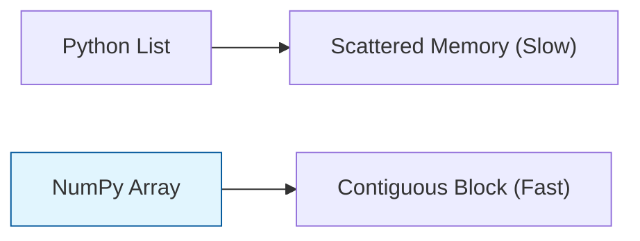
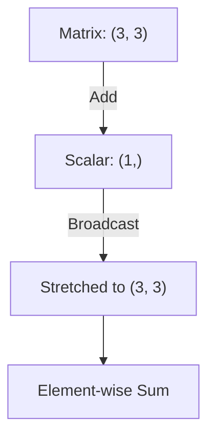

If Python is the skeleton of Machine Learning, **NumPy** is the muscle. It is a library for scientific computing that introduces the **ndarray** (N-dimensional array), which is significantly faster and more memory-efficient than standard Python lists.

## 1. Why NumPy? (Speed & Efficiency)

Python lists are flexible but slow because they store pointers to objects scattered in memory. NumPy arrays store data in **contiguous memory blocks**, allowing the CPU to process them using SIMD (Single Instruction, Multiple Data).



## 2. Array Anatomy and Shapes

In ML, we describe data by its **Rank** (number of dimensions) and **Shape**.

* **Scalar (Rank 0):** A single number.
* **Vector (Rank 1):** A line of numbers (e.g., a single sample's features).
* **Matrix (Rank 2):** A table of numbers (e.g., a whole dataset).
* **Tensor (Rank 3+):** Higher dimensional arrays (e.g., a batch of color images).

```python
import numpy as np

# Creating a 2D Matrix
data = np.array([[1, 2, 3], [4, 5, 6]])
print(data.shape)  # Output: (2, 3) -> 2 rows, 3 columns

```

## 3. Vectorization

**Vectorization** is the practice of replacing explicit `for` loops with array expressions. This is how we achieve high performance in Python.

**Instead of this:**

```python
# Slow: Element-wise addition with a loop
result = []
for i in range(len(a)):
    result.append(a[i] + b[i])

```

**Do this:**

```python
# Fast: NumPy handles the loop in C
result = a + b

```

## 4. Broadcasting: The Magic of NumPy

Broadcasting allows NumPy to perform arithmetic operations on arrays with **different shapes**, provided they meet certain compatibility rules.



**Example:** Adding a constant bias to every row in a dataset.

```python
features = np.array([[10, 20], [30, 40]]) # Shape (2, 2)
bias = np.array([5, 5])                  # Shape (2,)
result = features + bias                 # [[15, 25], [35, 45]]

```

## 5. Critical ML Operations in NumPy

| Operation | NumPy Function | ML Use Case |
| --- | --- | --- |
| **Dot Product** | `np.dot(a, b)` | Calculating weighted sums in a neuron. |
| **Reshaping** | `arr.reshape(1, -1)` | Changing an image from 2D to a 1D feature vector. |
| **Transposing** | `arr.T` | Aligning dimensions for matrix multiplication. |
| **Aggregations** | `np.mean()`, `np.std()` | Normalizing data (Standard Scaling). |
| **Slicing** | `arr[:, 0]` | Extracting a single column (feature) from a dataset. |

## 6. Slicing and Masking

NumPy allows for "Boolean Indexing," which is incredibly powerful for filtering data.

```python
# Select all values in the array greater than 0.5
weights = np.array([0.1, 0.8, -0.2, 0.9])
positive_weights = weights[weights > 0] 
# Result: [0.1, 0.8, 0.9]

```

---

While NumPy handles the raw numbers, we need a way to manage data with column names, different data types, and missing values. For that, we turn to the most popular data manipulation library.