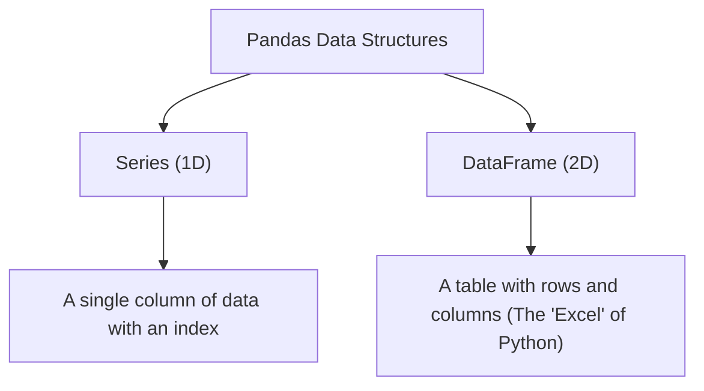
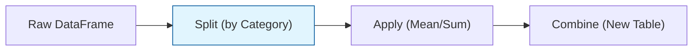

In Machine Learning, data rarely arrives ready for training. It comes in messy CSVs, Excel files, or SQL databases with missing values and inconsistent formatting. **Pandas** is the library designed to handle this "Data Wrangling."

## 1. Core Data Structures

Pandas is built on top of NumPy, but it adds labels (indices and column names) to the data.



### The DataFrame

A DataFrame is essentially a dictionary of Series objects. It is the primary object you will use to store your features () and targets ().

```python
import pandas as pd

# Creating a DataFrame from a dictionary
df = pd.DataFrame({
    'Age': [25, 30, 35],
    'Salary': [50000, 60000, 70000]
})

```

## 2. Loading and Inspecting Data

Pandas can read almost any format. Once loaded, we use specific methods to "peek" into the data.

* **`pd.read_csv('data.csv')`**: The most common way to load data.
* **`df.head()`**: View the first 5 rows.
* **`df.info()`**: Check data types and memory usage.
* **`df.describe()`**: Get statistical summaries (mean, std, min, max).

## 3. Selecting and Filtering Data

In ML, we often need to separate our target variable from our features. We use `.loc` (label-based) and `.iloc` (integer-based) indexing.

```python
# Select all rows, but only the 'Salary' column
target = df['Salary']

# Select rows where Age is greater than 30
seniors = df[df['Age'] > 30]

```

## 4. Data Cleaning: The "ML Pre-processing" Step

Before a model can learn, the data must be "clean." Pandas provides high-level functions for the most common cleaning tasks:

### A. Handling Missing Values

Most ML algorithms cannot handle `NaN` (Not a Number) values.

* **`df.isnull().sum()`**: Count missing values.
* **`df.dropna()`**: Remove rows with missing values.
* **`df.fillna(df.mean())`**: Fill missing values with the average (Imputation).

### B. Handling Categorical Data

ML models require numbers. We use Pandas to convert text to categories.

* **`pd.get_dummies(df['City'])`**: One-Hot Encoding (turns "City" into multiple 0/1 columns).

## 5. Grouping and Aggregation

Commonly used in **Exploratory Data Analysis (EDA)** to find patterns.

```python
# Calculate the average salary per city
avg_sal = df.groupby('City')['Salary'].mean()

```



## 6. Vectorized String Operations

Pandas allows you to perform operations on entire text columns without writing loops—essential for **Natural Language Processing (NLP)**.

```python
# Lowercase all text in a 'Reviews' column
df['Reviews'] = df['Reviews'].str.lower()

```

## References for More Details

* **Pandas Official "10 Minutes to Pandas":**
* [Link](https://pandas.pydata.org/docs/user_guide/10min.html)
* *Best for:* A quick syntax cheat sheet.


* **Kaggle - Data Cleaning Course:**
* [Link](https://www.kaggle.com/learn/data-cleaning)
* *Best for:* Practical, hands-on experience with messy real-world data.

---

Pandas helps us clean the data, but "seeing is believing." To truly understand our dataset, we need to visualize the relationships between variables.