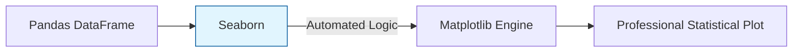

**Seaborn** is a Python data visualization library based on Matplotlib. It provides a high-level interface for drawing attractive and informative statistical graphics. In Machine Learning, we use Seaborn to quickly understand the distribution of our features and the correlations between them.

## 1. Why Seaborn over Matplotlib?

Seaborn is designed to work directly with **Pandas DataFrames**. It automates much of the boilerplate code (like labeling axes and handling colors) that Matplotlib requires.



## 2. Visualizing Distributions

Before training a model, you need to know if your data is "Normal" (Gaussian) or skewed.

### Histograms and KDEs

The `displot()` (distribution plot) combines a histogram with a **Kernel Density Estimate (KDE)** to show the "shape" of your data.

```python
import seaborn as sns
import matplotlib.pyplot as plt

# Visualizing the distribution of a feature
sns.displot(df['feature_name'], kde=True, color="skyblue")
plt.show()

```

## 3. Visualizing Relationships

### Scatter Plots and Regressions

In ML, we often want to see if one feature can predict another. `regplot()` draws a scatter plot and fits a **Linear Regression** line automatically.

```python
# Check for linear relationship between 'SquareFootage' and 'Price'
sns.regplot(data=df, x="SquareFootage", y="Price")

```

### The Pair Plot

The `pairplot()` is perhaps the most useful tool in EDA. It creates a matrix of plots, showing every feature's relationship with every other feature.

```python
# Instant overview of the entire dataset
sns.pairplot(df, hue="Target_Class")

```

## 4. Visualizing Categorical Data

When dealing with discrete categories (like "City" or "Product Type"), we use plots that show the central tendency and variance.

* **Box Plot:** Shows the median, quartiles, and **outliers**.
* **Violin Plot:** Combines a box plot with a KDE to show the density of the data at different values.

```python
# Comparing distribution across categories
sns.boxplot(data=df, x="Category", y="Value")

```

## 5. Matrix Plots: Correlation Analysis

Before selecting features for your model, you must check for **Multicollinearity** (features that are too similar to each other). We do this using a Correlation Matrix visualized as a Heatmap.

```python
# Compute correlation matrix
corr = df.corr()

# Visualize with Heatmap
sns.heatmap(corr, annot=True, cmap='coolwarm', fmt=".2f")

```

## 6. Seaborn "Themes" and Aesthetics

Seaborn makes it easy to change the look of your plots globally to match a professional report or dark-mode dashboard.

* `sns.set_theme(style="whitegrid")`
* `sns.set_context("talk")` (Scales labels for presentations)

## References for More Details

* **[Seaborn Example Gallery](https://seaborn.pydata.org/examples/index.html):** Finding the specific "look" you want for your data.
* **[Python Graph Gallery](https://python-graph-gallery.com/seaborn/):** Learning how to customize Seaborn plots beyond the defaults.

---

You have now mastered the "Big Three" of Python data science: NumPy for math, Pandas for data, and Matplotlib/Seaborn for sight. You are ready to stop preparing and start predicting.