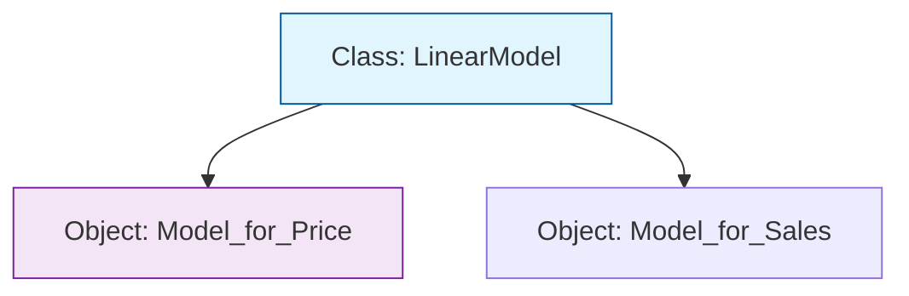

Most beginner code is **Procedural** (a long list of instructions). However, professional Machine Learning code is almost always **Object-Oriented**. OOP allows us to bundle data (like model weights) and functions (like the training logic) into a single unit called an **Object**.

## 1. Classes vs. Objects

Think of a **Class** as a blueprint and an **Object** as the actual house built from that blueprint.

* **Class:** The template for a "Model" (e.g., defines that all models need a `fit` and `predict` method).
* **Object:** A specific instance (e.g., a `RandomForest` trained on housing data).



## 2. The Core Components: Attributes and Methods

In ML, an object typically consists of:

1. **Attributes (Data):** The "State" of the model. (e.g., `self.weights`, `self.learning_rate`).
2. **Methods (Behavior):** The "Actions" the model can take. (e.g., `self.fit()`, `self.predict()`).

```python
class SimpleModel:
    def __init__(self, lr):
        # Attribute: Initializing the state
        self.learning_rate = lr
        self.weights = None

    def fit(self, X, y):
        # Method: Defining behavior
        print(f"Training with LR: {self.learning_rate}")

```

## 3. The Four Pillars of OOP in ML

### A. Encapsulation

Hiding the internal complexity. You don't need to know the calculus inside `.fit()` to use it; you just call the method. It "encapsulates" the math away from the user.

### B. Inheritance

Creating a new class based on an existing one. In libraries like PyTorch, your custom neural network **inherits** from a base `Module` class.

### C. Polymorphism

The ability for different objects to be treated as instances of the same general class. For example, you can loop through a list of different models and call `.predict()` on all of them, regardless of their internal math.

### D. Abstraction

Using simple interfaces to represent complex tasks. An "Optimizer" object abstracts away the specific update rules (SGD, Adam, RMSProp).

## 4. Why use OOP for ML?

1. **Organization:** Keeps weights and training logic together. Without OOP, you'd have to pass `weights` as an argument to every single function.
2. **Reproducibility:** You can save an entire object (the "state_dict") and reload it later to get the exact same results.
3. **Extensibility:** Want to try a new loss function? You can create a subclass and just override one method without rewriting the whole training loop.

## 5. Standard ML Pattern: The Class Structure

```python
class MyNeuralNet:
    def __init__(self, input_size):
        self.weights = initialize(input_size) # State
        
    def forward(self, x):
        return x @ self.weights # Behavior 1
        
    def backward(self, grad):
        # Update weights logic # Behavior 2
        pass

```

---

Now that you understand how objects work, you can begin to navigate the source code of major ML libraries. But before we build complex classes, we need to master the math engine that powers them.