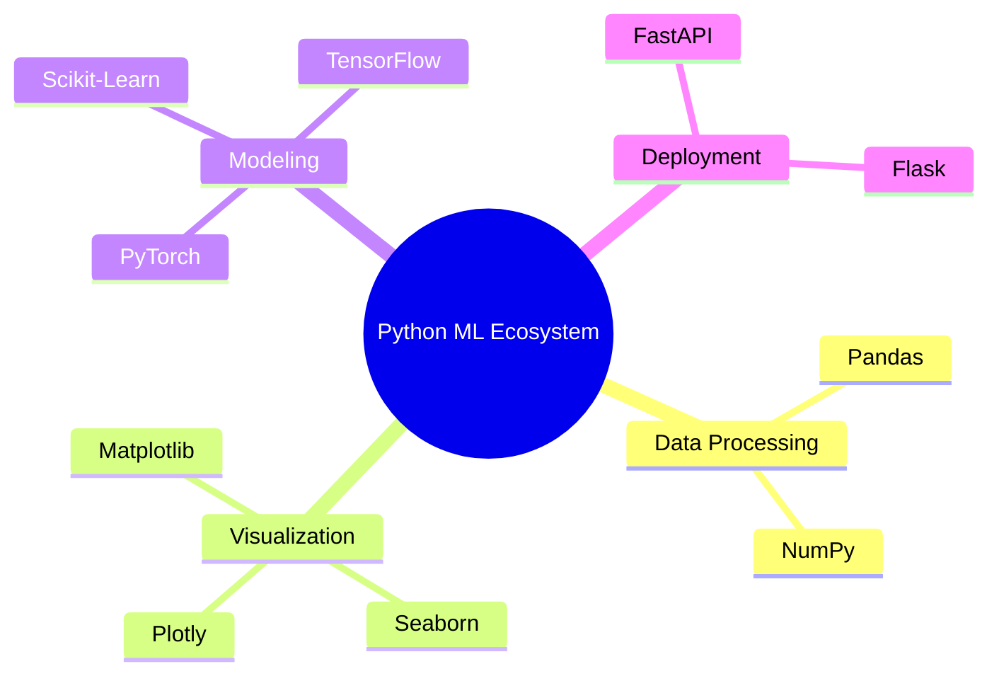
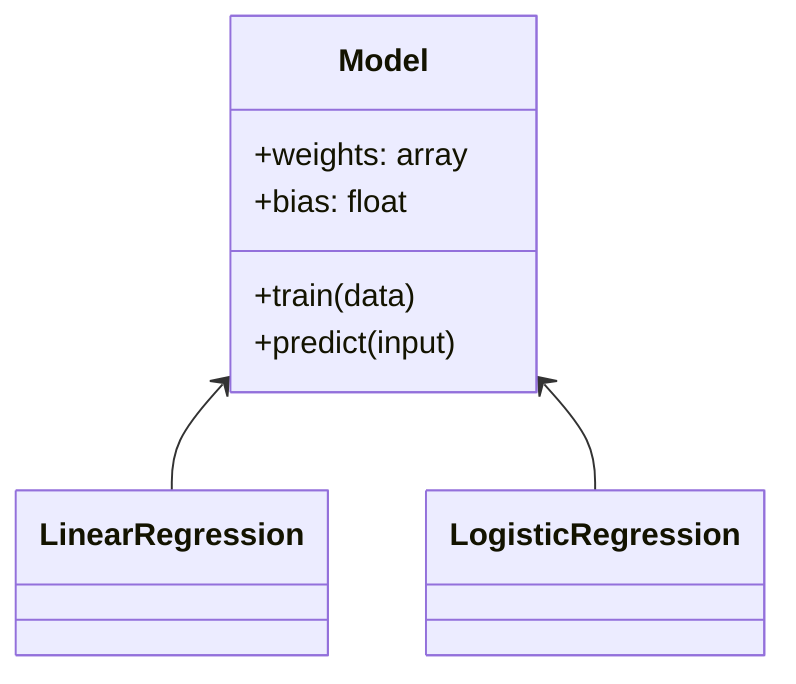
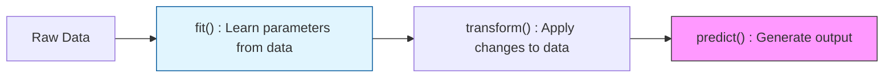

Python is the "lingua franca" of Machine Learning. Its simplicity allows researchers to focus on algorithms rather than syntax, while its robust ecosystem of libraries provides the heavy lifting for mathematical computations.

## 1. Why Python for ML?

The power of Python in ML doesn't come from its speed (it is actually quite slow compared to C++), but from its **ecosystem**.



## 2. Core Data Structures for ML

In ML, we don't just store values; we store **features** and **labels**. Understanding how Python holds this data is vital.

| Structure | Syntax | Best Use Case in ML |
| --- | --- | --- |
| **List** | `[1, 2, 3]` | Storing a sequence of layer sizes or hyperparameter values. |
| **Dictionary** | `{"lr": 0.01}` | Passing hyperparameters to a model. |
| **Tuple** | `(640, 480)` | Storing immutable shapes of images or tensors. |
| **Set** | `{1, 2}` | Finding unique classes/labels in a dataset. |

## 3. The Power of Vectorization (NumPy)

Standard Python `for` loops are slow. In ML, we use **Vectorization** via NumPy to perform operations on entire arrays at once. This pushes the computation down to optimized C and Fortran code.

```python
import numpy as np

# Standard Python (Slow)
result = [x + 5 for x in range(1000000)]

# NumPy Vectorization (Fast)
arr = np.arange(1000000)
result = arr + 5

```

### Multi-dimensional Data

Most ML data is represented as **Tensors** (ND-Arrays):

* **1D Array:** A single feature vector.
* **2D Array:** A dataset (rows = samples, columns = features).
* **3D Array:** A batch of grayscale images.
* **4D Array:** A batch of color images (Batch, Height, Width, Channels).

## 4. Functional Programming Tools

ML code often involves transforming data. These three tools are used constantly for feature engineering:

1. **List Comprehensions:** Creating new lists from old ones in one line.
* `normalized_data = [x / 255 for x in pixels]`


2. **Lambda Functions:** Small, anonymous functions for quick transformations.
* `clean_text = lambda x: x.lower().strip()`


3. **Map/Filter:** Applying functions across datasets efficiently.

---

## 5. Object-Oriented Programming (OOP) in ML

Most ML frameworks (like Scikit-Learn and PyTorch) use Classes to define models. Understanding `self`, `__init__`, and `inheritance` is necessary for building custom model pipelines.



## 6. Common ML Patterns in Python

### The Fit-Transform Pattern

Almost all Python ML libraries follow this logical flow:



---

Python provides the syntax, but for heavy mathematical operations, we need a specialized engine. Let's dive into the core library that makes numerical computing in Python possible.