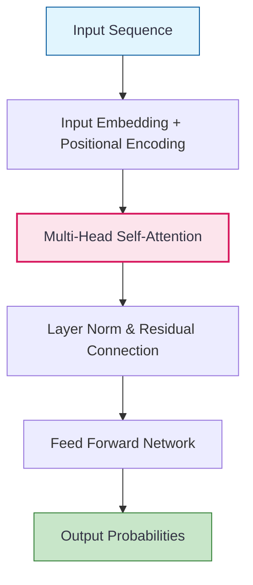

Advanced projects involve systems that don't just analyze data but **create** new data or **interact** autonomously with environments. At this level, you will work with transformer architectures, diffusion models, and feedback-based learning.

## Project 1: Multi-Agent Research Assistant (LLM Ops)
**Goal:** Build a system where multiple AI agents collaborate to research a topic, verify facts, and write a formatted report.

### Project Overview
This project moves from simple "Chat" to **Agentic Workflows**. You will learn how to orchestrate different LLM "personas" and give them tools to browse the web and write files.

* **Tech Stack:** `LangChain` or `CrewAI`, `OpenAI API` or `Llama 3 (Ollama)`.
* **Key Concept:** **Tool Use (Function Calling)** and **Multi-Agent Orchestration**.
* **Success Metric:** Accuracy of citations and coherence of the final multi-step report.

### Advanced Skills
1.  **Orchestration:** Managing the "handoff" of data from one agent to the next.
2.  **State Management:** Ensuring the agents remember what has already been researched.
3.  **Prompt Engineering:** Writing system prompts that prevent agents from getting stuck in infinite loops.

## Project 2: Synthetic Image Generation (GANs or Diffusion)
**Goal:** Train a model to generate realistic images (e.g., human faces or artistic styles) that do not exist in the real world.

### Project Overview
You will explore the "Generative" side of AI. You can choose between **Generative Adversarial Networks (GANs)** or the more modern **Latent Diffusion Models**.

* **Key Algorithm:** $G$ (Generator) vs $D$ (Discriminator) or **Denoising Diffusion Probabilistic Models (DDPM)**.
* **Framework:** `PyTorch`.
* **Dataset:** [CelebA](http://mmlab.ie.cuhk.edu.hk/projects/CelebA.html) (Faces) or [CIFAR-10](https://www.cs.toronto.edu/~kriz/cifar.html).

[Image showing the Denoising process: starting with pure noise and slowly revealing a clear image]

###  Key Mathematical Concepts
* **Adversarial Loss:** The generator learns to fool the discriminator:
  
  $$ \min_G \max_D V(D, G) = \mathbb{E}_{x \sim p_{data}(x)}[\log D(x)] + \mathbb{E}_{z \sim p_z(z)}[\log(1 - D(G(z)))] $$
  
* **Latent Space:** Understanding how low-dimensional "noise" maps to high-dimensional images.

## Project 3: Autonomous RL Agent (Reinforcement Learning)
**Goal:** Train an agent to master a game (like Lunar Lander or Atari) or optimize a trading strategy through trial and error.

### Project Overview
Reinforcement Learning (RL) is about maximizing rewards in an environment. There are no labels; only "points" for good actions and "penalties" for bad ones.

* **Environment:** `OpenAI Gym` (Gymnasium).
* **Key Algorithm:** **Deep Q-Learning (DQN)** or **Proximal Policy Optimization (PPO)**.
* **Primary Metric:** Cumulative Reward over Time.

## Advanced Architecture: The Transformer

Most advanced projects today rely on the **Transformer** architecture, which uses **Self-Attention** to process data in parallel.

## The Advanced AI Stack

* **Deployment:** `BentoML`, `Triton Inference Server`, or `vLLM` for fast LLM serving.
* **Optimization:** **Quantization** (making models smaller) and **LoRA** (Low-Rank Adaptation for fine-tuning).
* **Tracking:** `Weights & Biases` for monitoring complex training runs.
* **Compute:** Heavy reliance on **CUDA** and high-performance GPUs (A100/H100).

## References

* **Attention is All You Need:** [The original Transformer Paper](https://arxiv.org/abs/1706.03762)
* **OpenAI:** [Spinning Up in Deep RL](https://spinningup.openai.com/)
* **Hugging Face:** [Diffusion Models Course](https://huggingface.co/learn/diffusion-course/)

---

**Advanced projects are the gateway to a career as an AI Engineer or Researcher. How do these technologies apply to real businesses?**