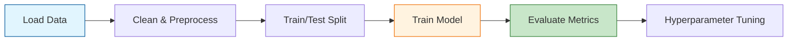

The best way to learn Machine Learning is by building. These three projects are the "Hello World" of ML, covering the fundamental types of supervised and unsupervised learning.

## Project 1: House Price Predictor (Regression)
**Goal:** Predict the continuous price of a house based on features like square footage, number of bedrooms, and location.

### Project Overview
This project introduces **Linear Regression**. You will learn how to handle numerical data and minimize the error between your prediction and the actual price.

* **Dataset:** [Ames Housing Dataset](https://www.kaggle.com/c/house-prices-advanced-regression-techniques) or California Housing.
* **Key Algorithm:** `LinearRegression` or `RandomForestRegressor`.
* **Primary Metric:** Mean Squared Error (MSE) or $R^2$ Score.

### Implementation Steps
1.  **Exploratory Data Analysis (EDA):** Visualize correlations using a heatmap.
2.  **Preprocessing:** Handle missing values and scale features using `StandardScaler`.
3.  **Training:** Split data into 80% training and 20% testing.
4.  **Evaluation:** Calculate the $R^2$ score to see how much variance your model explains.

## Project 2: Iris Flower Classifier (Classification)
**Goal:** Predict the species of an iris flower (Setosa, Versicolour, or Virginica) based on its petal and sepal measurements.

### Project Overview
This is the classic "classification" problem. You will learn how to handle categorical targets and evaluate accuracy across multiple classes.

* **Dataset:** [Iris Dataset](https://archive.ics.uci.edu/ml/datasets/iris) (built into Scikit-Learn).
* **Key Algorithm:** `LogisticRegression` or `K-Nearest Neighbors (KNN)`.
* **Primary Metric:** Accuracy and the **Confusion Matrix**.

### Implementation Steps
1.  **Pairplots:** Use Seaborn to see how the species cluster based on petal width vs length.
2.  **Training:** Use a Simple Decision Tree to see how the model "splits" the data.
3.  **Evaluation:** Generate a classification report to check **Precision** and **Recall** for each flower type.

## Project 3: Customer Segmentation (Clustering)
**Goal:** Group customers into "segments" based on their spending habits and income without using any pre-defined labels.

### Project Overview
This project introduces **Unsupervised Learning**. Unlike the first two, there is no "correct answer." You are asking the model to find hidden patterns.

* **Dataset:** [Mall Customer Segmentation](https://www.kaggle.com/vjchoudhary7/customer-segmentation-tutorial-in-python).
* **Key Algorithm:** `K-Means Clustering`.
* **Primary Metric:** Silhouette Score or the "Elbow Method."

### Implementation Steps
1.  **Feature Selection:** Focus on "Annual Income" and "Spending Score."
2.  **The Elbow Method:** Run K-Means for $k=1$ to $10$ to find the optimal number of clusters.
3.  **Visualization:** Plot the clusters in different colors and identify the "Big Spenders" vs "Frugal" groups.

## Project Workflow Summary

The following diagram illustrates the standard workflow you should follow for every beginner project.

## Recommended Tools for Beginners

* **Google Colab:** No setup required; run Python in your browser.
* **Scikit-Learn:** The industry-standard library for classical ML.
* **Pandas & NumPy:** For data manipulation.
* **Matplotlib & Seaborn:** For data visualization.

## References

* **Kaggle:** [House Prices Competition](https://www.kaggle.com/c/house-prices-advanced-regression-techniques)
* **Scikit-Learn Docs:** [Supervised Learning Guide](https://scikit-learn.org/stable/supervised_learning.html)
* **UCI Machine Learning Repository:** [Classic Datasets](https://archive.ics.uci.edu/ml/index.php)

---

**Building these projects provides the foundation for more complex systems. Once you have mastered these, are you ready to tackle real-world case studies?**