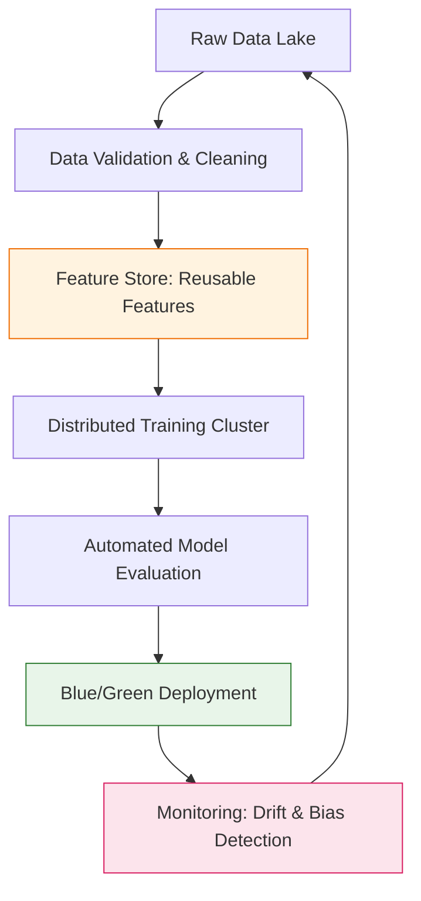

Moving from a local Jupyter notebook to a system serving millions of users requires a shift in thinking. These case studies highlight how industry giants solve problems regarding **scale**, **latency**, and **data drift**.

## 1. Netflix: The Artwork Personalization Engine
**The Problem:** How do you convince a user to click on a movie they’ve never heard of?

**The Solution:** Netflix doesn't just recommend movies; they recommend **artwork**. If you watch many romantic movies, you might see a thumbnail of the lead couple. If you watch comedies, you might see the same movie represented by a funny side-character.

* **Technology:** Multi-Armed Bandits (MAB).
* **Logic:** The system continuously tests different images (arms) for the same title and exploits the one with the highest Click-Through Rate (CTR) for your specific profile.
* **Outcome:** Significant increase in "Take-rate" (the percentage of recommendations that result in a play).

## 2. Uber: Michelangelo & Marketplace Forecasting
**The Problem:** Predicting "Estimated Time of Arrival" (ETA) and "Surge Pricing" in real-time across thousands of cities.

**The Solution:** Uber built **Michelangelo**, an internal ML-as-a-Service platform. It allows data scientists to train and deploy models that process trillions of data points, including weather, historical traffic, and current driver supply.

* **Technology:** Deep Learning and Gradient Boosted Decision Trees (GBDT).
* **Key Challenge:** Feature Store management. Ensuring that "training data" and "serving data" are identical to avoid **Training-Serving Skew**.

## 3. Amazon: Predictive Supply Chain
**The Problem:** How can Amazon offer "Same-Day Delivery" without knowing exactly what people will buy?

**The Solution:** **Anticipatory Shipping**. Amazon uses deep learning to predict what customers in a specific zip code are likely to purchase *before* they actually click "Buy." They move those items to a local fulfillment center in advance.

* **Technology:** Time-Series Forecasting (DeepAR).
* **Impact:** Massive reduction in shipping costs and delivery times.

## 4. Comparing Architectures

The transition from a simple model to an industry-grade system involves adding layers for monitoring and data validation.

## 5. Key Lessons from the Industry

| Challenge | Industry Solution | Why it Matters |
| --- | --- | --- |
| **Data Drift** | Continuous Monitoring | Models degrade as the world changes (e.g., shopping habits during a pandemic). |
| **Latency** | Model Quantization | A recommendation is useless if it takes 5 seconds to load a webpage. |
| **Scalability** | Distributed Computing | Training on petabytes of data requires clusters (Spark/Ray), not single GPUs. |

## 6. Emerging Case Study: AI Agents in FinTech

In 2026, companies like **Klarna** and **Stripe** are replacing traditional support flows with **Autonomous Agents**.

* **Case:** An agent handles a "disputed transaction."
* **Workflow:** The agent queries the merchant API  Checks user's location history  Compares with fraud patterns  Decides to approve/deny the refund  Updates the ledger.

## References

* **Netflix Tech Blog:** [Artwork Personalization at Netflix](https://netflixtechblog.com/artwork-personalization-c589f074ad76)
* **Uber Engineering:** [Meet Michelangelo: Uber’s ML Platform](https://www.uber.com/en-IN/blog/michelangelo-machine-learning-platform/)
* **Amazon Science:** [The Science of Anticipatory Shipping](https://www.amazon.science/)

---

**Case studies prove that ML is about more than just accuracy—it's about reliability and system design. Now that you've seen the "what," are you ready to learn the "how" of deployment?**