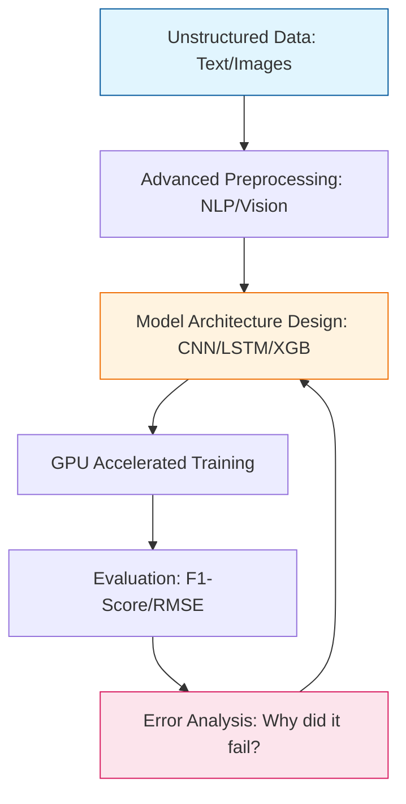

Intermediate projects move beyond basic Scikit-Learn pipelines. At this level, you will deal with **unstructured data** (text and images) and **temporal data**, requiring more sophisticated feature engineering and deep learning frameworks.

## Project 1: Sentiment Analysis on Movie Reviews (NLP)
**Goal:** Classify a text review as positive or negative using natural language processing.

### Project Overview
This project introduces the challenges of turning text into numbers. You will explore word importance and sequence.

* **Dataset:** [IMDb Movie Reviews](https://www.kaggle.com/datasets/lakshmi25npathi/imdb-dataset-of-50k-movie-reviews).
* **Key Techniques:** TF-IDF Vectorization, Word Embeddings, or BERT.
* **Algorithm:** `XGBoost` or a simple `RNN/LSTM`.

### Challenges
1.  **Text Cleaning:** Removing HTML tags, emojis, and stopwords.
2.  **Sparsity:** Managing high-dimensional data created by large vocabularies.
3.  **Context:** Moving from "Bag of Words" (ignoring order) to "Word Sequences" (preserving context).

## Project 2: Digit Recognition (Computer Vision)
**Goal:** Correctly identify handwritten digits (0-9) from grayscale images.

### Project Overview
This is the entry point into **Deep Learning**. You will move from flat feature vectors to spatial data processing.

* **Dataset:** [MNIST Database](http://yann.lecun.com/exdb/mnist/).
* **Key Algorithm:** Convolutional Neural Networks (CNN).
* **Framework:** `TensorFlow/Keras` or `PyTorch`.

### Implementation Steps
1.  **Reshaping:** Convert image arrays into a format compatible with CNNs (Height, Width, Channels).
2.  **Normalization:** Scale pixel values from [0, 255] to [0, 1].
3.  **Architecture:** Build a model with `Conv2D`, `MaxPooling`, and `Dropout` layers to prevent overfitting.

## Project 3: Stock Price or Weather Forecasting (Time-Series)
**Goal:** Predict future values based on historical sequential data.

### Project Overview
Time-series data is unique because the order of data points matters. You will learn to handle "autocorrelation."

* **Dataset:** Yahoo Finance (Stock) or NOAA (Weather).
* **Key Algorithm:** `Prophet` (by Meta), `ARIMA`, or `LSTMs`.
* **Primary Metric:** Root Mean Squared Error (RMSE).

### Key Concepts
1.  **Stationarity:** Checking if the mean and variance change over time.
2.  **Windowing:** Creating "Sliding Windows" where the previous $N$ days are used to predict the next day.
3.  **Seasonality:** Identifying repeating patterns (e.g., higher sales during holidays).

## Intermediate Project Workflow

At this stage, your workflow includes an "Feature Engineering" and "Architecture Design" phase.

## Recommended Tools for Intermediate Level

* **Frameworks:** `PyTorch` or `TensorFlow`.
* **Boosting:** `XGBoost`, `LightGBM`, or `CatBoost`.
* **NLP Tools:** `Hugging Face Transformers`, `Spacy`.
* **Hardware:** Access to GPUs (Google Colab or Kaggle Kernels).

## References

* **Hugging Face:** [NLP Course](https://huggingface.co/learn/nlp-course/)
* **DeepLearning.ai:** [Convolutional Neural Networks Course](https://www.coursera.org/learn/convolutional-neural-networks)
* **Prophet:** [Forecasting at Scale](https://facebook.github.io/prophet/)

---

**Intermediate projects transition you from a "user" of libraries to a "builder" of architectures. Are you ready to dive into the cutting edge of AI?**