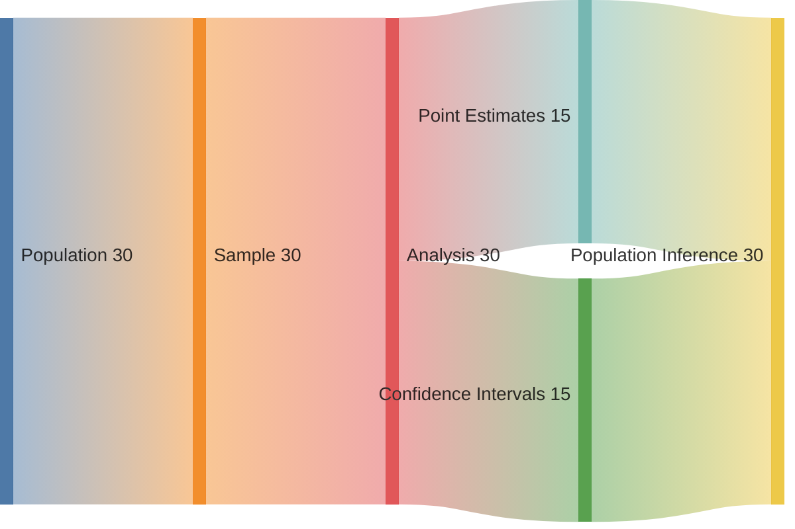
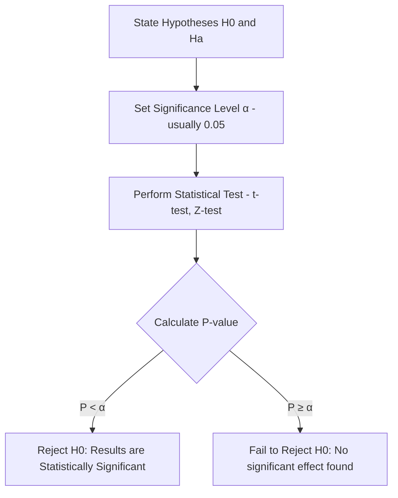
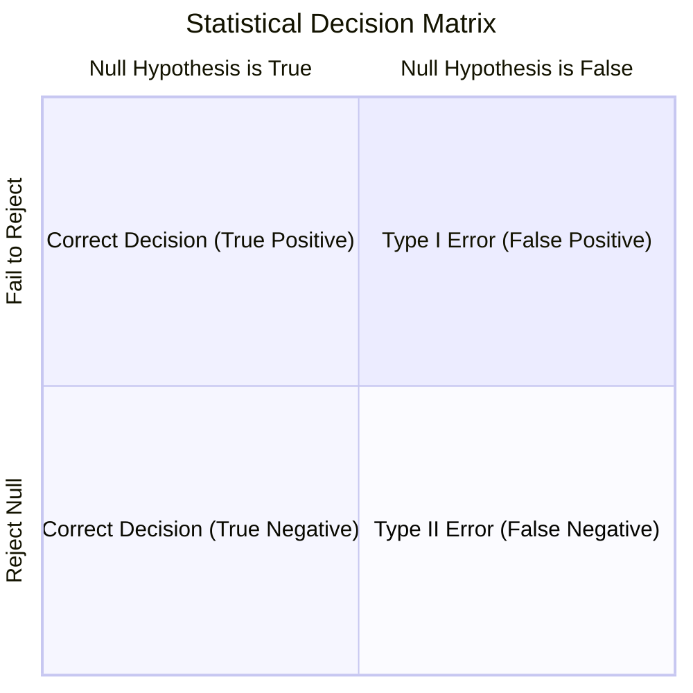

In Descriptive Statistics, we describe the data we have. In **Inferential Statistics**, we use that data to make "educated guesses" or predictions about data we *don't* have. This is the foundation of scientific discovery and model validation in Machine Learning.

## 1. The Core Workflow

Inferential statistics allows us to take a small sample and project those findings onto a larger population.

## 2. Point Estimation

A **Point Estimate** is a single value (a statistic) used to estimate a population parameter.

* **Sample Mean ($\bar{x}$)** estimates the **Population Mean ($\mu$)**.
* **Sample Variance ($s^2$)** estimates the **Population Variance ($\sigma^2$)**.

However, because samples are smaller than populations, point estimates are rarely 100% accurate. We use **Confidence Intervals** to express our uncertainty.

## 3. Hypothesis Testing

Hypothesis testing is a formal procedure for investigating our ideas about the world using statistics.

### The Two Hypotheses

1. **Null Hypothesis ($H_0$):** The "status quo." It assumes there is no effect or no difference. (e.g., "This new feature does not improve model accuracy.")
2. **Alternative Hypothesis ($H_a$):** What we want to prove. (e.g., "This new feature improves model accuracy.")

### The Decision Process

We use the **P-value** to decide whether to reject the Null Hypothesis.

## 4. Confidence Intervals

A **Confidence Interval (CI)** provides a range of values that is likely to contain the population parameter.

$$ 
\text{CI} = \text{Point Estimate} \pm (\text{Critical Value} \times \text{Standard Error}) 
$$

:::note Example
We are 95% confident that the true accuracy of our model on all future data is between 88% and 92%.
:::

## 5. Common Statistical Tests in ML

| Test | Use Case | Example in ML |
| --- | --- | --- |
| **Z-Test** | Comparing means with a large sample size (n > 30). | Comparing the average spend of two large user groups. |
| **T-Test** | Comparing means with a small sample size (n < 30). | Comparing performance of two model architectures on a small dataset. |
| **Chi-Square Test** | Testing relationships between categorical variables. | Is the "Click" rate independent of the "Device Type"? |
| **ANOVA** | Comparing means across 3 or more groups. | Does the choice of optimizer (Adam, SGD, RMSprop) significantly change accuracy? |

## 6. Type I and Type II Errors

When making inferences, we can be wrong in two ways:

 

1. **Type I Error (\alpha):** You claim there is an effect when there isn't. (False Positive).
2. **Type II Error (\beta):** You fail to detect an effect that actually exists. (False Negative).

## 7. Why this matters for ML Engineers

* **A/B Testing:** Inferential statistics is the engine behind A/B testing new model versions in production.
* **Feature Selection:** We use tests like Chi-Square to see if a feature actually has a relationship with the target variable.
* **Model Comparison:** If Model A has 91% accuracy and Model B has 91.5%, is that difference "real" or just luck? Inferential stats tells you if the improvement is **statistically significant**.

---

Understanding inference allows us to trust our model's results. Now, we dive into the specific probability distributions that model the randomness we see in the real world.