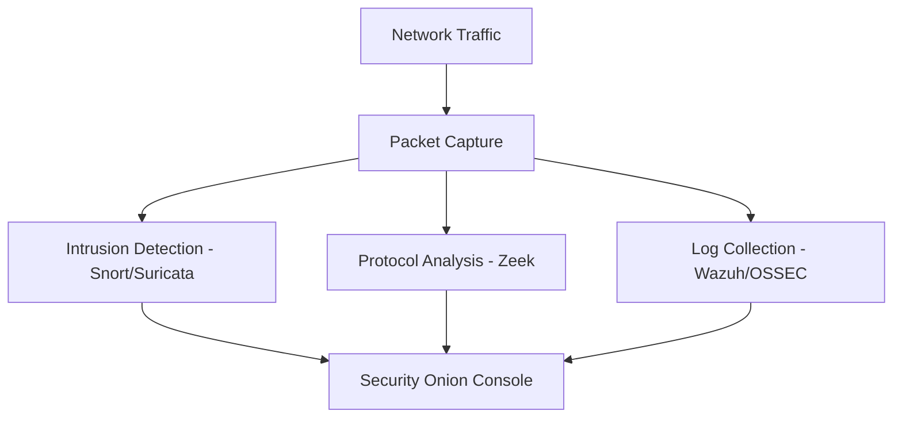
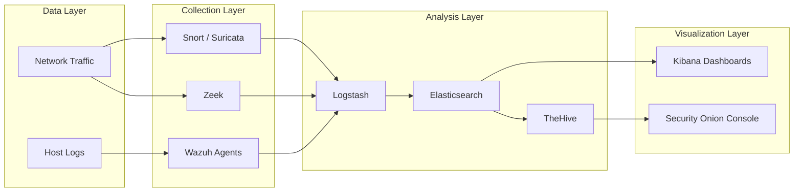
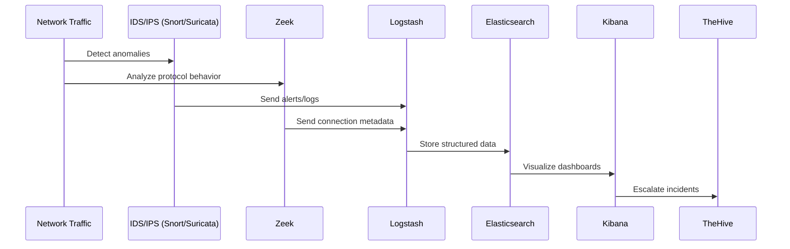
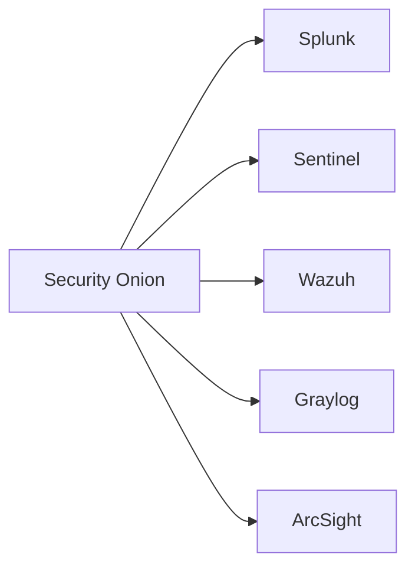

**Security Onion** is a free and open-source **Linux distribution** for **intrusion detection**, **network security monitoring (NSM)**, and **log management**. It’s widely used in **Security Operations Centers (SOCs)**, **cybersecurity training labs**, and **enterprise monitoring setups**.

Developed and maintained by **Doug Burks** and the Security Onion team, it provides an integrated suite of tools like **Snort**, **Suricata**, **Zeek**, **Wazuh**, and **Elasticsearch** — all preconfigured for rapid deployment.

## Why Security Onion?

Security Onion simplifies complex security infrastructure into a **single, cohesive platform**.



**In simple terms:**

Security Onion collects, inspects, and visualizes network data — helping analysts **detect**, **investigate**, and **respond** to security threats efficiently.


## Core Components

| Component               | Description                                                            |
| ----------------------- | ---------------------------------------------------------------------- |
| **Snort / Suricata**    | Network Intrusion Detection Systems (IDS/IPS)                          |
| **Zeek (formerly Bro)** | Network analysis framework for protocol and behavior-based detection   |
| **Wazuh / OSSEC**       | Host-based intrusion detection (HIDS) and log analysis                 |
| **Elastic Stack (ELK)** | Elasticsearch, Logstash, and Kibana — for storing and visualizing logs |
| **TheHive + Cortex**    | Incident response and case management                                  |
| **CyberChef**           | Data decoding, conversion, and analysis tool                           |

## Architecture Overview



This architecture allows real-time traffic inspection, data correlation, and security event visualization from a **single pane of glass**.

## Installation Modes

Security Onion supports three main deployment modes:

| Mode            | Use Case                                                |
| --------------- | ------------------------------------------------------- |
| **Standalone**  | Ideal for labs and small networks                       |
| **Distributed** | For enterprise-scale environments with multiple sensors |
| **Eval Mode**   | Quick evaluation using a single VM (best for beginners) |

```bash
sudo so-setup
```

You can select the desired mode during setup and configure sensors, managers, and storage accordingly.

## Workflow: From Detection to Response



This flow demonstrates how Security Onion provides **end-to-end visibility**, from detection → analysis → investigation → response.

## Log Correlation Formula

To understand correlation mathematically, think of Security Onion’s detection engine as:

$$
A(t) = \sum_{i=1}^{n} (E_i \times W_i)
$$

Where:

* $ A(t) $: Alert strength at time *t*
* $ E_i $: Event score (based on severity, frequency, or signature match)
* $ W_i $: Weight of event importance

Higher $ A(t) $ indicates higher confidence of a real incident — enabling analysts to **prioritize critical alerts** efficiently.

## Real-World Use Cases

| Scenario              | Description                                                 |
| --------------------- | ----------------------------------------------------------- |
| **SOC Operations**    | Centralized log management and real-time threat monitoring  |
| **Threat Hunting**    | Searching for Indicators of Compromise (IOCs) and anomalies |
| **Incident Response** | Using TheHive to manage and document security incidents     |
| **Training Labs**     | Perfect for blue team exercises and cyber range setups      |

## Key Tools Inside Security Onion

* **so-status** — Check system and service health
* **so-allow** — Manage firewall rules and IP access
* **so-import-pcap** — Import and analyze captured network traffic
* **so-query** — Query Elasticsearch directly from the terminal
* **so-dashboard** — Manage and monitor dashboard views

```bash
sudo so-import-pcap /path/to/traffic.pcap
```

This command imports and indexes network captures into the Elastic Stack for retrospective analysis.

## Integration with SIEM and EDR

Security Onion can send data to external systems like:

* **Splunk**
* **Microsoft Sentinel**
* **Wazuh EDR**
* **Graylog**
* **ArcSight**



This allows hybrid monitoring and advanced analytics across diverse environments.

## Key Takeaways

* Security Onion is an **all-in-one platform** for IDS, NSM, and log management.
* Combines **Snort/Suricata**, **Zeek**, **Elastic Stack**, **Wazuh**, and **TheHive**.
* Perfect for **SOC environments**, **blue team training**, and **incident response**.
* Supports **distributed deployments** for scalability.
* Offers **real-time dashboards** and **correlation across multiple data sources**.
