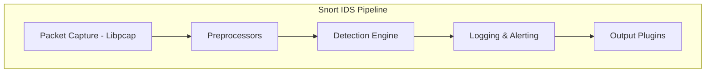
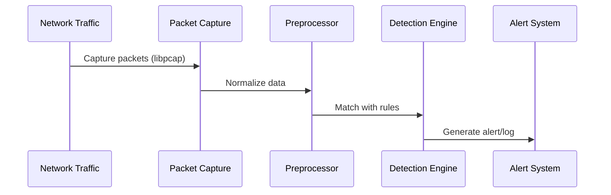
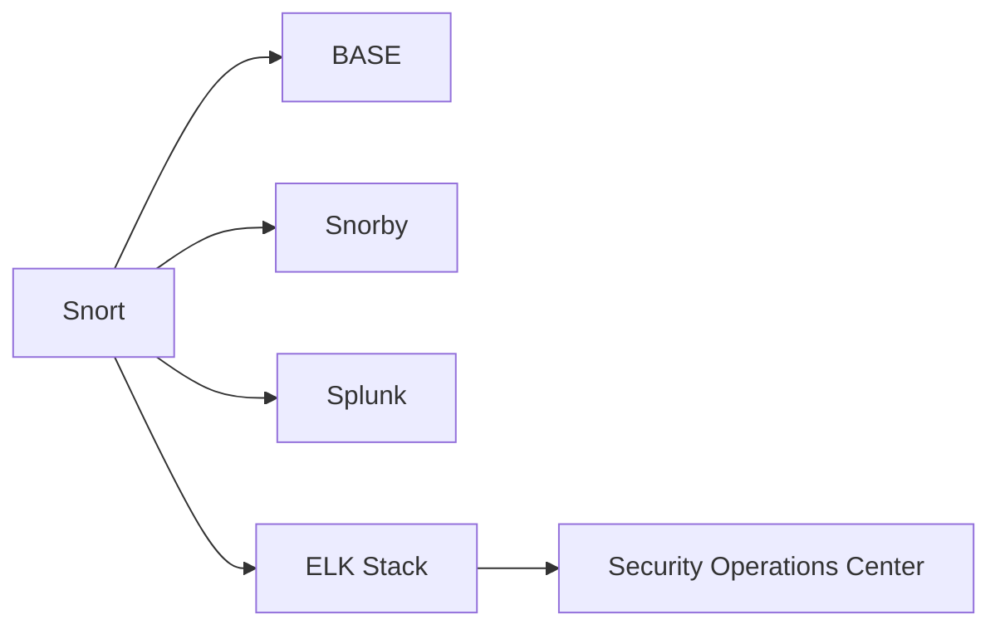

**Snort** is an **open-source Intrusion Detection and Prevention System (IDS/IPS)** developed by **Cisco**. It’s one of the most widely used network security tools for detecting and preventing malicious network traffic in real time.

## What is Snort?

Snort acts as a **network traffic analyzer** that monitors packets flowing through the network and compares them against predefined **rules** or **signatures**.

It can operate in multiple modes:

| Mode | Description |
|------|--------------|
| **Sniffer Mode** | Reads network packets and displays them on the console. |
| **Packet Logger Mode** | Logs packets to disk for later analysis. |
| **Network Intrusion Detection (NIDS) Mode** | Analyzes network traffic and alerts for suspicious activity. |
| **Intrusion Prevention (IPS) Mode** | Detects and blocks malicious packets in real time. |


## Snort Architecture



**Explanation:**

* **Packet Capture:** Uses `libpcap` to capture live network packets.
* **Preprocessors:** Normalize and prepare packets for detection (e.g., decode protocols, detect anomalies).
* **Detection Engine:** Matches traffic against Snort rules and triggers alerts.
* **Logging & Alerting:** Records alerts or logs for review.
* **Output Plugins:** Export data to databases, dashboards, or SIEM tools.

## Snort Rule Syntax

Snort rules are written in a simple yet powerful format:

```bash
alert tcp any any -> 192.168.1.0/24 80 (msg:"Possible web exploit"; content:"/bin/sh"; sid:1000001; rev:1;)
```

### Rule Breakdown

| Part                          | Meaning                                 |
| ----------------------------- | --------------------------------------- |
| `alert`                       | Action to take (alert, log, pass, drop) |
| `tcp`                         | Protocol type                           |
| `any any`                     | Source IP and port                      |
| `->`                          | Traffic direction                       |
| `192.168.1.0/24 80`           | Destination IP range and port           |
| `msg:"Possible web exploit";` | Description shown in alert              |
| `content:"/bin/sh";`          | Signature or string to match            |
| `sid:1000001;`                | Unique Snort rule ID                    |
| `rev:1;`                      | Rule version                            |


## How Snort Detects Intrusions

Snort’s detection process follows a **rule-based mathematical model**:

$$
A(t) = f(P, R, C)
$$

Where:

* $A(t)$ = Alert at time *t*
* $ P $ = Packet data captured
* $ R $ = Rule set applied
* $ C $ = Context (state/session information)

The function $( f ) $ determines whether a packet matches a rule condition, producing an alert if true.

## Example: Detecting a Port Scan

```bash
alert tcp any any -> any 22 (flags:S; msg:"Possible SSH Port Scan"; sid:2000001;)
```

This rule triggers an alert whenever a **TCP SYN packet** targets port **22 (SSH)** — a common behavior during a scan.

## Snort in Action (Workflow)



## Integration & Automation

Snort integrates with various tools for **alert management** and **data visualization**:

* **Snorby** – Web interface for Snort alerts
* **BASE** – Basic Analysis and Security Engine
* **Splunk / ELK Stack** – For SIEM and visualization
* **Security Onion** – Linux distro with Snort preconfigured



## Formula: Rule Matching Probability

Snort’s detection efficiency can be approximated as:

$$
P_{match} = \frac{M_r}{T_p}
$$

Where:

* $P_{match} $ = Probability of rule match
* $ M_r $ = Matched rules count
* $ T_p $ = Total packets processed

A higher $ P_{match} $ indicates frequent matches, possibly signaling an attack or misconfigured rule.

## Deployment Options

| Environment            | Recommended Mode            |
| ---------------------- | --------------------------- |
| **Home / Lab**         | IDS (alert-only)            |
| **Enterprise Network** | IPS (preventive blocking)   |
| **Cloud / VM**         | Inline bridge mode          |
| **SOC Environment**    | Combined Snort + SIEM setup |

## Example: Inline IPS Mode Setup (Linux)

```bash
sudo snort -Q --daq afpacket -i eth0:eth1 -c /etc/snort/snort.conf -A console
```

* `-Q`: Enables inline mode
* `--daq afpacket`: Uses AFPacket for inline packet capture
* `-i eth0:eth1`: Bridge between two interfaces
* `-A console`: Prints alerts to the console

## Key Takeaways

* **Snort** is a rule-based **IDS/IPS** used for packet-level network security.
* It uses **libpcap** for packet capture and **custom rules** for detection.
* Supports **multiple operation modes** (sniffer, logger, IDS, IPS).
* Easily integrates with **SIEMs** like Splunk and ELK for advanced monitoring.
* **Continuous rule updates** and **proper tuning** are critical for accuracy.
