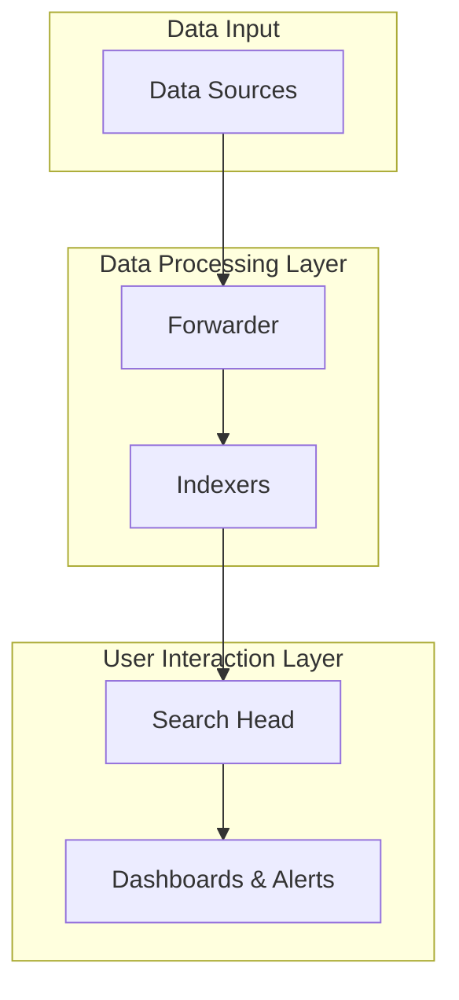
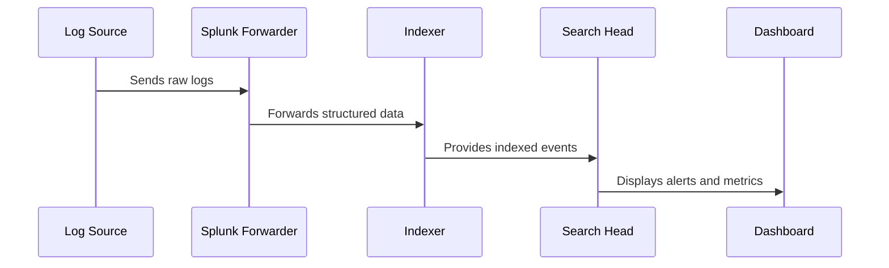
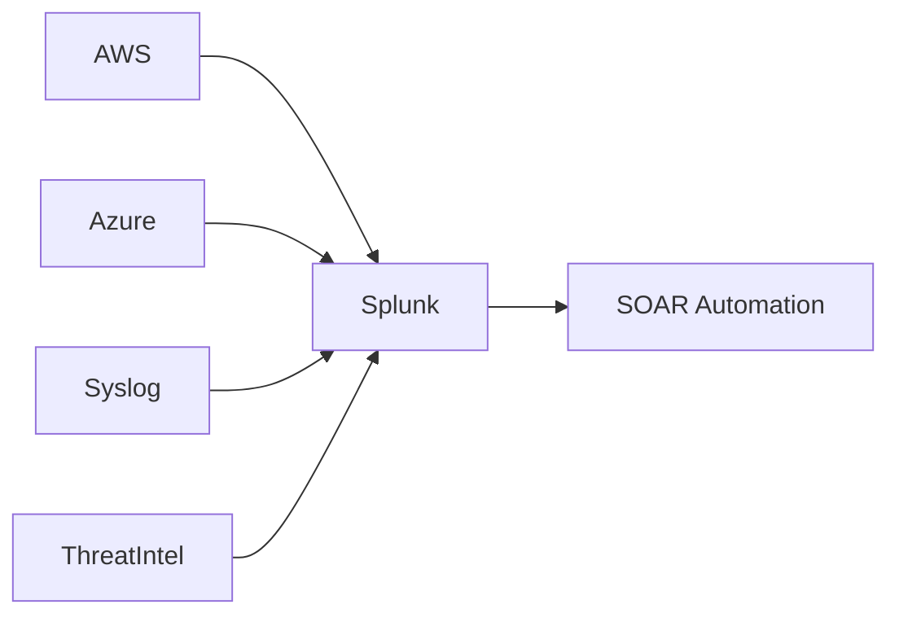

Splunk is a **Security Information and Event Management (SIEM)** platform that helps organizations monitor, analyze, and visualize machine-generated data in real time. It’s widely used for **log management**, **threat detection**, and **incident response**.

## What is Splunk?

Splunk collects and indexes data from multiple sources — network devices, applications, cloud systems, and endpoints — turning raw logs into actionable insights.

It operates on the simple formula:

$$
\text{Actionable Insight} = \text{(Search + Analyze + Visualize)}(\text{Raw Data})
$$

This means Splunk processes unstructured data into structured events, making it easy to identify patterns, anomalies, or threats.

## Splunk Architecture



* **Forwarder**: Collects data and sends it to the indexer.
* **Indexer**: Stores and indexes the data.
* **Search Head**: Allows users to run searches and queries.
* **Dashboard/Alerts**: Provides visualizations and alerting mechanisms.

## Splunk Search Processing Language (SPL)

Splunk uses **SPL (Search Processing Language)** to query indexed data.
Here’s a simple example:

```spl
index=web_logs status=404 | stats count by url
```

**Explanation:**

* `index=web_logs`: Searches in the `web_logs` index.
* `status=404`: Filters HTTP 404 errors.
* `stats count by url`: Counts occurrences grouped by URLs.

## Example: Security Alert Dashboard Flow



Splunk dashboards display real-time data to detect anomalies like spikes in failed logins or sudden traffic surges.

## Common Use Cases

| Use Case                  | Description                                                 |
| ------------------------- | ----------------------------------------------------------- |
| **Threat Detection**      | Monitor failed logins, port scans, or suspicious traffic.   |
| **Incident Response**     | Correlate events across sources to trace attacker activity. |
| **Compliance Monitoring** | Ensure adherence to policies (e.g., PCI-DSS, HIPAA).        |
| **Performance Analytics** | Track uptime, latency, and resource utilization.            |

## Data Correlation Formula

The core concept behind Splunk’s correlation search is:

$$
R(t) = \sum_{i=1}^{n} D_i(t) \times W_i
$$

Where:

* $R(t)$ = Correlation Result at time *t*
* $D_i(t)$ = Data source input
* $W_i$ = Weight (importance) of the data source

This weighted model helps identify high-confidence alerts by giving priority to critical event types.

## Integration Capabilities

Splunk can integrate with:

* **Syslog servers**
* **Cloud platforms (AWS, Azure, GCP)**
* **Threat Intelligence feeds**
* **Security Orchestration tools (SOAR, Phantom)**



## Final Thoughts

Splunk stands as a backbone of **modern security operations centers (SOCs)**.
It bridges the gap between **data visibility** and **actionable response**, empowering security teams to react faster and smarter.

## Key Takeaways

* Splunk is a **real-time data analytics** and **SIEM tool**.
* It uses **SPL** for searching and analyzing data.
* The architecture is built around **Forwarders, Indexers, and Search Heads**.
* Splunk supports **automation, alerting, and integrations** for better incident response.
* **Machine learning** features enhance predictive defense capabilities.