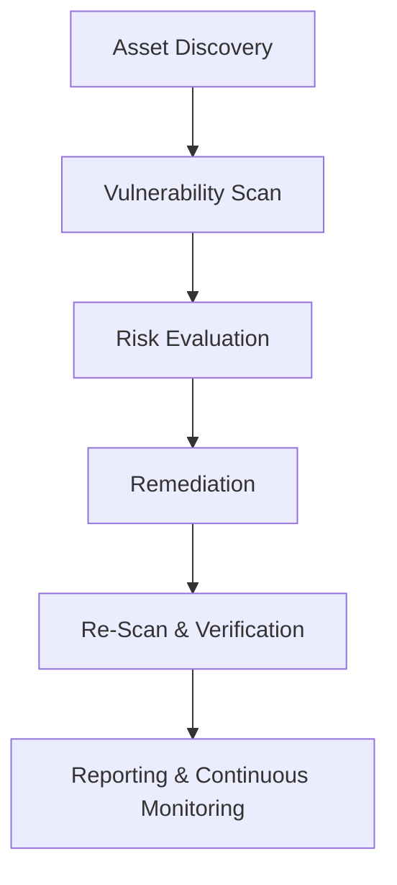
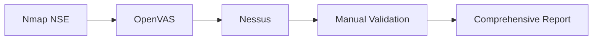
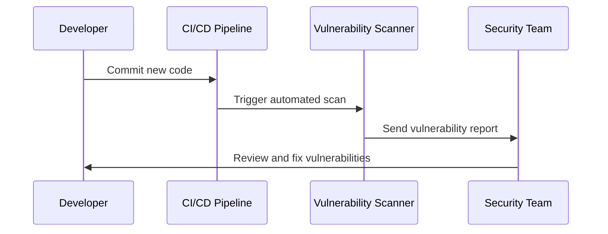

Vulnerability scanning is the process of identifying **security weaknesses in systems, networks, and applications** before attackers do. It’s the **first line of defense** in proactive cybersecurity used by penetration testers, SOC analysts, and DevSecOps teams to maintain a strong security posture.

This guide gives you **technical, hands-on insights** into scanning effectively, avoiding false positives, understanding risk scoring, and integrating results into a continuous security workflow.

## What Is Vulnerability Scanning?

A **vulnerability scanner** probes systems for:
* Missing patches or misconfigurations  
* Weak or default credentials  
* Exposed services and open ports  
* Known CVEs (Common Vulnerabilities and Exposures)  
* Unsafe protocols or outdated software versions  

:::tip Goal

Detect vulnerabilities before threat actors exploit them.

:::

## Scanning Workflow Overview

Let’s visualize how a vulnerability scan fits into the broader security cycle:



Each phase ensures not only detection but also remediation and validation, a full vulnerability management lifecycle.

## Common Scanning Tools

| Tool                    | Type           | Usage                                                |
| ----------------------- | -------------- | ---------------------------------------------------- |
| **Nmap + NSE**          | Open-source    | Network discovery & script-based vulnerability scans |
| **OpenVAS / Greenbone** | Open-source    | Comprehensive network & host vulnerability scanner   |
| **Nessus**              | Commercial     | Enterprise-grade scanning & compliance checking      |
| **Qualys**              | Cloud-based    | Continuous vulnerability management                  |
| **Nikto**               | Open-source    | Web application vulnerability scanning               |
| **Burp Suite**          | Semi-automated | Web app scanning with manual testing integration     |

## Best Practices for Effective Scanning

### 1. Identify and Classify Your Assets

Before scanning, define:

* IP ranges or domains
* Operating systems and application stack
* Critical vs non-critical systems

:::tip

Maintain an up-to-date **asset inventory** to avoid missing shadow IT systems.

:::


### 2. Use Credentialed Scanning Where Possible

Authenticated scans provide deeper insights:

* Check patch levels and registry configurations
* Identify outdated or vulnerable software
* Evaluate system hardening policies

```bash
# Example: OpenVAS with credentials
omp -u admin -w password --xml="<create_target><name>ServerScan</name><hosts>10.0.0.1</hosts><credentials><credential><type>ssh</type><name>root</name><password>toor</password></credential></credentials></create_target>"
```

:::note

Always obtain authorization before performing credentialed scans.

:::

### 3. Combine Tools for Better Coverage

No single tool detects everything. Use multiple sources for confidence.



Each layer adds reliability and cross-verification.

### 4. Understand CVSS Scoring

Vulnerabilities are often rated using **CVSS (Common Vulnerability Scoring System)**. The **base score** ranges from 0 to 10 and measures severity.

$$
CVSS_{score} = f(Impact, Exploitability, Scope)
$$

| Severity | CVSS Score | Color |
| -------- | ---------- | ----- |
| Low      | 0.1–3.9    | 🟩    |
| Medium   | 4.0–6.9    | 🟨    |
| High     | 7.0–8.9    | 🟧    |
| Critical | 9.0–10.0   | 🟥    |

:::tip
Prioritize remediation not only by score but also by **asset value** and **exploit availability**.
:::

### 5. Reduce False Positives

False positives waste analyst time and undermine confidence.

**How to minimize them:**

* Verify results manually (e.g., test endpoints or patches).
* Correlate findings with system logs.
* Disable redundant plugins or outdated detection signatures.
* Regularly update vulnerability databases (e.g., CVE feeds, NVTs).

```bash
# Update OpenVAS feed
greenbone-nvt-sync
```

### 6. Automate & Integrate Scans in CI/CD

In modern DevSecOps environments, automation is key.

Example workflow:



:::note Tools
GitHub Actions, Jenkins, or GitLab CI can automatically trigger scans during build/test stages.
:::

:::info
Integrate scanners like Trivy, Snyk, or Dependency-Check for container and dependency scanning.
:::

### 7. Continuous Monitoring and Reporting

* Schedule **weekly or monthly scans** for critical infrastructure.
* Track vulnerability trends with dashboards (e.g., Grafana, ELK).
* Generate executive summaries for leadership.

```bash
# Example: Scheduled scan using cron
0 2 * * 1 openvas-start --target "Production Servers"
```

:::info
Reporting should include vulnerability trends, severity breakdowns, and remediation status.
:::

## Quick Math Example — Risk Prioritization Formula

To calculate overall **risk score** for a vulnerability:

$$
Risk = Likelihood \times Impact
$$

For example:

* Likelihood = 0.8 (based on exploitability)
* Impact = 0.9 (based on data sensitivity)

$$
Risk = 0.8 \times 0.9 = 0.72
$$

> A score above **0.7** might trigger an immediate patch or containment action.

## Real-World Example

**Scenario:** You’re performing a vulnerability scan on a web application.

| Step | Tool       | Action                                  |
| ---- | ---------- | --------------------------------------- |
| 1    | Nmap       | Identify open ports (80, 443, 8080)     |
| 2    | Nikto      | Run web server vulnerability scan       |
| 3    | Burp Suite | Test for SQLi, XSS, CSRF                |
| 4    | OpenVAS    | Validate findings at network level      |
| 5    | Manual     | Confirm exploit manually or through PoC |

```bash
nikto -h https://example.com -output scan_results.txt
```

> Cross-validate Nikto results with OWASP ZAP or Burp to filter false positives.

:::note Final Thoughts

Vulnerability scanning is not a one-time event — it’s a **continuous, adaptive process**.
Combine automated scanning with human validation, integrate it into your CI/CD workflow, and align results with your organization’s threat model.

### Key Points Recap:

* Start with accurate asset discovery
* Use both authenticated and unauthenticated scans
* Cross-verify results with multiple tools
* Automate scans and integrate into DevSecOps
* Continuously monitor and report vulnerabilities

> “**Scanning without remediation is just noise.** Make sure every detected issue leads to action.”

:::