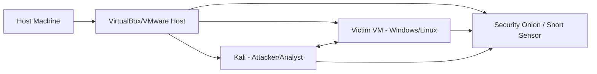

This lab teaches you how to **capture network traffic**, **analyze packets**, and **extract meaningful artifacts** (files, credentials, protocols) using common tools: **Wireshark**, **tcpdump**, and **tshark**. You’ll learn safe capture practices, filter strategies, forensic extraction techniques, and detection patterns that are useful for both red and blue teamers.

:::warning Legal & Safety Notice
Only run packet captures on networks and systems you own or for which you have **explicit authorization**. Packet captures can include sensitive data (passwords, tokens, PII). Treat captured data as confidential.
:::

## Lab Goals

* Set up safe packet captures in an isolated lab.  
* Use capture filters (BPF) vs. display filters (Wireshark).  
* Extract files (HTTP, SMB) and reconstruct sessions (Follow TCP Stream).  
* Detect common suspicious patterns (cleartext creds, ARP spoofing, DNS exfil).  
* Measure capture quality and avoid packet drops.

## Lab Topology (Suggested)



Use a host-only / internal network so traffic is contained. Optionally include a monitoring sensor (Security Onion) to compare detections.

## Tools You’ll Use

* **Wireshark** — GUI packet analysis, decoding protocols, reconstructing objects.
* **tcpdump** — Lightweight CLI capture and initial triage.
* **tshark** — CLI version of Wireshark for scripted analysis and extraction.
* **ngrep** — Human-friendly packet pattern matching (good for quick HTTP inspection).
* **capinfos / editcap** (from Wireshark suite) — pcap metadata and manipulation.
* **scapy** (Python) — craft/test packets programmatically.

Install on Kali / Ubuntu:

```bash
sudo apt update
sudo apt install wireshark tcpdump tshark ngrep -y
```

## Capture Basics — Where & How

### Promiscuous mode vs Monitor mode

* **Promiscuous mode** — NIC receives all frames on the same Ethernet segment (useful for bridged/host networks).
* **Monitor mode** — Wireless interface mode to capture raw 802.11 frames (required for Wi-Fi sniffing).

### Mirror/SPAN port or host-only network

For reliable captures of multi-host traffic, use a switch’s **SPAN** port or a virtual network in host-only/internal mode.

### Basic tcpdump capture

Capture on `eth0`, no name resolution, write to pcap:

```bash
sudo tcpdump -i eth0 -nn -s 0 -w capture.pcap
```

Rotate files every 100 MB (prevent disk fill):

```bash
sudo tcpdump -i eth0 -nn -s 0 -C 100 -w capture-%Y%m%d-%H%M%S.pcap
```

## Capture Filters (BPF) — Apply at Capture Time

Capture filters reduce the amount of data copied to disk (kernel-level), e.g.:

* By host:

  ```bash
  sudo tcpdump -i eth0 host 192.168.56.102 -w host.pcap
  ```
* By port:

  ```bash
  sudo tcpdump -i eth0 tcp port 80 -w http.pcap
  ```
* By network:

  ```bash
  sudo tcpdump -i eth0 net 192.168.56.0/24 -w lan.pcap
  ```
* Complex:

  ```bash
  sudo tcpdump -i eth0 'tcp and (port 80 or port 443) and not src net 10.0.0.0/8' -w web.pcap
  ```

**Rule of thumb:** Use capture filters to avoid overwhelming storage, but be conservative when you expect an unknown attack (capture broader, then filter in analysis).

## Display Filters — Inspect After Capture (Wireshark / tshark)

Display filters are applied in the analyzer (Wireshark) and are far more expressive:

* Show HTTP: `http`
* Show DNS: `dns`
* Show traffic to/from IP: `ip.addr == 192.168.56.102`
* Show TLS handshakes: `tls.handshake`
* Show packets containing credentials (HTTP Basic auth): `http.authbasic` (or search for `Authorization: Basic` in payload)

Example: filter for POST requests to `/login`:

```
http.request.method == "POST" && http.request.uri contains "/login"
```


## Analysis Recipes — Common Tasks

### 1) Follow a TCP stream (reconstruct session)

In Wireshark: right-click a TCP packet → `Follow` → `TCP Stream`.
This shows the request/response flow (useful for web sessions and simple protocols).

### 2) Extract HTTP objects (files)

Wireshark → `File` → `Export Objects` → `HTTP` — choose objects (images, downloads) to save.

With `tshark` or `tcpflow`:

```bash
# tshark to extract HTTP objects isn't trivial; prefer Wireshark GUI or use `foremost` on reassembled streams
tcpflow -r capture.pcap
```

### 3) Detect cleartext credentials

Search for likely fields or patterns:

* HTTP basic authentication: look for `Authorization: Basic`.
* Common POST param names: `password`, `pwd`, `pass`, `token`.
* Use display filter in Wireshark:

```
http contains "password" || http contains "Authorization"
```

### 4) Find DNS exfil patterns (many small unique subdomains)

Telltale sign: lots of unique DNS queries to suspicious domain:

```tshark
tshark -r capture.pcap -Y "dns.qry.name" -T fields -e dns.qry.name | sort | uniq -c | sort -nr | head
```

If you see thousands of distinct subdomains for a single base domain, suspect DNS tunneling/exfil.

## Lab Exercises

### Lab 1 — Basic Capture & HTTP Analysis

1. Start capture on sensor or host:

   ```bash
   sudo tcpdump -i eth0 -nn -s 0 -w web_lab.pcap
   ```
2. From victim VM, open a webpage that serves images and simple forms.
3. Stop capture after a few minutes and open `web_lab.pcap` in Wireshark.
4. Use display filter `http` and `Follow TCP Stream` for POST to `/login`. Export any downloadable object.

**Learning outcome:** Understand HTTP fields, reconstruct requests, and extract files.

### Lab 2 — Detect Cleartext Credentials

1. In the victim web app, submit forms with simple credentials (lab only).
2. Capture traffic and filter:

   ```
   http contains "password" || http contains "Authorization"
   ```
3. Identify credentials, then reconfigure the app to use HTTPS and re-run capture.
4. Show difference: encrypted TLS payload vs cleartext.

**Learning outcome:** Why HTTPS matters, and how cleartext leaks credentials.

### Lab 3 — ARP Spoofing & Detection

1. In lab, run a simple ARP spoof from Kali (using `arpspoof` or `ettercap`) to MITM Victim → Gateway.

   ```bash
   sudo arpspoof -i eth0 -t 192.168.56.102 192.168.56.1
   sudo arpspoof -i eth0 -t 192.168.56.1 192.168.56.102
   ```
2. Capture traffic on Sensor and Victim. Look for duplicate ARP replies, gratuitous ARP, and sudden change in MAC-IP mapping.
3. Use Wireshark filter:

   ```
   arp.opcode == 2 && arp.src.proto_ipv4 == 192.168.56.1
   ```
4. Detect presence of MITM and restore ARP state after lab.

**Learning outcome:** How ARP spoofing looks on the wire and ways to detect it.

### Lab 4 — TLS Decryption in Lab (SSLKEYLOGFILE)

If you control the client and server you can decrypt TLS in Wireshark using the client key log:

1. In a controlled browser (Firefox/Chrome), set `SSLKEYLOGFILE` env var before launching:

   ```bash
   export SSLKEYLOGFILE=/tmp/sslkeys.log
   firefox &
   ```
2. In Wireshark: `Edit → Preferences → Protocols → TLS → (Pre)-Master-Secret log filename` → point to `/tmp/sslkeys.log`.
3. Capture traffic and load pcap. Wireshark will be able to decrypt TLS application data for sessions from that browser.

**Learning outcome:** Understand what can and cannot be decrypted, and how TLS protects payloads when keys remain private.

## Measuring Capture Quality & Packet Drops

Capturing at high rates can drop packets. You should measure drop rate:

Let:

* (C) = captured packets (what tcpdump/wireshark shows)
* (D) = dropped packets reported by NIC or capture tool

The **drop rate**:

$$
\text{Drop_Rate} = \frac{D}{C + D}
$$

Example: if `tcpdump`/`pcap` statistics show `packets captured = 100000` and `packets dropped = 2000`:

$$
\text{Drop_Rate} = \frac{2000}{102000} \approx 0.0196 ; (1.96%)
$$

**How to reduce drops**

* Capture on a dedicated host or mirror port.
* Use `-s 0` only when you need full payload; otherwise use smaller snaplen.
* Write to local fast SSD, not network storage.
* Use ring buffers (`-C`/`-W`) to split files.

Check capture stats with `tcpdump -r file.pcap -z` or `capinfos capture.pcap`.

## Command Cheatsheet

```bash
# Capture full packets on interface eth0 to file
sudo tcpdump -i eth0 -nn -s 0 -w capture.pcap

# Capture only HTTP
sudo tcpdump -i eth0 -nn -s 0 tcp port 80 -w http.pcap

# Read pcap and show top DNS queries
tshark -r capture.pcap -Y "dns.qry.name" -T fields -e dns.qry.name | sort | uniq -c | sort -nr | head

# Extract HTTP objects using Wireshark GUI:
# File -> Export Objects -> HTTP

# List pcap info
capinfos capture.pcap

# Convert pcapng to pcap with editcap
editcap -F pcap input.pcapng output.pcap

# TShark: export HTTP bodies (example)
tshark -r capture.pcap -Y "http.content_type contains \"text/html\"" -T fields -e http.file_data > bodies.txt
```

## Reporting & Evidence Handling

* Record capture metadata: who captured, where, time range, capture filters.
* Hash pcap files (SHA256) before analysis and store copies securely.
* When including artifacts in reports, redact sensitive fields (PII, passwords) unless needed for remediation and allowed by scope.
* Provide reproductions steps and timestamps for any suspicious activity.

## Summary & Next Steps

This lab covers the essential skills for network sniffing and packet analysis. Next steps you might want to take:

* Deep dive into **protocol analysis** (DNS, SMB, SMB2, NTLM, SMB signing).
* Learn **Zeek/Bro** for network metadata generation and automated detection.
* Practice **forensic reconstruction** (reassembling files, parsing email attachments, analyzing malware C2).
* Integrate packet captures into a SIEM (Splunk/ELK) for alerting and long-term analysis.