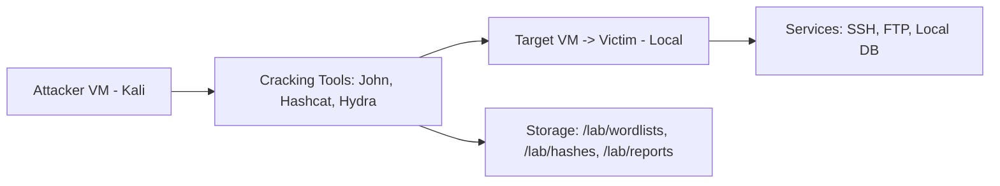

This lab teaches you **how password cracking works**, how to run controlled experiments with **John**, **Hashcat**, and **Hydra**, and how to interpret and report results responsibly.  Everything below is written for **lab use only** — do **not** run these techniques on systems you don’t own or haven’t been explicitly authorized to test.

:::warning Legal & Ethical Warning

Unauthorized password cracking is illegal and unethical. Only perform the exercises in an isolated lab or on systems where you have written permission.

:::

## Learning Objectives

* Set up a safe password-cracking environment (VMs / Docker).  
* Create and identify common hash formats (MD5, NTLM, bcrypt, SHA-256).  
* Use **John the Ripper** and **Hashcat** for offline cracking (wordlists, masks, rules).  
* Use **Hydra** for controlled online login testing (SSH/FTP/HTTP forms) in-lab.  
* Measure cracking performance, calculate password entropy, and produce an audit report with remediation steps.

## Lab Topology



Typical setup: Host runs VirtualBox/VMware with two VMs — **Kali (attacker)** and **Ubuntu (victim)**. Use a host-only/internal network.

## Prerequisites & Resources

* Virtualization: VirtualBox or VMware
* VMs: Kali Linux (attacker) + a Linux victim (Ubuntu)
* Tools preinstalled (on Kali): `john`, `hashcat`, `hydra`, `zip`, `openssl`, `python3`
* Wordlists: `rockyou.txt`, `SecLists` (passwords, common-usernames)
* GPU (optional): NVIDIA/AMD with drivers & OpenCL/CUDA for Hashcat performance

File layout suggestion:

```
/lab/
  wordlists/
    rockyou.txt
    seclists/
  hashes/
    unix_shadow.txt
    ntlm_hashes.txt
  reports/
```

## Lab Setup — Create Test Accounts & Hashes (Safe, Local)

**On the victim VM (Ubuntu)** — create test users with known passwords:

```bash
# create test users (lab only)
sudo useradd -m -s /bin/bash alice
echo "alice:Password123!" | sudo chpasswd

sudo useradd -m -s /bin/bash bob
echo "bob:qwerty2020" | sudo chpasswd

# create an intentionally weak user for practice
sudo useradd -m -s /bin/bash eve
echo "eve:123456" | sudo chpasswd
```

Export `/etc/passwd` + `/etc/shadow` for offline cracking (authorized lab):

```bash
# on victim, as root
sudo cp /etc/passwd /tmp/lab_passwd
sudo cp /etc/shadow /tmp/lab_shadow
sudo chown $USER:$USER /tmp/lab_passwd /tmp/lab_shadow
# transfer these files to attacker VM over host-only share
```

On attacker (Kali), combine files for John:

```bash
unshadow /path/to/lab_passwd /path/to/lab_shadow > /lab/hashes/unshadowed.txt
```

Create an NTLM example (Windows-simulated) and some raw hashes:

```bash
# simple MD5 example
echo -n "password" | md5sum > /lab/hashes/md5.txt

# create NTLM hash using mkntpwd or pypi:passlib, or save exported Windows hashes for lab
# For demonstration, use known NTLM string:
echo "aad3b435b51404eeaad3b435b51404ee:8846f7eaee8fb117ad06bdd830b7586c" > /lab/hashes/ntlm.txt
```

## Exercise 1 — John the Ripper: Wordlist + Rules

**Goal:** Crack `/etc/shadow` entries using a common wordlist and John’s default rules.

```bash
# common commands
john --wordlist=/usr/share/wordlists/rockyou.txt --rules /lab/hashes/unshadowed.txt

# view cracked passwords
john --show /lab/hashes/unshadowed.txt
```

**Notes**

* `--rules` mutates words (capitalize, append numbers, leetspeak).
* Use `--format=` if you need to specify hash format (e.g., `--format=sha512crypt`).

## Password Entropy — Quick Math

Password entropy estimates how many bits of unpredictability a password has.

**Formula:**

$$
Entropy = L \times \log_2(N)
$$

* $L$ = length of password
* $N$ = size of character set (e.g., 26 lowercase, 52 letters, 62 letters+digits, plus symbols)

**Example:** `Password123!`

* Length (L = 12)
* Character set approx (N = 94) (printable ASCII)
  $$
  Entropy \approx 12 \times \log_2(94) \approx 12 \times 6.5546 \approx 78.66 \text{ bits}
  $$

Use this to explain why longer passphrases beat short complex passwords.

## Exercise 2 — Hashcat: GPU-Accelerated Mask Attack

If you have a GPU, Hashcat is faster for large-scale cracking.

**Example:** Mask attack for passwords with 4 letters + 2 digits:

```bash
# hashcat mode 0 = MD5, -a 3 = mask attack
hashcat -m 0 -a 3 /lab/hashes/md5.txt ?l?l?l?l?d?d -w 3 --status --status-timer=10 --session=lab_mask
```

**Mask shorthand**:

* `?l` = lowercase, `?u` = uppercase, `?d` = digits, `?s` = special, `?a` = all.

Use `-O` for optimized kernels (shorter password limits) and `-w` to adjust workload profile.

## Exercise 3 — Hybrid Attacks & Rules

Combine wordlists with masks or rules to target common human patterns (word + year, name + 123).

```bash
# Hashcat hybrid example: wordlist + 2 digit mask
hashcat -m 1000 -a 6 ntlm_hashes.txt /usr/share/wordlists/rockyou.txt ?d?d -w 3

# John with rules
john --wordlist=/usr/share/wordlists/rockyou.txt --rules=Jumbo /lab/hashes/unshadowed.txt
```

## Exercise 4 — Hydra (Online, Controlled)

Hydra tests login services (SSH/FTP/HTTP forms). **Ensure target is your VM and rate-limit to avoid lockouts.**

**SSH example (lab VM):**

```bash
hydra -L /lab/wordlists/usernames.txt -P /usr/share/wordlists/rockyou.txt \
  -t 4 -f -o /lab/reports/hydra_ssh_hits.txt ssh://192.168.56.102
```

**HTTP form example:**

```bash
hydra -L users.txt -P passwords.txt 192.168.56.103 http-post-form \
"/login.php:user=^USER^&pass=^PASS^:F=Incorrect" -t 4 -o /lab/reports/hydra_http.txt
```

## Measuring Performance & Throughput

For offline cracking (Hashcat), measure hashes per second:

```bash
hashcat -m 1000 -b          # benchmark NTLM and show H/s
```

For John, use `--status` or check `john.pot` potfile. Record H/s to compare wordlist effectiveness and GPU acceleration.

## Reporting — What to Include

Your lab audit should include:

* Scope & authorization statement (who approved lab).
* Hash types and sources (e.g., `unshadowed /etc/shadow`).
* Tools & versions used (John v..., Hashcat v..., Hydra v...).
* Wordlists and rules applied (rockyou, custom masks).
* Crack summary (accounts cracked, time taken, method). Example table:

| Account | Hash Type   | Cracked | Method         | Time   |
| ------- | ----------- | ------- | -------------- | ------ |
| alice   | sha512crypt | ✅       | wordlist+rules | 2m 30s |
| bob     | sha512crypt | ✅       | mask           | 45s    |
| eve     | sha512crypt | ✅       | brute-force    | 5s     |

* Impact & remediation (force resets, enable MFA, hash migration).
* Artifacts (output files) stored securely.

## Remediation Checklist (For Lab Reports)

* [ ] Enforce strong password policies (length, passphrases).
* [ ] Implement Multi-Factor Authentication (MFA).
* [ ] Use slow, salted hashing (Argon2 / bcrypt / scrypt).
* [ ] Implement account lockout / rate-limiting for online services.
* [ ] Scan password databases for reused/compromised passwords (check against breach lists).
* [ ] Educate users on passphrase use and password managers.

## Advanced Topics & Experiments

* Build targeted wordlists using `cewl` or `maskprocessor`.
* Use `hashcat-utils` for candidate generation & statistics.
* Try distributed cracking setups (multiple GPUs across machines).
* Experiment with `--session` and `--restore` for very long jobs.

## Final Notes & Safety

This lab is meant to build defensive expertise: understand attacker techniques so you can protect systems. Keep your findings confidential and use them to improve security posture, not for unauthorized access.