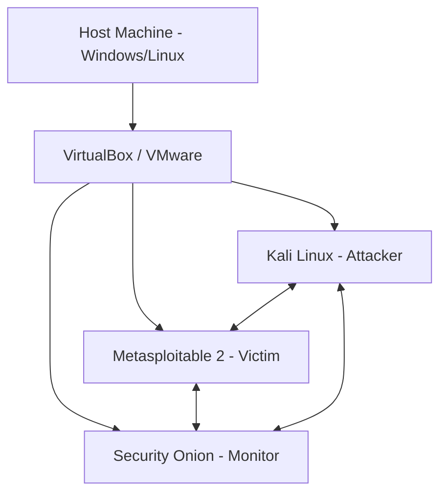
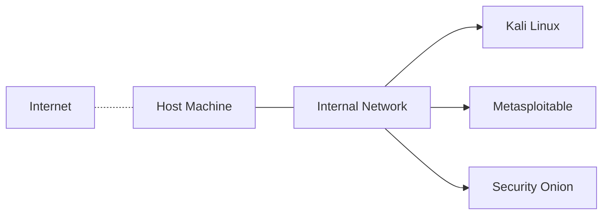
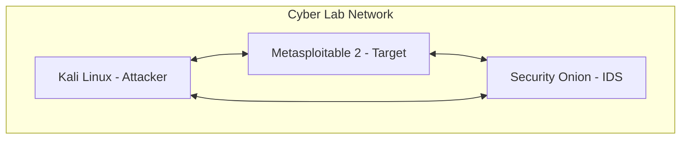

Before diving into hands-on hacking, network monitoring, or digital forensics, you need a **safe and isolated lab environment**. This ensures your experiments don’t harm your system or network — and helps you learn security tools in a **controlled sandbox**.

## What is a Cybersecurity Lab?

A **cybersecurity lab** is a controlled, virtual environment where you can safely:
* Practice **ethical hacking** and **penetration testing**.
* Analyze **malware behavior**.
* Simulate **network attacks and defenses**.
* Study **incident response** and **forensics**.

:::tip[Before You Begin]
Make sure your computer has **at least:**
* 16 GB RAM (minimum 8 GB)
* 100 GB free disk space
* Virtualization enabled in BIOS
* Tools: [VirtualBox](https://www.virtualbox.org/) or [VMware Workstation Player](https://www.vmware.com/)
:::

## Lab Architecture Overview

Here’s a simple architecture for a beginner-friendly cybersecurity lab:



**Goal:**

* **Kali Linux** → used for offensive testing and scanning
* **Metasploitable** → a vulnerable machine for testing exploits
* **Security Onion** → monitors network activity and captures logs

## Step 1: Choose a Virtualization Platform

You can use either **VirtualBox (free)** or **VMware**.
Both support creating **isolated networks** that simulate a real-world LAN.

**Recommended Setup:**

```bash
Host:  Windows 10 / Ubuntu 22.04
Virtualization Tool:  VirtualBox
VMs:  Kali Linux, Metasploitable 2, Security Onion
```

## Step 2: Download Required ISOs

| Tool / OS                 | Description                                | Download Link                                                                                      |
| ------------------------- | ------------------------------------------ | -------------------------------------------------------------------------------------------------- |
| **Kali Linux**            | Offensive Security distro for pentesting   | [kali.org](https://www.kali.org/get-kali/)                                                         |
| **Metasploitable 2**      | Vulnerable VM for exploitation             | [SourceForge Link](https://sourceforge.net/projects/metasploitable/)                               |
| **Security Onion**        | Network monitoring and intrusion detection | [securityonionsolutions.com](https://securityonionsolutions.com/software/)                         |
| **Windows 10 Evaluation** | Optional for Windows pentesting            | [Microsoft Eval Center](https://developer.microsoft.com/en-us/windows/downloads/virtual-machines/) |

## Step 3: Configure the Network

Use an **Internal Network** or **Host-Only Adapter** to keep your lab **isolated from the Internet**.



### Network Modes Explained

| Mode                 | Description                                  |
| -------------------- | -------------------------------------------- |
| **NAT**              | Internet access for updates                  |
| **Host-Only**        | Isolated from Internet, connects VMs to host |
| **Internal Network** | Fully isolated VM-to-VM communication        |

## Step 4: Test Connectivity

Once all VMs are running, test the network connection.

```bash
# From Kali Linux terminal
ping 192.168.56.102  # Metasploitable
ping 192.168.56.103  # Security Onion
```

If you receive replies, your lab network is configured correctly.

## Step 5: Take Snapshots

Snapshots help you **restore your lab** to a clean state after testing exploits or malware.

```bash
VBoxManage snapshot "Kali Linux" take "Clean State"
VBoxManage snapshot "Metasploitable" take "Fresh Setup"
```

## Step 6: Install and Configure Tools

### On Kali Linux

```bash
sudo apt update && sudo apt install nmap metasploit-framework burpsuite john hydra
```

### On Security Onion

Use its setup wizard:

```bash
sudo so-setup
```

Then select:

* **Eval Mode** (for small labs)
* Add sensor and manager roles

## Step 7: Verify Monitoring

Generate test traffic using **nmap** from Kali and check if **Security Onion** detects it.

```bash
sudo nmap -sS 192.168.56.102
```

Then open Kibana (Security Onion Dashboard) → search for “Nmap Scan” events.

## Security Lab Performance Formula

The efficiency of your lab setup can be modeled as:

$$
E = \frac{R_m + D_t + M_s}{N_c}
$$

Where:

* $ E $ = Efficiency of lab environment
* $ R_m $ = Resource management (RAM/CPU usage)
* $ D_t $ = Detection time for incidents
* $ M_s $ = Monitoring stability
* $ N_c $ = Number of concurrent VMs

**Goal:** Keep $ E $ high by balancing performance and monitoring accuracy.

## Optional Add-ons

* **PfSense** – Add a firewall for network segmentation
* **Cloud Integration** – Simulate AWS or Azure security labs
* **ELK Stack** – Build your own SIEM from scratch
* **Volatility / Autopsy** – Practice memory and disk forensics

## Final Lab Layout Summary



Your cybersecurity playground is now ready! You can start exploring penetration testing, exploit development, and network defense — all within a **secure virtual ecosystem**.

## Next Steps

* Build a **Penetration Testing Project** using your Kali + Metasploitable setup
* Integrate **Splunk** or **Wazuh** for additional SIEM insights
* Practice **Incident Response** with Security Onion and TheHive