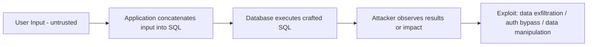

**SQL Injection (SQLi)** is a class of vulnerability where untrusted input is interpreted as part of a database query. It can allow attackers to read, modify, or delete data, bypass authentication, or (in extreme cases) execute commands on the server.

This page walks you through a **safe, educational demo** — focused on **how SQLi works**, **how to test it in a controlled lab**, and **how to fix it properly**. Every example here is intended for *local testing* (DVWA, WebGoat, or your own intentionally vulnerable app). Do **not** run these techniques against third-party systems.

:::warning Legal & Ethical Notice  
Only perform SQL injection testing on systems you own or have **explicit written permission** to test. Unauthorized testing is illegal and unethical and can cause real damage.
:::

## Quick Overview — Attack Flow



## Types of SQL Injection (short)

* **Error-based** — causes the DB to return error messages that leak data.
* **Union-based** — use `UNION SELECT` to append attacker results to legitimate query results.
* **Boolean-based (Blind)** — infer data by observing true/false responses.
* **Time-based (Blind)** — infer data by forcing DB to delay responses (e.g., `SLEEP()`), useful when output is not visible.

## Lab Setup (what you should use)

Use one of these safe environments:

* **DVWA (Damn Vulnerable Web App)** — has SQLi labs.
* **WebGoat** — practice vulnerable patterns.
* **A local intentionally vulnerable app** — e.g., a small PHP/MySQL demo running in a VM isolated from the Internet.

Network: ensure VMs are on an **internal** or **host-only** network so no external machines are exposed.

## Vulnerable Example (PHP — DO NOT USE IN PRODUCTION)

This tiny example shows a classic vulnerable pattern (string concatenation into SQL):

```php title="vulnerable.php"
// (do NOT deploy publicly)
<?php
$pdo = new PDO('mysql:host=127.0.0.1;dbname=test', 'user', 'pass');
$id = $_GET['id']; // untrusted input
$sql = "SELECT username, email FROM users WHERE id = $id";  // vulnerable!
$stmt = $pdo->query($sql);
$row = $stmt->fetch(PDO::FETCH_ASSOC);
echo "User: " . htmlspecialchars($row['username']);
?>
```

**Why it's vulnerable:** `$_GET['id']` is inserted directly into SQL — an attacker can send `?id=1 OR 1=1` to change query logic.

## Demo Payload Examples (Lab Only)

### 1) Authentication bypass (simple)

```
' OR '1'='1' -- 
```

If the application concatenates this into `WHERE username = '...' AND password = '...'`, it can make the WHERE always true.

### 2) Union-based data extraction (example)

```
' UNION SELECT null, database(), user() -- 
```

Used when query columns are known or guessed; appends results from attacker SELECT.

### 3) Error-based leak (example)

```
' AND (SELECT 1 FROM (SELECT COUNT(*), CONCAT((SELECT database()),0x3a,FLOOR(RAND(0)*2)) AS x FROM information_schema.tables GROUP BY x)a) -- 
```

Complex — forces DB error that may include data in an error message (depends on DB & settings).

### 4) Time-based blind (MySQL)

```
' OR IF(SUBSTRING((SELECT password FROM users WHERE id=1),1,1)='a', SLEEP(5), 0) -- 
```

If the response is delayed, the first character is `'a'`. Repeat to extract full strings.

## Detecting SQLi (Safe methods)

1. **Manual input tests (in lab):**

   * Input: `'` or `"' OR '1'='1` and watch for errors or changed behavior.
2. **Observe application responses:**

   * Different page content, errors, or delays (time-based) are indicators.
3. **Use controlled automated testing carefully:**

   * Tools like `sqlmap` can automate exploitation — use **only in lab** with `--batch` if preferred.
   * Example (lab only):

     ```bash
     sqlmap -u "http://localhost/vuln.php?id=1" --batch --level=2 --risk=1
     ```
   * **Warning:** sqlmap can be noisy and destructive if options like `--os-shell` or `--os-pwn` are used. Avoid those.

## Step-by-step Demo (Safe, educational)

**Goal:** Show an authentication bypass and then fix the app.

1. Start your vulnerable app (e.g., DVWA low mode or the `vulnerable.php` above).
2. Visit the login or query page and enter an injection payload: `' OR '1'='1' --`. Observe login success or change.
3. Try a `UNION SELECT` where applicable to list database info (table names) — use small column counts first (e.g., `UNION SELECT 1,2` to see how many columns the original query expects).
4. Use time-based injection to practice blind extraction — measure response times.
5. Record findings and then **apply fixes** (see remediation below) and re-test.

## Fixing SQL Injection — Secure Patterns

### 1) Prepared Statements / Parameterized Queries

**PHP (PDO) — safe rewrite of vulnerable example:**

```php title="safe.php"
<?php
$pdo = new PDO('mysql:host=127.0.0.1;dbname=test', 'user', 'pass', [
  PDO::ATTR_ERRMODE => PDO::ERRMODE_EXCEPTION,
]);
$id = $_GET['id'];
$stmt = $pdo->prepare('SELECT username, email FROM users WHERE id = :id');
$stmt->execute([':id' => $id]);
$row = $stmt->fetch(PDO::FETCH_ASSOC);
echo "User: " . htmlspecialchars($row['username']);
?>
```

**Node.js (mysql2) example:**

```js title="safe.js"
const mysql = require('mysql2/promise');
const pool = mysql.createPool({ host: '127.0.0.1', user: 'user', database: 'test' });

app.get('/user', async (req, res) => {
  const id = req.query.id;
  const [rows] = await pool.execute('SELECT username, email FROM users WHERE id = ?', [id]);
  res.send(`User: ${escapeHtml(rows[0].username)}`);
});
```

**Why prepared statements work:** The DB engine treats the SQL text and parameters separately, so input can't change query structure.

### 2) Principle of Least Privilege (DB user)

* App DB user should have minimal permissions (e.g., `SELECT`, `INSERT` only where required).
* Never connect as the DB admin (root).

**Example:** create a limited user:

```sql
CREATE USER 'appuser'@'localhost' IDENTIFIED BY 'strongpassword';
GRANT SELECT, INSERT, UPDATE ON myappdb.* TO 'appuser'@'localhost';
FLUSH PRIVILEGES;
```

### 3) Input Validation & Output Encoding

* Validate types (numbers, dates) on server side.
* Use allow-lists (whitelists) not block-lists.
* Encode output in HTML to prevent XSS when showing DB values.

### 4) Use ORMs Safely

* ORMs often parameterize queries for you. Learn how your ORM constructs queries and avoid `raw` SQL when possible.
* Example (Sequelize):

```js
User.findOne({ where: { id: req.query.id } });
```

## Logging & Monitoring

* Log suspicious inputs and failed queries (redact sensitive data).
* Monitor for excessive requests that match injection patterns or cause repeated DB errors.
* Use WAF rules (e.g., ModSecurity) as an additional layer — not a replacement for secure code.

## Risk Prioritization (simple formula)

When prioritizing a found SQLi vulnerability, consider:

$$
Risk = Impact \times Exploitability
$$

* **Impact:** 0..1 (data sensitivity, ability to modify/delete, auth bypass)
* **Exploitability:** 0..1 (easy blind/visible, requires auth, network access)

If `Risk > 0.7` treat as high priority.

## Practical Remediation Checklist

* [ ] Replace all string-concatenated SQL with prepared statements.
* [ ] Enforce server-side input validation and type checks.
* [ ] Use least-privilege DB accounts.
* [ ] Add logging and alerts for suspicious query patterns.
* [ ] Test fixes by re-running safe scans in lab environment.
* [ ] Use automated CI tests that assert SQLi defenses for new code (unit/integration tests).

## Further Practice Exercises (Lab)

1. **Column discovery with UNION** — use `UNION SELECT` with incremental column counts to find the right number of columns, then extract a simple string column.
2. **Blind extraction** — write a small script to automate boolean/time-based extraction of a single character from a target string (lab only).
3. **Secure migration** — convert a vulnerable route to prepared statements, demonstrate fix, and show that previous payloads no longer work.
4. **Use sqlmap locally** — run `sqlmap` against your local DVWA instance with `--batch --risk=1 --level=1` and review findings. **Do not** use aggressive options.

## Resources & References

* OWASP SQL Injection Cheat Sheet — a practical reference.
* DVWA / WebGoat — vulnerable apps for practice.
* sqlmap documentation — automated testing tool (use responsibly).

## Final Notes

SQL Injection remains one of the oldest — and most impactful — web vulnerabilities. The cure is straightforward but requires discipline: **parameterize queries, validate input, and follow least privilege**. Practice detection and remediation in isolated labs until secure patterns become second nature.