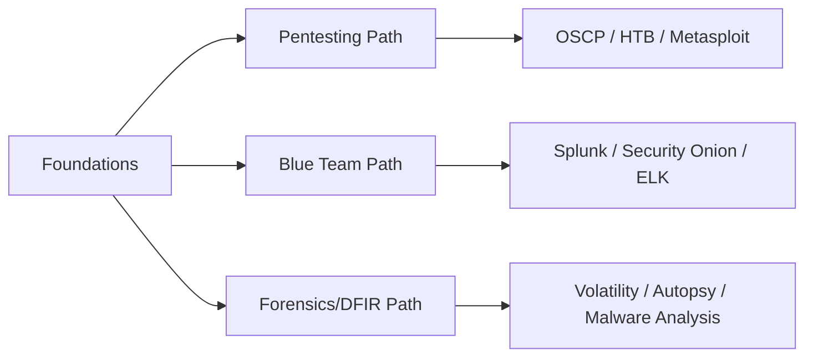
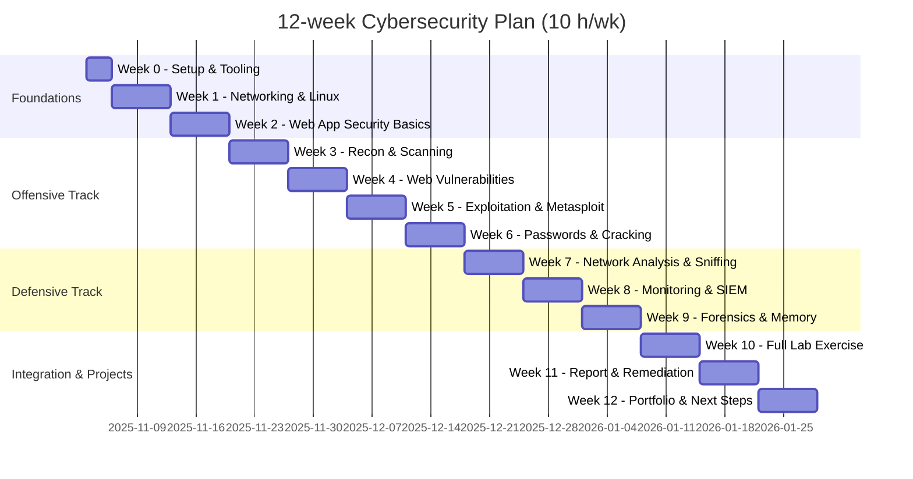

This page collects **high-quality, practical books, online courses, and learning platforms** I recommend for building real-world cybersecurity skills. The list is organized by **level** and **role**, with short notes on *why* each resource helps and how to use it inside your lab or study plan.

:::warning Ethics first
Use these resources to learn defensively and legally. Don’t practice offensive techniques on targets you don’t own or aren’t authorized to test.
:::

## How to pick resources

Use this simple formula to pick study time and intensity:

$$
\text{Total\_Hours} = \text{Weeks} \times \text{Hours\_per\_Week}
$$

Example: a 12-week study block at 8 hours/week gives $(12 \times 8 = 96)$ hours — enough to complete 1–2 intermediate courses plus hands-on labs.

## Beginner — foundations (skills, 1–3 months)

### Books
* **The Web Application Hacker's Handbook** — excellent for practical web security fundamentals and payload mindset.  
* **Hacking: The Art of Exploitation** — core systems and exploitation concepts with hands-on C examples (good for thinking like an attacker).  
* **Practical Packet Analysis** — short book to learn packet capture basics (Wireshark/tcpdump).

### Courses & Platforms
* **TryHackMe (Beginner Paths)** — guided, hands-on rooms for absolute beginners (networking, web, Linux basics).  
* **Coursera / edX** — “Introduction to Cybersecurity” or vendor-backed beginner certificates (IBM, Google, etc.).  
* **Udemy** — beginner-friendly courses like “Complete Cyber Security Course” (look for high-rated instructors such as Nathan House).

### How to use them
* Read one book while completing 2–3 TryHackMe beginner modules.  
* Build a lab (Kali + vulnerable VM) and practice simple tasks: scanning, packet capture, and a basic SQLi lab.

## Intermediate — tooling & practice (3–6 months)

### Books
* **Metasploit: The Penetration Tester’s Guide** — practical exploitation workflows using Metasploit.  
* **Practical Malware Analysis** — great for getting started with dynamic/static malware analysis (laboratory-focused).  
* **The Practice of Network Security Monitoring** — for blue team skills: detection and monitoring.

### Courses & Platforms
* **TryHackMe (Intermediate / Offensive Paths)** — CTF-style labs and structured paths for pentesting basics.  
* **Hack The Box (HTB)** — hands-on vulnerable machines, great for practicing enumeration & exploitation.  
* **Offensive Security (PWK / OSCP)** — if you want a rigorous, hands-on pentesting course (lab-heavy).  
* **Pluralsight / LinkedIn Learning** — targeted courses for specific OS or stack skills (Windows internals, Linux hardening).

### How to use them
* Pair a book chapter with a targeted lab (e.g., read Metasploit chapter → exploit a Metasploitable VM).  
* Aim to solve 1 HTB machine per week and keep a writeup journal.

## Advanced & Specialization (6+ months)

### Books
* **Applied Cryptography** — deep dive into cryptographic primitives and design (theory + practice).  
* **Rootkits & Bootkits** (or vendor advanced titles) — for deep OS internals & persistence techniques.  
* Vendor and SANS books on advanced DFIR, forensics, and exploit dev.

### Courses & Platforms
* **Offensive Security — OSCP → OSCE (advanced)** — exam and lab-focused progression for exploit development and deep pentesting.  
* **SANS Institute** — high-quality, high-cost courses on DFIR, ICS/SCADA, advanced incident response.  
* **eLearnSecurity / Pentester Academy** — advanced offensive/defensive specializations.  
* **Cloud security courses** (AWS/Azure/GCP security tracks) — for cloud-native attack/defense.

### How to use them
* Combine advanced reading with long, timed lab exercises (e.g., multi-week exploit chains, red-team scenarios).  
* Contribute to writeups, open-source tooling, or research to deepen mastery.

## Practical, role-focused learning paths

* **Pentester**: Foundations → Nmap, Burp, Metasploit → HTB/OSCP → Advanced exploit dev.
* **Blue team / SOC analyst**: Foundations → Splunk/ELK, Security Onion → Incident response & threat hunting.
* **Forensics / Malware Analyst**: Foundations → Autopsy & Volatility → dynamic malware analysis / sandboxing.

## Recommended hands-on platforms & labs

* **TryHackMe** — excellent guided beginner → intermediate paths.
* **Hack The Box** — real-world machine practice, scalable difficulty.
* **VulnHub / Metasploitable** — downloadable vulnerable VMs for offline labs.
* **RangeForce / Immersive Labs** — scenario-based SOC training (team/enterprise focus).
* **Cuckoo Sandbox / Any.run** — for safe malware execution and observation.

## Courses & Certificates — which to choose

* **Entry-level / career-starters**: Google Cybersecurity Certificate, IBM Cybersecurity Analyst (Coursera), CompTIA Security+.
* **Hands-on offensive**: Offensive Security PWK → OSCP (laboratory and exam).
* **Hands-on defensive**: Splunk Fundamentals + Splunk certifications; Elastic/Kibana training; Security Onion courses.
* **Management / governance**: CISSP (broad), CISM (management-focused).

:::tip
Certifications support hiring and credibility — but practical labs and documented projects (HTB writeups, GitHub repos, blog posts) are often *more convincing* in job interviews.
:::

## Study plan — 12-week sample (balanced)

### Weeks 1–4 (Foundations)

* Read a foundational book (e.g., *Web App Hacker’s Handbook* chapter excerpts).
* Complete TryHackMe beginner path (networking + web basics).
* 6–8 hours/week hands-on.

### Weeks 5–8 (Tools & Practice)

* Finish a focused course (Burp / Nmap + Web labs).
* Solve 6 HTB/THM machines (one per 3–4 days).
* Start a lab notebook / writeups.

### Weeks 9–12 (Project & Report)

* Pick a target VM → run a full pentest (recon → exploit → post-exploit) in lab.
* Produce a short report and remediation recommendations.
* Prepare for a certification exam if desired.

## Free vs Paid — what to invest in

* **Free:** TryHackMe (many free rooms), VulnHub, OWASP resources, YouTube instructors (John Hammond, LiveOverflow), GitHub repos, OWASP Juice Shop.
* **Paid & high-value:** OSCP (lab depth), SANS (enterprise-grade), Pluralsight/OffSec courses for structured progression, books from reputable publishers (No Starch, O’Reilly).
* **Tip:** Start with free resources; invest in one paid, lab-heavy course (OSCP or equivalent) when you’re ready to commit time.

## Continuous learning — podcasts, newsletters, and blogs

* **Podcasts:** *Darknet Diaries*, *Risky Business*, *Security Weekly* — good for threat context and stories.
* **Newsletters / blogs:** SANS Internet Storm Center, Krebs on Security, Cloud provider security blogs (AWS, Microsoft) for cloud-focused learners.
* **Twitter / X and Mastodon:** follow respected practitioners for short tips and links to research.

## How to keep momentum (practical tips)

* Build a **weekly habit** (2–3 focused sessions of 60–120 minutes).
* Maintain a **lab notebook** with timestamps, commands, and lessons learned.
* Publish **1 writeup every month** (HTB box, lab exercise, or vulnerability replication).
* Join local meetups and online communities — accountability speeds learning.

## Quick annotated reading list (one-line why)

* *The Web Application Hacker’s Handbook* — web app attack and defense best practices.
* *Hacking: The Art of Exploitation* — systems fundamentals and exploit mindset.
* *Practical Malware Analysis* — malware triage & sandboxing techniques.
* *Metasploit: The Penetration Tester’s Guide* — exploitable modules & workflow.
* *The Practice of Network Security Monitoring* — building the blue team muscle.
