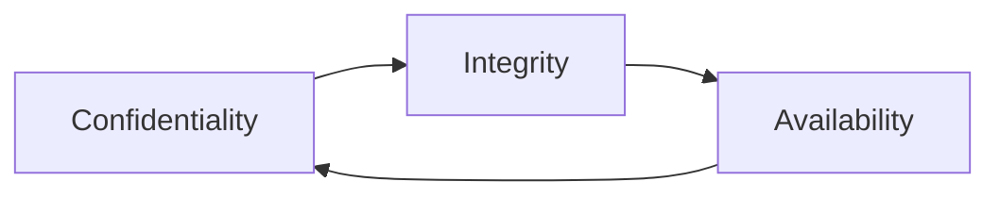

This glossary gathers **clear, user-friendly definitions** of key cybersecurity terms you’ll encounter in these tutorials and labs. Use it as a quick reference while you’re learning tools, running labs, or writing reports.

:::warning
This glossary explains concepts for education and defensive practice. Do **not** use this information for malicious activities. Always act ethically and follow the law.
:::

## A — C

**APT (Advanced Persistent Threat):** A long-term, targeted intrusion campaign run by a capable adversary (often nation-state or organized group) that maintains stealthy presence to exfiltrate data or observe targets.

**Authentication:** Process that verifies a user or system identity (e.g., password, token, biometrics).

**Authorization:** Determines what authenticated users are allowed to do (permissions and access control).

**AV / Antivirus:** Software that detects, quarantines, or removes known malware using signature and heuristic techniques.

**CA (Certificate Authority):** Trusted organization that issues public key certificates used in TLS/PKI to validate identities.

**CISA / CISSP / (other certs):** Common certification acronyms you might see. (Examples in the certification guide explain scope and prerequisites.)

**CIA Triad**  
Core security properties: **Confidentiality**, **Integrity**, **Availability**.

**CISA / CISM / CISSP:** Professional certifications for security practitioners (governance, management, architecture).

**Cipher / Encryption:** Algorithm that transforms plaintext into ciphertext to prevent unauthorized reading. Decryption is the reverse operation.

**CVE (Common Vulnerabilities and Exposures):** A unique identifier for a publicly known vulnerability (e.g., CVE-2024-XXXXX).

**CVSS (Common Vulnerability Scoring System):** Numeric system (0–10) used to express the severity of vulnerabilities. See the Certification Guide and vulnerability scanning tips for how scores are used.

## D — F

**DDoS (Distributed Denial of Service):** Attack that overwhelms a service with traffic from many sources to cause downtime.

**Detection vs Prevention:**

|Detection|Prevention|
|-----|-----|
|identifying malicious activity (IDS, SIEM). | blocking or mitigating an attack before impact (IPS, firewalls, WAF). |

**Digital Forensics:** Process of collecting, preserving, analyzing digital evidence (disk, memory, logs) for incident response and legal processes.

**DMZ (Demilitarized Zone):** Network segment that exposes services to the Internet while keeping internal networks protected.

**EDR (Endpoint Detection & Response):** Agent-based technology that monitors endpoints for suspicious behavior and supports remediation.

**Exploit:** Code or sequence that takes advantage of a vulnerability to cause unintended behavior (e.g., RCE, auth bypass).

**Firewall:** Network or host device that controls traffic flow based on rules (packet filtering, stateful inspection).

## G — I

**Hash / Hashing:** One-way function that maps input to a fixed-size output. Common uses: integrity checks and password storage (with salt).

* Example property: small input change → large hash change.
* Formula (conceptual):
  $$
  h = H(x)
  $$
  where $(H)$ is the hash function, $(x)$ is input, and $(h)$ the digest.

**Honeypot / Honeytoken:** Deceptive resource designed to attract attackers so defenders can observe techniques and collect Indicators of Compromise (IOCs).

**HSM (Hardware Security Module):** Specialized device for secure key storage and cryptographic operations.

**IAAS / PAAS / SAAS**
Cloud service models: Infrastructure, Platform, Software as a Service. Each has shared-security responsibilities.

**IDS / IPS**

* **IDS (Intrusion Detection System)**: monitors and alerts on suspicious traffic.
* **IPS (Intrusion Prevention System)**: can block or drop traffic inline.

**Incident Response (IR):** Structured process for detecting, containing, eradicating, recovering from, and learning after a security incident.

**IOC (Indicator of Compromise):** Artefacts (file hashes, IPs, domains) that indicate a system has been compromised.

## J — L

**Least Privilege**
Security principle: grant the minimum privileges necessary for tasks or services.

**Lateral Movement:** Act by which an attacker moves through a network from an initial foothold to higher-value systems.

## M — O

**MFA (Multi-Factor Authentication):** Authentication requiring two or more independent credentials (something you know, have, or are).

**MITM (Man-in-the-Middle):** Attack where an adversary intercepts and potentially alters communications between two parties.

**NIST:** National Institute of Standards and Technology — publishes widely used security frameworks and guidance (e.g., NIST IR lifecycle).

**Network Sniffing / Packet Capture:** Collecting raw network packets (tcpdump, Wireshark) for analysis. Useful for debugging, forensics, and detecting exfiltration.

**Non-repudiation:** Guarantee that an actor cannot deny a previous action (often addressed with digital signatures).

**Obfuscation:** Technique to make code or data harder to analyze (used legitimately and by malware authors).

## P — R

**Patch / Vulnerability Management:** Process to identify, prioritize, and remediate software flaws (scanning → testing → patch deployment → verification).

**Penetration Testing (Pentest):** Authorized simulated attack to evaluate security posture and find vulnerabilities before adversaries do.

**Phishing / Spear Phishing:** Social-engineering attacks via email or messages; spear-phishing targets specific individuals with tailored content.

**PKI (Public Key Infrastructure):** System for issuing, managing, and revoking digital certificates used in TLS and encrypted channels.

**Privilege Escalation:** Techniques to gain higher permissions on a host (vertical) or broader access across systems (horizontal).

**Proof-of-Concept (PoC):** A minimal demonstration that a vulnerability is exploitable; used in testing and reporting.

**RAT (Remote Access Trojan):** Malware that provides remote, persistent control of a compromised host.

**RDP (Remote Desktop Protocol):** Microsoft’s remote desktop protocol — common target for brute force and credential theft if exposed.

## S — U

**Salt (in password hashing):** Random data added to a password before hashing to prevent precomputed attacks (rainbow tables).

**SCADA / ICS:** Industrial control systems with specialized security considerations (OT security).

**SIEM (Security Information and Event Management):** Platform that aggregates logs, correlates events, and enables alerting and investigation (e.g., Splunk, ELK).

**SLA (Service-Level Agreement):** Contractual uptime and performance guarantees that influence incident response priorities.

**SOC (Security Operations Center):** Team and platform that monitor security telemetry, triage alerts, and coordinate response.

**SQLi (SQL Injection):** Web vulnerability where untrusted input is executed in a database query. Lab demos demonstrate detection and fixes (use parameterized queries).

**SSO / OAuth / SAML:** Authentication / federated identity standards and flows used for single sign-on and delegated access.

**Supply Chain Attack:** Compromise that leverages software dependencies, update channels, or third-party services to reach targets.

**Threat Intel:** Information about adversary capabilities, infrastructure, and motives used to prioritize defenses and detection.

**TTP (Tactics, Techniques, Procedures):** Attacker behavior models used in threat hunting (e.g., MITRE ATT&CK).

**TLS / SSL:** Protocols that provide encrypted channels for network communication. TLS has largely superseded SSL.

## V — Z

**Vulnerability:** A weakness in hardware, software, or configuration that can be exploited to cause harm.

**Vulnerability Disclosure:** Process and policy for reporting, verifying, and remediating security flaws (coordinated disclosure).

**WAF (Web Application Firewall):** A protective layer that filters and monitors HTTP(s) traffic to web applications, often blocking common attacks (e.g., SQLi, XSS).

**XSS (Cross-Site Scripting):** Web vulnerability where attacker-supplied script executes in victims’ browsers. Types: reflected, stored, DOM-based.

**Zero Trust:** Security model that assumes no implicit trust; verify everything (identity, device, context) before granting access.

## Quick Reference Table (Shortcuts)

| Term    | Quick Definition                       |
| ------- | -------------------------------------- |
| CVE     | Public vulnerability ID                |
| CVSS    | Vulnerability severity score           |
| IOC     | Indicator of Compromise                |
| SIEM    | Log aggregation & correlation platform |
| IDS/IPS | Detect / Prevent network threats       |
| MFA     | Multi-factor authentication            |
| PKI     | Certificate & key management system    |

## How to Use This Glossary

* Bookmark this page while studying tools and labs.
* Link terms in your notes to these definitions for consistent language in reports.
* If you need a deeper dive on any term, use the tutorial index — many glossary items have full sections (e.g., **SIEM** → Splunk Overview; **Memory Forensics** → Volatility).