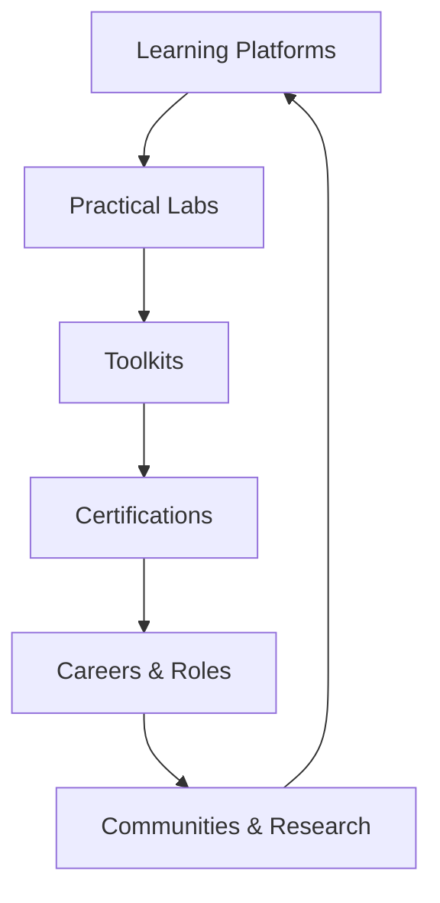

This page lists **curated links** to the most trusted resources—tools, communities, blogs, labs, and documentation to help you **stay updated, practice ethically, and build expertise** in cybersecurity.

:::warning
Always verify any downloaded tools or scripts from third-party sources. Stick to **official documentation and trusted repositories** to avoid malicious versions.
:::

## Official Documentation & Standards

| Resource | Description |
|-----------|--------------|
| [OWASP Foundation](https://owasp.org) | Community-driven web security standards and projects like OWASP Top 10. |
| [MITRE ATT&CK Framework](https://attack.mitre.org) | A comprehensive matrix of adversarial tactics and techniques used in real-world attacks. |
| [NIST Cybersecurity Framework](https://www.nist.gov/cyberframework) | Best practices and standards for managing cybersecurity risks. |
| [CIS Benchmarks](https://www.cisecurity.org/cis-benchmarks) | Secure configuration guidelines for systems, networks, and cloud environments. |
| [ISO/IEC 27001](https://www.iso.org/isoiec-27001-information-security.html) | International standard for information security management systems (ISMS). |

## Hands-on Learning & Labs

| Platform | Description |
|-----------|--------------|
| [TryHackMe](https://tryhackme.com) | Guided, beginner-friendly virtual rooms for learning cybersecurity hands-on. |
| [Hack The Box](https://www.hackthebox.com) | Real-world penetration testing and CTF challenges for intermediate/advanced learners. |
| [VulnHub](https://www.vulnhub.com) | Downloadable vulnerable machines for local practice. |
| [OverTheWire](https://overthewire.org) | Classic wargame-based cybersecurity puzzles (e.g., Bandit, Narnia, Leviathan). |
| [Root-Me](https://www.root-me.org) | Challenges across web, network, crypto, and reverse engineering. |
| [PortSwigger Academy](https://portswigger.net/web-security) | Free, in-depth Burp Suite and web app security labs. |
| [RangeForce](https://www.rangeforce.com) | Professional cyber range for team-based defensive exercises. |

## Knowledge Bases & Learning Platforms

| Platform | Description |
|-----------|--------------|
| [Cybrary](https://www.cybrary.it) | Structured cybersecurity courses and career paths. |
| [Coursera Cybersecurity Specializations](https://www.coursera.org/browse/information-technology/cybersecurity) | Vendor and university-backed cybersecurity courses. |
| [edX Cybersecurity](https://www.edx.org/learn/cybersecurity) | Free and paid courses from leading institutions. |
| [OpenSecurityTraining2](https://opensecuritytraining.info) | Free in-depth training materials on topics like memory forensics and exploit dev. |
| [YouTube - LiveOverflow](https://www.youtube.com/@LiveOverflow) | Great for visual learning through hack demos and exploit breakdowns. |
| [John Hammond’s Channel](https://www.youtube.com/@JohnHammond010) | Walkthroughs, CTFs, and practical cybersecurity exercises. |

## Security Tools & Frameworks

| Tool | Link | Description |
|------|------|--------------|
| Metasploit | [https://www.metasploit.com](https://www.metasploit.com) | Industry-standard penetration testing framework. |
| Wireshark | [https://www.wireshark.org](https://www.wireshark.org) | Network protocol analyzer for packet capture and analysis. |
| Burp Suite | [https://portswigger.net/burp](https://portswigger.net/burp) | Web application penetration testing suite. |
| OWASP ZAP | [https://www.zaproxy.org](https://www.zaproxy.org) | Open-source web application security scanner. |
| Autopsy | [https://www.autopsy.com](https://www.autopsy.com) | Digital forensics platform for analyzing disks and files. |
| Volatility | [https://www.volatilityfoundation.org](https://www.volatilityfoundation.org) | Memory analysis framework for incident response. |

## Cybersecurity News & Threat Intelligence

| Resource | Description |
|-----------|--------------|
| [The Hacker News](https://thehackernews.com) | Latest security news, vulnerabilities, and exploits. |
| [Bleeping Computer](https://www.bleepingcomputer.com) | Cyber incidents and malware analysis reports. |
| [Krebs on Security](https://krebsonsecurity.com) | In-depth articles by Brian Krebs on cybersecurity trends. |
| [Dark Reading](https://www.darkreading.com) | Threat intelligence and security research news. |
| [SANS Internet Storm Center](https://isc.sans.edu) | Daily logs, threat reports, and infosec news. |
| [VirusTotal Intelligence](https://www.virustotal.com/gui/home/upload) | File and URL scanning for malware and suspicious behavior. |

## Community & Collaboration

| Platform | Description |
|-----------|--------------|
| [Reddit: r/cybersecurity](https://www.reddit.com/r/cybersecurity/) | Discussions, news, and advice from infosec professionals. |
| [Infosec Discord Servers](https://discord.gg/tryhackme) | Active chat communities for TryHackMe, Hack The Box, and others. |
| [LinkedIn Security Groups](https://www.linkedin.com/groups) | Networking with professionals and finding cybersecurity roles. |
| [OWASP Local Chapters](https://owasp.org/chapters/) | Join a local OWASP chapter to connect with web security practitioners. |
| [DEF CON Groups](https://defcongroups.org) | Local DEF CON community meetups around the world. |

## Research Papers & Academic Resources

| Resource | Description |
|-----------|--------------|
| [Google Scholar - Cybersecurity](https://scholar.google.com/scholar?q=cybersecurity) | Academic papers on security, cryptography, and network defense. |
| [arXiv Security Section](https://arxiv.org/list/cs.CR/recent) | Cutting-edge cryptography and computer security research papers. |
| [USENIX Security](https://www.usenix.org/conferences/byname/108) | Premier conference papers and research archives. |
| [Black Hat Briefings](https://www.blackhat.com) | Technical research presentations from world-class security researchers. |

## Cloud Security Resources

| Resource | Description |
|-----------|--------------|
| [AWS Security Hub](https://aws.amazon.com/security/) | Centralized cloud security visibility for AWS users. |
| [Microsoft Defender for Cloud Docs](https://learn.microsoft.com/en-us/azure/defender-for-cloud/) | Azure’s native cloud security platform. |
| [Google Cloud Security Best Practices](https://cloud.google.com/security) | Security guidelines for GCP workloads. |
| [Prowler](https://github.com/prowler-cloud/prowler) | Open-source AWS security assessment tool. |
| [ScoutSuite](https://github.com/nccgroup/ScoutSuite) | Multi-cloud security auditing tool. |

## Cybersecurity Certifications & Career Prep

| Certification | Official Link | Level |
|----------------|----------------|-------|
| CompTIA Security+ | [https://www.comptia.org/certifications/security](https://www.comptia.org/certifications/security) | Beginner |
| CEH (Certified Ethical Hacker) | [https://www.eccouncil.org](https://www.eccouncil.org) | Intermediate |
| OSCP (Offensive Security Certified Professional) | [https://www.offsec.com](https://www.offsec.com) | Advanced |
| CISSP (Certified Information Systems Security Professional) | [https://www.isc2.org](https://www.isc2.org) | Advanced |
| CHFI (Computer Hacking Forensic Investigator) | [https://www.eccouncil.org](https://www.eccouncil.org) | Forensics |
| CCSP (Certified Cloud Security Professional) | [https://www.isc2.org/Certifications/CCSP](https://www.isc2.org/Certifications/CCSP) | Cloud Security |

## Cybersecurity Metrics Formula (For Learners)

A simplified way to measure your weekly learning momentum:

$$
\text{Progress Score} = \frac{\text{Completed Labs} + (\text{Books Read} \times 2)}{\text{Weeks}}
$$

:::info
**Example:** If you completed 6 labs and read 1 book in 3 weeks:  
$ (6 + (1 \times 2)) / 3 = 2.67 $  
Aim for a **progress score ≥ 2** each week for steady growth.
:::

## Cybersecurity Ecosystem (Mermaid Visualization)

## Suggested Path for Beginners

1. Start with **TryHackMe** or **OverTheWire** to learn by doing.
2. Follow **PortSwigger Academy** to understand web attacks.
3. Use **OWASP Top 10** as your web security checklist.
4. Set up your lab with **Kali Linux + Metasploitable** VMs.
5. Join **communities** and follow experts to stay current.
