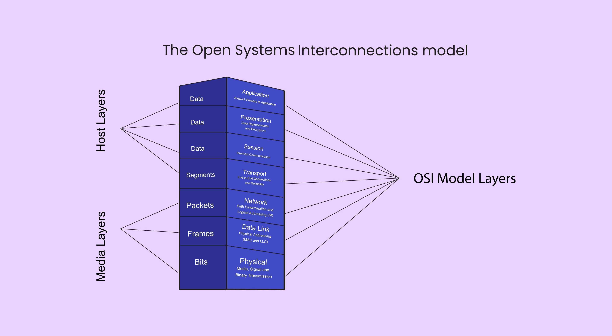

**CSS Scalability** is the ability of a stylesheet codebase to grow over time without becoming a source of bugs, conflicts, or developer friction. As projects increase in complexity, the global nature of CSS makes it prone to side effects—where changing one style breaks an unrelated part of the application.

Achieving scalability requires establishing clear boundaries, conventions, and architectural layers to control the cascade.

<AdsComponent />
<br />

## 1. Establishing Architectural Layers (SMACSS)

One of the most effective strategies for scalability is adopting a layered architecture, such as **SMACSS (Scalable and Modular Architecture for CSS)**. This approach separates your styles into distinct, predictable categories, enforcing structure and controlling the cascade.




### A. Base and Layout

| Layer | Purpose | Content | Priority |
| :--- | :--- | :--- | :--- |
| **Base** | Default styles applied to bare elements. | `reset.css`, `body`, `h1`, `a`, form elements. | Lowest. |
| **Layout** | Defines the major page sections and containers. | Grid systems, headers, footers, sidebars (`.l-main-content`). | Low. |

### B. Module (Components)

This is the largest and most critical layer for scalability. Modules are reusable, independent components (e.g., a card, a modal, a button).

:::tip Key Scalability Rule
Styles within a module **must not** rely on the styles defined in the Layout or Base layers, except for global resets. A module should render correctly regardless of where it is placed on the page.
:::

### C. State and Theme

| Layer | Purpose | Notation/Scope |
| :--- | :--- | :--- |
| **State** | Describes how a module or layout looks in a particular state. | Prefixed classes like `.is-active`, `.has-error`. Always override module/layout styles. |
| **Theme** | Provides visual variations (e.g., color scheme, dark mode). | Separate files or variables that globally modify the look. |

<AdsComponent />
<br />

## 2. Component Isolation and Modularity

Scalability hinges on making components independent. When every component manages its own styles, you can add, remove, or modify it without fear of global side effects.

### A. Flat Naming (BEM)

As discussed in maintainability, **BEM** (Block\_\_Element--Modifier) forces low, predictable specificity (e.g., `0,0,1,0`). This prevents styles from bleeding between components.

```css title="styles.css"
/* Avoid reliance on HTML structure */
.product-card > h2 { color: red; } /* High specificity, easily broken */

/* BEM Style: Flat and predictable */
.product-card__title { color: var(--product-title-color); }
```

### B. Utility-First Frameworks (The Modern Approach)

The utility-first paradigm (like Tailwind CSS) takes component isolation to the extreme. Since all styles are applied via single-purpose classes on the element itself, there is **zero cascade** between components, making scaling incredibly simple.

<Tabs>
<TabItem value="traditional" label="Traditional Modular CSS">

```css
/* Requires careful selector naming and file separation */
.card-component {
  background-color: white;
  padding: 1rem;
}
.card-component__title {
  font-size: 1.25rem;
}
```

</TabItem>
<TabItem value="utility" label="Utility-First CSS">

```html
<!-- Styles are localized and fully decoupled from a stylesheet -->
<div class="bg-white p-4 rounded-lg shadow-md">
  <h2 class="text-xl font-semibold">
    Scalable Card Title
  </h2>
</div>
```

</TabItem>
</Tabs>

<AdsComponent />
<br />

## 3. The Power of CSS Custom Properties

Custom Properties (CSS Variables) are a modern feature that drastically improves scalability by centralizing values and simplifying theme management.

### A. Dry Code

By defining colors, spacing, and typography once, you avoid repeating values throughout your stylesheets.

```css title="styles.css"
:root {
  --color-primary: #1e3a8a; /* Blue-900 */
  --spacing-unit: 8px;
}

.button {
  background: var(--color-primary);
  padding: calc(var(--spacing-unit) * 2); /* Modular spacing */
}
```

### B. Theme Scalability

Custom Properties enable true runtime theming. To introduce a "dark mode," you only need to override the variables on a higher selector (like the `body` or a dedicated `.theme--dark` class), and all dependent components update automatically.

```css title="styles.css"
.theme--dark {
  /* Override the global variable */
  --color-primary: #3b82f6; /* Blue-500 */
  --color-text: #f3f4f6;
  
  /* All components using var(--color-primary) are instantly themed */
}
```

:::info Custom Properties vs. Preprocessor Variables
CSS Custom Properties are *dynamic* (they can be changed at runtime via JavaScript), while preprocessor variables (like Sass `$variables`) are *static* (they are compiled once and cannot be changed by the browser). Use both\!
:::

<AdsComponent />
<br />

## 4. Tooling and Automation

Scalability often depends on your build tools being smart enough to manage large codebases efficiently.

### A. Preprocessor Organization

Leverage preprocessors (Sass, Less) to break your styles into hundreds of small, manageable files called **Partials**.

Your main stylesheet should become a simple manifest of imports:

```scss title="styles.scss"
/* main.scss */

// 1. Variables and Mixins
@use 'abstracts/variables'; 
@use 'abstracts/mixins';

// 2. Base styles
@use 'base/reset';
@use 'base/typography';

// 3. Layouts
@use 'layout/header';
@use 'layout/grid';

// 4. Components (Modules)
@use 'components/button';
@use 'components/card';
@use 'components/modal';
```

### B. Purging Unused CSS

In large projects, unused CSS accumulates quickly. Use PostCSS plugins like **PurgeCSS** to scan your HTML/JS files and strip out any CSS classes that are not detected in your markup. This ensures your final production bundle is as small as possible, regardless of how many libraries or components you are using.

:::warning The Trade-Off
While Purging is vital for performance, it requires careful configuration. Ensure dynamic classes (e.g., classes toggled by JavaScript, or utility classes used in non-standard ways) are included in the 'safelist' to prevent them from being accidentally removed.
:::

## Conclusion

By implementing these CSS scalability best practices, you can build large, complex applications that remain maintainable and performant over time. Establish clear architectural layers, isolate components, leverage modern CSS features like Custom Properties, and utilize tooling to manage complexity. Scalability is not just about writing code that works today—it's about creating a foundation that can grow and adapt as your project evolves.