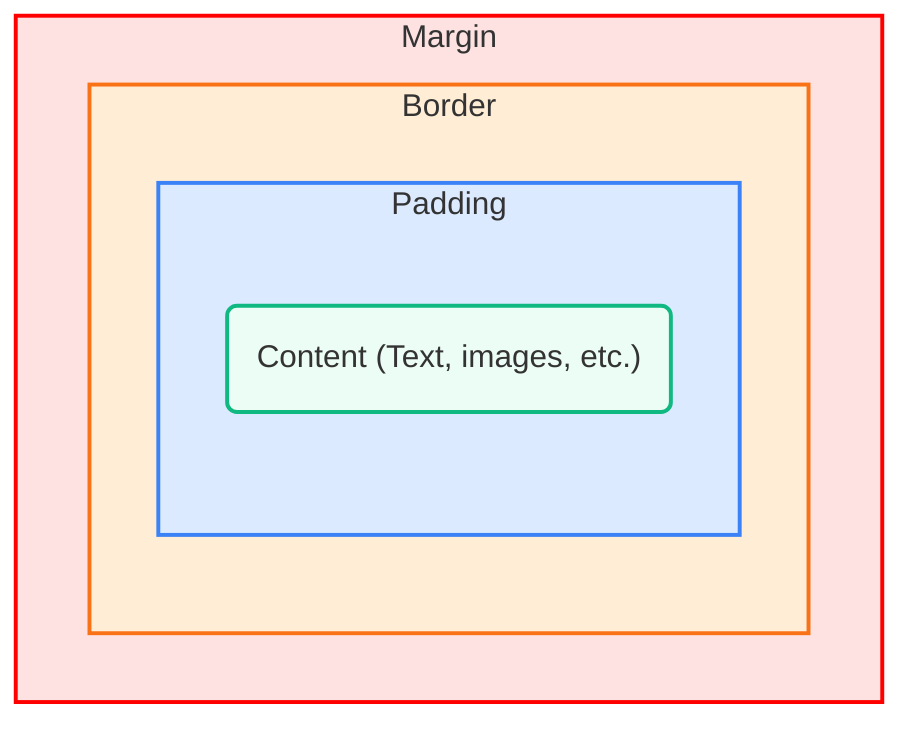

The **CSS Box Model** is the most fundamental concept in web layout and design. It is a set of rules that defines how every HTML element is rendered by the browser as a rectangular box. Understanding the Box Model is crucial because it dictates the total space an element occupies on the page.

Every element you see on a webpage a paragraph, an image, a button, or a container is drawn as a box with four distinct, concentric layers. 

<AdsComponent />
 

## The Four Layers of the Box Model

The Box Model consists of four main layers, built outward from the center (the content):

### 1. Content

The innermost area. This is where the **actual content** of the element resides, such as text, images, or child elements. Its size is controlled by the `width` and `height` properties.

### 2. Padding

The space between the **Content** and the **Border**.
* It clears an area around the content.
* The background color or image of the element extends into the padding area.
* Its size is controlled by the `padding` property.

### 3. Border

A structural line that wraps the **Padding** and **Content**.
* It sits directly around the padding.
* Its appearance (style, width, and color) is controlled by the `border` properties.

### 4. Margin

The outermost layer. The space **outside** the Border.
* It clears an area around the element, separating it from other elements.
* The margin area is always transparent.
* Its size is controlled by the `margin` property.

<AdsComponent />
 

## Calculating Total Element Space (Default)

The single most important takeaway from the Box Model is how to calculate the **total space** an element consumes on the page.

By default (`box-sizing: content-box;`), the `width` and `height` CSS properties only control the size of the **Content** area.

The total space occupied by an element is calculated as follows:

$
\text{Total Width} = \text{Margin Left} + \text{Border Left} + \text{Padding Left} + \text{Width} + \text{Padding Right} + \text{Border Right} + \text{Margin Right}
$

:::info Total Width Example
If you set an element to `width: 300px;` and then add `padding: 20px;` and `border: 5px solid black;`, the element's total visible width will actually be **$350\text{px}$** ($20\text{px}$ padding left + $5\text{px}$ border left + $300\text{px}$ content + $20\text{px}$ padding right + $5\text{px}$ border right). This is a common source of layout frustration!
:::

## The `box-sizing` Property

To solve the frustration of having padding and border increase the total size, CSS introduced the **`box-sizing`** property to change the Box Model's behavior.

### `box-sizing: content-box;` (Default)

This is the standard model described above: **Width** only includes the **Content** area.

### `box-sizing: border-box;` (Recommended)

This widely-used alternative changes the calculation: **Width** and **Height** now include the **Content, Padding, and Border**.
* If you set `width: 300px;` and `padding: 20px;`, the browser automatically shrinks the content area to $260\text{px}$ to keep the total width exactly $300\text{px}$.

<AdsComponent />
 

## Interactive Box Model Demo (Default Behavior)

The demo below illustrates the default `content-box` behavior. The CSS sets the content width to $200\text{px}$. Change the `padding` and `margin` values below and see how the box's size and position change relative to the total space.

<CodePenEmbed 
  title="Interactive Box Model Demo"
  penId="vEGWzvK"
/>