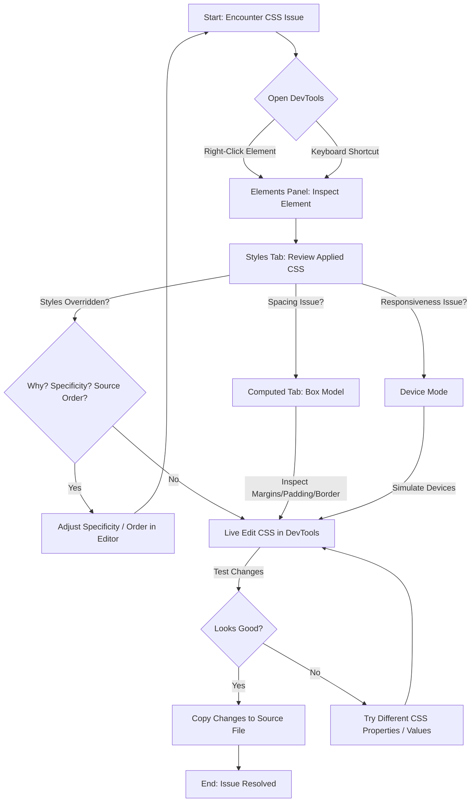

Browser Developer Tools are an indispensable set of utilities built directly into web browsers. For front-end developers, especially when working with CSS, these tools are your best friend for debugging, inspecting, and live-editing styles. This tutorial will guide you through the essential features of browser DevTools, primarily focusing on their application to CSS.

<AdsComponent />
 

## Opening Developer Tools

Most browsers offer multiple ways to open Developer Tools:

1. **Right-click an element** on a webpage and select "Inspect" (or "Inspect Element"). This will open the DevTools and automatically select the element you clicked in the Elements panel.
2. **Keyboard Shortcut:**
    * **Chrome/Edge/Brave:** `Ctrl+Shift+I` (Windows/Linux) or `Cmd+Option+I` (macOS)
    * **Firefox:** `Ctrl+Shift+I` (Windows/Linux) or `Cmd+Option+I` (macOS)
    * **Safari:** `Cmd+Option+C` (macOS) - Ensure "Show Develop menu in menu bar" is enabled in Safari Preferences > Advanced.
3. **Browser Menu:** Look for "More Tools" > "Developer Tools" in Chrome/Edge, or "Web Developer" > "Toggle Tools" in Firefox.

Once opened, you'll typically see a panel docked to the side or bottom of your browser window.

## The Elements Panel: Your CSS Command Center

The Elements panel is where you'll spend most of your time working with CSS. It displays the HTML structure of the page and, crucially, the computed styles for each selected element.

### 1. Inspecting Elements

When you select an element in the HTML tree of the Elements panel, the right-hand sidebar will update to show its styles.

* **Styles Tab:** This is the most frequently used tab. It lists all the CSS rules applied to the selected element, ordered by specificity and source. You can see which rules are active, which are overridden (crossed out), and where they come from (e.g., `style.css:25`).
    

### 2. Live Editing CSS

One of the most powerful features is the ability to live-edit styles directly in the browser.

* **Modify Existing Properties:** Click on any property value (e.g., `font-size: 16px;`) and type a new value. The changes are immediately reflected on the page.
* **Add New Properties:** Click on an empty line within a CSS rule block to add a new property-value pair.
* **Toggle Properties:** Next to each declaration, there's a checkbox. Unchecking it temporarily disables that specific CSS property, which is excellent for isolating issues.
* **Add New CSS Rules:** At the top of the Styles tab, you can often find a `+` button or an area to add a new CSS rule for the selected element. This is useful for testing entirely new styles.

<video controls className="w-full h-auto">
    <source src="https://developer.chrome.com/static/docs/devtools/css/reference/video/NJdAV9UgKuN8AhoaPBquL7giZQo1/vDfXTULIyNIJXVw6lKvf.mp4" type="video/mp4" />
    Your browser does not support the video element.
</video>

### 3. Understanding the Box Model

The "Computed" tab (often next to "Styles") displays the resolved values for all CSS properties. More importantly, it features an interactive **Box Model** diagram.

This diagram visually represents the margin, border, padding, and content area of the selected element. Hovering over parts of the diagram will highlight the corresponding area on the actual webpage, making it incredibly useful for debugging spacing issues.

<AdsComponent />
 

## Other Important Panels for CSS

### 1. Device Mode / Responsive Design Mode

This mode (usually toggled by an icon that looks like a mobile phone and tablet) allows you to simulate different screen sizes, resolutions, and even device pixel ratios. It's crucial for testing and developing responsive designs without needing multiple physical devices. You can drag the edges of the viewport or select predefined device presets.

### 2. Sources Panel

While primarily for JavaScript debugging, the Sources panel allows you to view and modify your actual CSS files. You can set breakpoints within your CSS (e.g., on a style declaration inside a `@media` query) to see when and how styles are applied. Any changes made here are also live, but remember they are temporary until you save them to your actual project files.

### 3. Console Panel

Though mostly for JavaScript, the Console can sometimes show CSS-related errors or warnings, especially if you have issues with `@import` rules or invalid syntax that the browser can't parse.

## Advanced CSS Debugging Techniques

### Forced States (Hover, Focus, Active, Visited)

In the Styles tab, you'll often find an option (e.g., `:hov` in Chrome, or a "Toggle Element State" icon) that allows you to force an element into a `:hover`, `:focus`, `:active`, or `:visited` state. This is incredibly useful for styling and debugging interactive elements without constantly moving your mouse or tabbing.

### CSS Grid and Flexbox Inspectors

Modern browser DevTools come with excellent visual inspectors for CSS Grid and Flexbox layouts. When an element has `display: grid` or `display: flex` applied, a special icon appears next to it in the Elements panel. Clicking this icon overlays visual guides on the page, showing grid lines, track sizes, and flex item distribution.

<Tabs>
  <TabItem value="Grid Inspectors" label="Grid Inspectors" default>
    
  </TabItem>
  <TabItem value="Flex Inspectors" label="Flex Inspectors">
    
  </TabItem>
</Tabs>

<AdsComponent />
 

## Visualizing the DevTools Workflow

Here's a Mermaid graph illustrating a common CSS debugging workflow using browser DevTools:

## Conclusion

Browser Developer Tools are an incredibly powerful and essential suite of tools for anyone working with CSS. Mastering them will significantly speed up your debugging process, help you understand how styles are applied, and empower you to build more robust and responsive web designs. Practice regularly with these tools, and they will become an invaluable part of your development workflow.