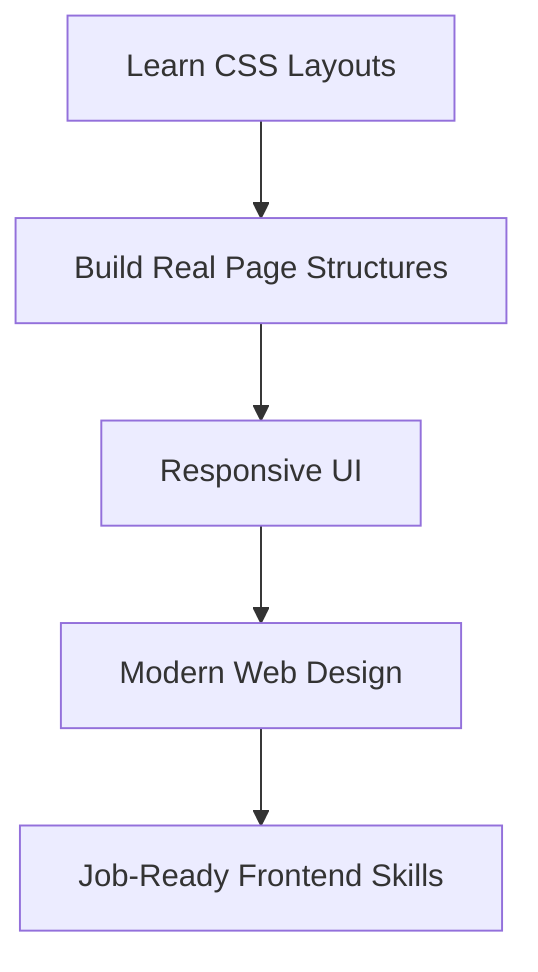

Now that you've learned about various CSS layout techniques, it's time to put them into practice with some real-world layout projects! These projects are designed to help you apply your knowledge of Flexbox and Grid to create common web page structures and components.

:::warning
* These projects are meant for practice and learning. Focus on understanding the concepts rather than achieving pixel-perfect designs.
* **Don't do copy-paste?** Try typing out the code manually to reinforce learning.
* **Experiment!** Modify the styles, colors, and layouts to see how changes affect the outcome.
:::

<AdsComponent />
<br />

## Why Practice Layouts?



Practicing layouts improves your ability to create visually appealing and functional web pages. By working on real-world examples, you'll gain confidence in using CSS layout techniques effectively.

There are various layout techniques in CSS, but the most commonly used ones are **Flexbox** and **Grid**. This module focuses on these techniques to help you build modern, responsive layouts.

:::note Key layout techniques

There are several CSS layout techniques, each suited for different scenarios:

* **Flexbox**: Ideal for one-dimensional layouts (rows or columns). Great for navbars, toolbars, and aligning items.
* **Grid**: Perfect for two-dimensional layouts (rows and columns). Excellent for complex page structures like dashboards and galleries.
* **Positioning**: Useful for specific placement of elements (absolute, relative, fixed).
* **Media Queries**: Essential for creating responsive designs that adapt to different screen sizes.
:::

<AdsComponent />
<br />

## Layout 1: Responsive Three-Column Layout

A common pattern used in blogs, ecommerce, and dashboards.

### Preview

<BrowserWindow minHeight={200} url="http://127.0.0.1:5500/index.html">
<div style={{
  display:'grid',
  gridTemplateColumns:'1fr 2fr 1fr',
  gap:'12px'
}}>
<div style={{background:'#222',padding:'10px',color:'#fff',borderRadius:'6px'}}>Left</div>
<div style={{background:'#444',padding:'10px',color:'#fff',borderRadius:'6px'}}>Main</div>
<div style={{background:'#222',padding:'10px',color:'#fff',borderRadius:'6px'}}>Right</div>
</div>
</BrowserWindow>

### Code

<Tabs>
<TabItem value="html" label="HTML">

```html
<div class="layout">
  <aside class="left">Left</aside>
  <main class="main">Main</main>
  <aside class="right">Right</aside>
</div>
```

</TabItem>
<TabItem value="css" label="CSS">

```css
.layout {
  display: grid;
  gap: 20px;
  grid-template-columns: 1fr 2fr 1fr;
}

.left,
.main,
.right {
  padding: 20px;
  background: #222;
  color: #fff;
  border-radius: 8px;
}

.main {
  background: #444;
}
```

</TabItem>
</Tabs>

<AdsComponent />
<br />

## Layout 2: Dashboard Grid

Perfect for analytics dashboards and admin panels.

### Preview

<BrowserWindow minHeight={200} url="http://127.0.0.1:5500/index.html">
<div style={{
  display:'grid',
  gridTemplateColumns:'repeat(auto-fit, minmax(150px, 1fr))',
  gap:'12px'
}}>
<div style={{background:'#333',height:'80px',borderRadius:'8px'}}></div>
<div style={{background:'#333',height:'80px',borderRadius:'8px'}}></div>
<div style={{background:'#333',height:'80px',borderRadius:'8px'}}></div>
<div style={{background:'#333',height:'80px',borderRadius:'8px'}}></div>
</div>
</BrowserWindow>

### Code

<Tabs>
<TabItem value="html" label="HTML">

```html
<div class="dashboard">
  <div class="card"></div>
  <div class="card"></div>
  <div class="card"></div>
  <div class="card"></div>
</div>
```

</TabItem>
<TabItem value="css" label="CSS">

```css
.dashboard {
  display: grid;
  gap: 20px;
  grid-template-columns: repeat(auto-fit, minmax(180px, 1fr));
}

.card {
  height: 100px;
  background: #333;
  border-radius: 12px;
}
```

</TabItem>
</Tabs>

<AdsComponent />
<br />

## Layout 3: Centering Layout (Flexbox Mastery)

### Preview

<BrowserWindow minHeight={200} url="http://127.0.0.1:5500/index.html">
<div style={{
  display:'flex',
  alignItems:'center',
  justifyContent:'center',
  height:'140px',
  background:'#222',
  color:'#fff',
  borderRadius:'10px'
}}>
Centered Box
</div>
</BrowserWindow>

### Code

<Tabs>
<TabItem value="html" label="HTML">

```html
<div class="center">
  Centered Box
</div>
```

</TabItem>
<TabItem value="css" label="CSS">

```css
.center {
  display: flex;
  justify-content: center;
  align-items: center;
  height: 180px;
  background: #222;
  color: white;
  border-radius: 12px;
}
```

</TabItem>
</Tabs>

## Layout 4: Navigation Bar (Flex Layout)

### Preview

<BrowserWindow minHeight={200} url="http://127.0.0.1:5500/index.html">
<nav style={{
  display:'flex',
  justifyContent:'space-between',
  padding:'10px 18px',
  background:'#111',
  color:'#fff',
  borderRadius:'6px'
}}>
<div>Logo</div>
<div style={{display:'flex',gap:'12px'}}>
<span>Home</span><span>Docs</span><span>Projects</span>
</div>
</nav>
</BrowserWindow>

### Code

<Tabs>
<TabItem value="html" label="HTML">

```html
<nav class="navbar">
  <div class="logo">Logo</div>
  <ul class="menu">
    <li>Home</li>
    <li>Docs</li>
    <li>Projects</li>
  </ul>
</nav>
```

</TabItem>
<TabItem value="css" label="CSS">

```css
.navbar {
  display: flex;
  justify-content: space-between;
  background: #111;
  padding: 12px 20px;
  border-radius: 8px;
  color: white;
}

.menu {
  display: flex;
  gap: 16px;
  list-style: none;
}
```

</TabItem>
</Tabs>

<AdsComponent />
<br />

## Layout 5: Hero Section (Landing Page)

### Preview

<BrowserWindow minHeight={200} url="http://127.0.0.1:5500/index.html">
<div style={{
  display:'flex',
  justifyContent:'space-between',
  padding:'20px',
  background:'#1a1a1a',
  color:'white',
  borderRadius:'10px'
}}>
<div><h2>Build Something Awesome</h2><p>Modern frontend layout practice.</p></div>

</div>
</BrowserWindow>

### Code

<Tabs>
<TabItem value="html" label="index.html">

```html
<section class="hero">
  <div class="text">
    <h1>Build Something Awesome</h1>
    <p>Modern CSS layout practice.</p>
  </div>
  
</section>
```

</TabItem>
<TabItem value="css" label="styles.css">

```css
.hero {
  display: flex;
  justify-content: space-between;
  padding: 25px;
  background: #1a1a1a;
  color: #fff;
  border-radius: 12px;
}

.hero img {
  width: 150px;
  border-radius: 10px;
}
```

</TabItem>
</Tabs>

## Layout 6: Sidebar + Content Layout

### Preview

<BrowserWindow minHeight={200} url="http://127.0.0.1:5500/index.html">
<div style={{
  display:'grid',
  gridTemplateColumns:'220px 1fr',
  gap:'12px'
}}>
<div style={{background:'#222',padding:'15px',color:'#fff',borderRadius:'8px'}}>Sidebar</div>
<div style={{background:'#333',padding:'15px',color:'#fff',borderRadius:'8px'}}>Content</div>
</div>
</BrowserWindow>

### Code

<Tabs>
<TabItem value="html" label="index.html">

```html
<div class="sidebar-layout">
  <aside class="side">Sidebar</aside>
  <main class="content">Content</main>
</div>
```

</TabItem>
<TabItem value="css" label="styles.css">

```css
.sidebar-layout {
  display: grid;
  gap: 20px;
  grid-template-columns: 220px 1fr;
}

.side,
.content {
  padding: 20px;
  border-radius: 10px;
  color: white;
}

.side {
  background: #222;
}

.content {
  background: #333;
}
```

</TabItem>
</Tabs>

<AdsComponent />
<br />

:::tip
Try customizing these layouts by changing colors, spacing, and adding more elements. Experiment with different layout techniques to see how they affect the design and responsiveness of your pages.
:::

## Additional Resources for Practice

* **[Dev Snap](https://devsnap.me/css-grid-examples):** A collection of community-driven code snippets featuring grids, layouts, and interactive designs. Many examples include subtle animations you can study and reuse in your own projects.


* **[Animista](https://animista.net):** A visual playground for exploring different animation styles such as fades, flips, rotations, zooms, entrances, exits, shadows, and text effects. You can customize animations and copy clean CSS instantly.

* **[CSS-Tricks](https://css-tricks.com):** This site provides deep-dive articles on CSS transitions, easing, smoothing, keyframes, performance tips, and advanced animation workflows. Great for understanding *why* animations work the way they do.

* **[MDN Web Docs](https://developer.mozilla.org/en-US/docs/Web/CSS/animation):** The most reliable and complete documentation for properties like `animation`, `transition`, `transform`, and `@keyframes`. Includes browser support tables and real examples.

* **[LottieFiles](https://lottiefiles.com):** Use rich vector animations powered by Lottie. Ideal for modern hero sections, onboarding screens, loading animations, and app interfaces.

* **[Easing Functions Cheat Sheet](https://easings.net):** A complete guide to easing curves with visual previews. Helps you choose the perfect timing function for smoother and more natural animations.

* **[GreenSock (GSAP)](https://gsap.com):** For complex, high-performance animations, GSAP is the industry standard. Ideal for scroll animations, timeline-based motion, stagger effects, and chaining.

* **[CodePen](https://codepen.io/search?q=css+animation):** A massive collection of community-built animations. Perfect for inspiration and hands-on practice by remixing pens.

* **[UI Snippets](https://uiverse.io/):** Provides modern animated UI components like buttons, loaders, cards, toggles, and input interactions. All examples are editable and use pure HTML/CSS.

* **[Cubic-Bezier.com](https://cubic-bezier.com):** Visually design custom cubic-bezier easing curves and instantly preview how your animation will feel.

## Summary

This module provided hands-on practice with essential CSS layout techniques using Flexbox and Grid. By building real-world layouts like navigation bars, dashboards, hero sections, and responsive grids, you can enhance your frontend development skills and create visually appealing web pages.