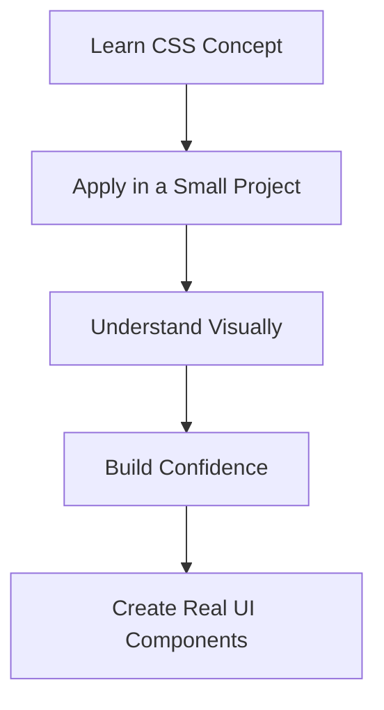
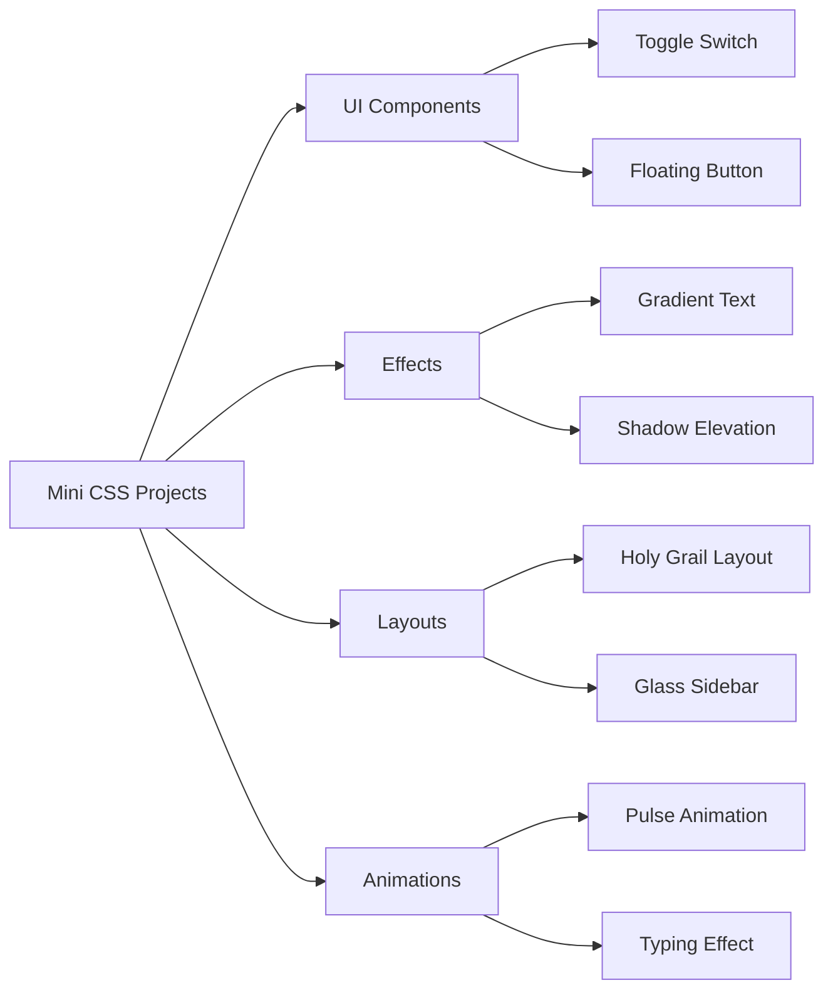

Now that you've learned various CSS concepts, it's time to put them into practice with some mini projects! These projects are designed to help you apply what you've learned in a practical way, building small UI components and effects that are commonly used in modern web design.

Let's dive into some mini projects that will strengthen your CSS skills and give you hands-on experience.

:::warning
* These projects are meant for practice and learning. Focus on understanding the concepts rather than achieving pixel-perfect designs.
* **Don't do copy-paste?** Try typing out the code manually to reinforce learning.
* **Experiment!** Modify the styles, colors, and layouts to see how changes affect the outcome.
:::

<AdsComponent />
<br />

## Why Mini Projects?



Mini projects help bridge the gap between theory and practice. By working on small, manageable tasks, you can see how CSS properties and techniques come together to create functional and visually appealing components. This hands-on approach solidifies your understanding and prepares you for larger projects.

<AdsComponent />
<br />

## Project 1: Neon Glow Button

A glowing, animated CTA button used in modern landing pages.

### Preview

<BrowserWindow minHeight={200} url="http://127.0.0.1:5500/index.html">
<button style={{
  padding:'12px 28px',
  background:'transparent',
  border:'2px solid #0ff',
  color:'#0ff',
  borderRadius:'8px',
  fontSize:'18px',
  boxShadow:'0 0 12px #0ff'
}} onMouseOver={e => {
  e.currentTarget.style.background = '#0ff';
  e.currentTarget.style.color = '#000';
  e.currentTarget.style.boxShadow = '0 0 25px #0ff, 0 0 60px #0ff';
}} onMouseOut={e => {
  e.currentTarget.style.background = 'transparent';
  e.currentTarget.style.color = '#0ff';
  e.currentTarget.style.boxShadow = '0 0 12px #0ff';
}}>Glow Me</button>
</BrowserWindow>

### Code

This button uses CSS for padding, border, color, and box-shadow to create a neon glow effect. The hover effect changes the background and intensifies the glow.

<Tabs>
<TabItem value="html" label="HTML">

```html
<button class="neon-btn">Glow Me</button>
```

</TabItem>
<TabItem value="css" label="CSS">

```css
.neon-btn {
  padding: 14px 30px;
  background: transparent;
  color: #0ff;
  border: 2px solid #0ff;
  border-radius: 8px;
  font-size: 18px;
  transition: 0.3s ease;
  box-shadow: 0 0 12px #0ff;
}

.neon-btn:hover {
  background: #0ff;
  color: #000;
  box-shadow: 0 0 25px #0ff, 0 0 60px #0ff;
}
```

</TabItem>
</Tabs>

:::note
Feel free to customize the button colors, sizes, and glow intensity to match your design preferences!
:::

<AdsComponent />
<br />

## Project 2: Glassmorphism Card

A frosted glass effect used in dashboards and modern UI.

### Preview

<BrowserWindow minHeight={200} url="http://127.0.0.1:5500/index.html">
<div style={{
  width:'250px',
  padding:'20px',
  borderRadius:'18px',
  background:'rgba(255,255,255,0.15)',
  backdropFilter:'blur(12px)',
  boxShadow:'0 8px 25px rgba(0,0,0,0.3)'
}}>
<h3>Glass UI</h3>
<p>Beautiful modern frosted effect.</p>
</div>
</BrowserWindow>

### Code

<Tabs>
<TabItem value="html" label="HTML">

```html
<div class="glass-card">
  <h2>Glass UI</h2>
  <p>Modern frosted design with pure CSS.</p>
</div>
```

</TabItem>
<TabItem value="css" label="CSS">

```css
.glass-card {
  width: 260px;
  padding: 20px;
  border-radius: 18px;
  background: rgba(255, 255, 255, 0.15);
  backdrop-filter: blur(12px);
  box-shadow: 0 8px 25px rgba(0,0,0,0.25);
}
```

</TabItem>
</Tabs>

<AdsComponent />
<br />

## Project 3: Loading Spinner

A common micro-UI component for async loading.

### Preview

<BrowserWindow minHeight={200} url="http://127.0.0.1:5500/index.html">
<div style={{
  width:'40px',
  height:'40px',
  border:'4px solid #ccc',
  borderTopColor:'#4f9',
  borderRadius:'50%',
  animation:'spin 1s linear infinite'
}}></div>
</BrowserWindow>

### Code

<Tabs>
<TabItem value="html" label="HTML">

```html
<div class="spinner"></div>
```

</TabItem>
<TabItem value="css" label="CSS">

```css
.spinner {
  width: 40px;
  height: 40px;
  border: 4px solid #ccc;
  border-top-color: #4f9;
  border-radius: 50%;
  animation: spin 1s linear infinite;
}

@keyframes spin {
  to {
    transform: rotate(360deg);
  }
}
```

</TabItem>
</Tabs>

<AdsComponent />
<br />

## Project 4: Responsive Card Grid

Ideal for product pages, blogs, galleries.

### Preview

<BrowserWindow minHeight={200} url="http://127.0.0.1:5500/index.html">
<div style={{
  display:'grid',
  gap:'12px',
  gridTemplateColumns:'repeat(auto-fit, minmax(120px, 1fr))'
}}>
<div style={{background:'#222',color:'#fff',padding:'12px',borderRadius:'8px'}}>Card 1</div>
<div style={{background:'#222',color:'#fff',padding:'12px',borderRadius:'8px'}}>Card 2</div>
<div style={{background:'#222',color:'#fff',padding:'12px',borderRadius:'8px'}}>Card 3</div>
</div>
</BrowserWindow>

## Code

<Tabs>
<TabItem value="html" label="HTML">

```html
<div class="grid">
  <div class="card">Card 1</div>
  <div class="card">Card 2</div>
  <div class="card">Card 3</div>
</div>
```

</TabItem>
<TabItem value="css" label="CSS">

```css
.grid {
  display: grid;
  gap: 20px;
  grid-template-columns: repeat(auto-fit, minmax(220px, 1fr));
}

.card {
  padding: 20px;
  background: #222;
  color: #fff;
  border-radius: 12px;
}
```

</TabItem>
</Tabs>

<AdsComponent />
<br />

## Project 5: Animated Progress Bar

Indicates task completion with smooth animation.

### Preview

Ideally used in forms, uploads, and loading states.

<BrowserWindow minHeight={200} url="http://127.0.0.1:5500/index.html">
<div style={{
  width:'100%',
  background:'#eee',
  borderRadius:'8px',
  overflow:'hidden'
}}>
  <div style={{
    width:'0',
    height:'16px',
    background:'#4f9',
    animation:'progressAnim 2s ease-in-out forwards'
  }}
  ></div>
</div>
</BrowserWindow>

### Code

<Tabs>
<TabItem value="html" label="HTML">

```html
<div class="progress-bar">
  <div class="progress-fill"></div>
</div>
```

</TabItem>
<TabItem value="css" label="CSS">

```css
.progress-bar {
  width: 100%;
  background: #eee;
  border-radius: 8px;
  overflow: hidden;
}
.progress-fill {
  width: 0;
  height: 16px;
  background: #4f9;
  animation: progressAnim 2s ease-in-out forwards;
}
@keyframes progressAnim {
  to {
    width: 70%;
  }
}
```
</TabItem>
</Tabs>

<AdsComponent />
<br />

## More Mini Project Ideas



:::tip
Feel free to expand on these mini projects or combine multiple concepts into a single project for more complex UI components!
:::

## Additional Resources for Practice

Now that you have some mini projects to work on, here are some additional resources where you can find more project ideas and challenges:

* **[Frontend Mentor](https://www.frontendmentor.io/use-cases/beginner-html-css-projects):** Offers real-world projects with designs to practice HTML and CSS.
* **[CSS Battle](https://cssbattle.dev/):** A fun way to practice CSS by replicating designs with the least code possible.
* **[CodePen Challenges](https://codepen.io/challenges):** Participate in weekly challenges to improve your CSS skills.

This will help you continue practicing and applying your CSS knowledge in various contexts.


## Summary

In this guide, we've explored several mini CSS projects that help reinforce your understanding of CSS concepts through practical application. From neon glow buttons to responsive card grids, these projects are designed to build your skills and confidence in creating real-world UI components.